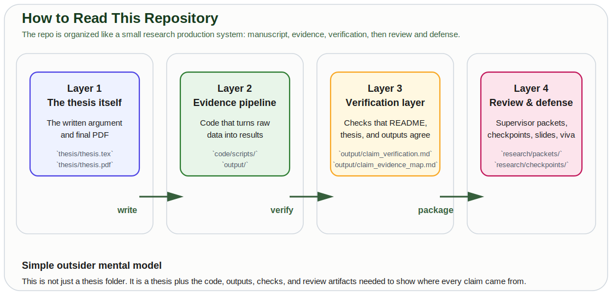
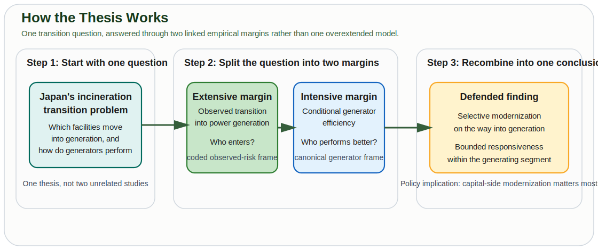

# Carbon Lock-in or Circular Transition?

**Heterogeneity in Japan's Waste Incineration Fleet and Net-Zero Compatibility**

**Author:** Pann Phetra | **Supervisor:** Prof. Han Ji | **Institution:** Ritsumeikan Asia Pacific University | **Degree:** Bachelor's Thesis, Sustainability | **Year:** 2026

> **One-sentence summary:** Japan operates ~1,000 waste incinerators — the most of any country — but 59% generate no electricity at all. This thesis separates two questions: which coded facilities first observed without generation make an observed transition into power generation, and conditional on power generation, which characteristics predict energy recovery efficiency; the evidence points to selective capital-side modernization on the extensive margin and bounded responsiveness within the generator sample on the intensive margin.

---

## If You Only Read Two Things

1. Read the thesis itself: [thesis/thesis.pdf](thesis/thesis.pdf)
2. If you want the repo in one picture, read the two diagrams below:
   - how the thesis works
   - how the repository is organized

This README is written to be understandable to people who are not already inside the project.

---

## What This Project Actually Is

This repository is a bachelor's thesis plus everything needed to support it.

In simple terms, it contains:

- the written thesis
- the code and outputs behind the thesis
- checks that keep the public-facing claims aligned with the evidence
- review and defense materials used during supervision and viva preparation



If you want the shortest mental model:

`data -> scripts -> outputs -> thesis -> verification -> review packet -> frozen checkpoint -> defense materials`

---

## Why This Thesis Exists

Japan burns most of its municipal waste, and it does so through the world's most incineration-dependent waste system. But "Japan's incineration fleet" is not one uniform object.

Some facilities are older furnaces that simply burn waste. Others are waste-to-energy plants that generate electricity and displace some grid emissions. That means the real question is not just "is incineration good or bad?" It is:

- which facilities are actually moving into electricity generation?
- among the facilities that already generate, which ones perform better?

That distinction matters because it separates **modernization** from **performance**.


---

## How The Thesis Works

The thesis answers one transition question through two linked empirical margins.

- The **extensive margin** asks who records an observed transition into power generation.
- The **intensive margin** asks what predicts efficiency among facilities that already generate power.

That is the central design choice of the thesis. Instead of asking one selected sample to explain the whole fleet, it uses the right sample for each part of the question.



---

## The Finding In Plain English

Japan's waste-incineration transition is real, but uneven.

- Some facilities are clearly modernizing into power generation.
- Many others are not.
- Among the facilities that already generate electricity, performance still differs much more **between** facilities than **within** the same facility over time.

So the thesis argues for a calibrated conclusion:

- **entry into generation is selective**
- **performance inside the generating segment is bounded by age, scale, and utilization**

That means the biggest fleet-wide gains are most consistent with **capital-side modernization** of the weakest segment, while operational improvements remain real but more limited.

---

## The Verified Result In Four Points

This is the simplest machine-aligned summary of the thesis results.

- The project uses a 20-year facility-level panel with **23,599 observations across 2,948 facilities**.
- On the adoption side, the coded transition panel contains **13,770 facility-years across 2,035 facilities, with 141 observed first-adoption events**; the lagged adoption model uses **11,717 facility-years across 1,915 facilities and 140 events**.
- In that adoption model, older facilities are **1.1–1.8 percentage points less likely** to transition into generation, while each additional 100 t/day of prior-year capacity adds **+0.50 percentage points**.
- The pathway audit classifies **82 as reset/rebuild-like, 38 as continuity/in-place-upgrade-like, 20 as forward-dated or placeholder entries, and 1 as unresolved**.
- On the generator side, the canonical regression frame contains **5,683 facility-years across 1,016 facilities**; the main coefficient ranges are **−0.019 to −0.035** for age, **+0.041 to +0.103** for design capacity, and **+0.541 to +0.779** for capacity utilization.
- The pooled within/total variance ratio is **0.1499, falling from 0.1795 in FY2005–FY2011 to 0.0956 in FY2012–FY2024**, which is one reason the thesis argues that performance differences are dominated by cross-facility heterogeneity rather than large within-facility reversals.

For readers who want the more technical machine-checked wording, the key evidence artifacts are:

- [output/claim_verification.md](output/claim_verification.md)
- [output/claim_evidence_map.md](output/claim_evidence_map.md)

---

## Three Useful Visuals

### Fleet split

The core problem is that the fleet still contains a large non-generating segment.


### Long-run trends

The fleet is consolidating and the generating share is rising, but heterogeneity remains large.


### Evidence pipeline

The repo is built so the thesis can be traced back through a reproducible pipeline.


---

## Headline Numbers

| Metric | Value |
|:-------|:------|
| Panel observations | 23,599 facility-years |
| Unique facilities | 2,948 |
| Adoption risk set | 13,770 facility-years (2,035 facilities) |
| Observed first-adoption events | 141 |
| Adoption age effect | −1.76 to −1.13 percentage points vs prior-year age 0–10 |
| Adoption capacity effect | +0.50 percentage points per 100 t/day of prior-year capacity |
| Pathway audit of adoption events | 82 reset/rebuild-like, 38 continuity-like, 20 forward-dated/placeholder, 1 unresolved |
| Generator regression sample | 5,683 facility-years (1,016 facilities) |
| Within/total variance ratio | 0.1499 (pooled), 0.1795 (pre-Fuku), 0.0956 (post-Fuku) |
| FY2024 gross avoided CO₂ | ~4.6 Mt-CO₂ (upper bound, excludes process emissions) |
| FY2024 share non-power-generating | 59% |

---

## How To Read The Repo

If you are just curious and want the shortest route:

| If you want... | Start here |
|:---------------|:-----------|
| The finished thesis | [thesis/thesis.pdf](thesis/thesis.pdf) |
| The thesis in source form | [thesis/thesis.tex](thesis/thesis.tex) |
| The clearest explanation of the repo outputs | [output/claim_evidence_map.md](output/claim_evidence_map.md) |
| A machine-checked repo sync report | [output/claim_verification.md](output/claim_verification.md) |
| The latest simplified supervisor-facing bundle | [research/packets/latest-supervisor-handoff](research/packets/latest-supervisor-handoff) |
| The latest frozen sendable milestone | [research/checkpoints/latest-sendable](research/checkpoints/latest-sendable) |
| Oral-defense prep | [research/notes/final-viva-cheat-sheet.md](research/notes/final-viva-cheat-sheet.md) |

---

## What The Thesis Is And Is Not Claiming

### It is claiming

- Japan's transition into power generation is selective rather than diffuse.
- Efficiency among generators is strongly associated with age, scale, and utilization.
- Cross-facility differences dominate within-facility movement in the generator sample.
- The evidence is most consistent with capital-side modernization mattering most for the weakest segment.

### It is not claiming

- one clean causal effect of age, capacity, or utilization
- proof that replacement is the unique dominant mechanism
- a complete capital-history reconstruction of the whole fleet
- a full life-cycle climate accounting
- automatic generalization from Japan to every other country

---

## Methodology At A Glance

| Choice | What | Why |
|:-------|:-----|:----|
| **Empirical architecture** | Two-part design: observed first-transition hazard on coded, initially non-generating facilities, then generator-only efficiency regressions | Separates transition into generation from conditional generator performance instead of asking one selected sample to carry both claims. |
| **Adoption risk set** | 13,770 facility-years (2,035 facilities; 141 events) | Facilities first observed without power generation remain at risk until first observed adoption or exit; left-censored first-year generators are excluded from the hazard. |
| **Adoption model frame** | 11,717 facility-years (1,915 facilities; 140 events) | The hazard uses prior-year age band and prior-year capacity, so the first observed at-risk year for each facility is not estimable. |
| **Generator regression sample** | 5,683 facility-years (1,016 facilities) | Canonical frame: power-generation rows with positive throughput and positive output, official facility code present, complete model covariates, utilization capped at 1.0, and efficiency winsorized to [0.01, 0.80] MWh/t. |
| **Extensive-margin DV** | `adopt_power_this_year` | Observed first transition into power generation in the coded, initially non-generating risk set. |
| **Intensive-margin DV** | `log(energy_efficiency_mwh_per_t)` | Log transformation produces symmetric distribution and coefficients interpretable as proportional effects among generators. |
| **Main regressors** | Adoption: prior-year age bands + prior-year capacity + year FE + prefecture FE. Efficiency: facility age, design capacity, capacity utilization, heating value, grid emission factor | The extensive-margin model uses lagged predictors to avoid same-year redesign timing and reports average marginal effects from a discrete-time hazard. |
| **Robustness** | 8 generator-efficiency specifications: pre/post-Fukushima split (R1–R4), capacity tercile endpoints (R5–R6), raw DV pooled/year-FE replications (R7–R8) | Tests stability across sample splits, distributional assumptions, and variable transformations. |
| **Standard errors** | Cluster-robust, clustered at facility | Accounts for within-facility autocorrelation of errors across years. |

---

## Jargon Glossary

| Term | Plain English |
|:-----|:-------------|
| **Waste-to-energy (WtE)** | Burning waste to generate electricity or heat. Japan calls this "thermal recycling." |
| **Energy recovery efficiency** | How much electricity a facility generates per tonne of waste it burns. Higher = better at extracting useful energy. |
| **Pooled OLS** | Ordinary least squares regression that ignores the panel structure — every observation is treated as independent. Used here as the primary estimator because within-facility variance is small. |
| **Random Effects (RE)** | A panel regression method that treats unobserved facility characteristics as random draws from a distribution. Uses both within and between variation. |
| **Panel data** | Tracking the same units (facilities) across multiple time periods. Ours: 2,948 facilities × up to 20 years. |
| **Within/between variance ratio** | The share of variation in the dependent variable that comes from changes within each facility over time, versus differences between facilities. In the canonical regression frame the pooled within/total ratio is 0.1499, meaning most variation still comes from differences between facilities. |
| **Grid emission factor** | How much CO₂ is produced per kWh of electricity on the regional grid. If the grid is dirty (coal-heavy), displacing grid electricity with waste-to-energy saves more carbon. |
| **Capacity utilization** | What fraction of a facility's design capacity it actually uses. A 300 t/day plant processing 200 t/day has 67% utilization. |
| **Fleet heterogeneity** | The fact that Japan's incinerators are not all the same — they vary in age, size, technology, and energy recovery capability. |
| **Infrastructure lock-in** | Once you build a 30-year incinerator, you're committed to burning waste for 30 years, regardless of whether better options emerge. |

---

## Data Sources

| Source | What it contains | Coverage | Link |
|:-------|:----------------|:---------|:-----|
| **Japan MOE General Waste Treatment Survey** | Facility-level incinerator data: capacity, throughput, power generation, efficiency, age, waste composition | FY2005–FY2024, ~1,000 facilities/year | [env.go.jp](https://www.env.go.jp/recycle/waste_tech/ippan/) |
| **Regional grid emission factors** | kg-CO₂/kWh by utility area and year | FY2005–FY2024, 10 regional utilities | Hardcoded from METI/utility publications with linear interpolation between anchor years |

---

## Repository Structure

This is the high-level structure. The important point is that the repo separates manuscript, evidence pipeline, verification, and review workflows.

```text
incineration-thesis/
|
|-- code/
|   |-- scripts/                         # analysis, packaging, verification, defense tooling
|   +-- notebooks/                      # exploration
|
|-- data/
|   |-- raw/                            # source files
|   +-- processed/                      # parsed and enriched panel data
|
|-- thesis/
|   |-- thesis.tex                      # authoritative manuscript source
|   |-- thesis.pdf                      # compiled thesis
|   +-- figures/                        # thesis figures
|
|-- output/                             # generated tables, reports, manifests
|-- docs/figures/                       # README-facing explanatory diagrams
|-- research/
|   |-- notes/                          # defense notes, supervisor brief, risk register
|   |-- packets/                        # supervisor/submission packet workflow
|   |-- review-rounds/                  # structured feedback intake
|   |-- checkpoints/                    # frozen milestones
|   +-- slides/                         # defense deck and bundle
|
|-- README.md
|-- ARCHITECTURE.md
|-- AGENTS.md
|-- package.json
+-- requirements.txt
```

---

## How To Reproduce

### Quick start

```bash
# 1. Clone and install
git clone https://github.com/Pann13223029/incineration-thesis.git
cd incineration-thesis
python3 -m venv .venv
.venv/bin/pip install -r requirements.txt
npm install

# 2. Optional: download raw data (requires internet)
.venv/bin/python code/scripts/01_download_facility_data.py
```

### Rebuild thesis-facing analysis

```bash
# Rebuild all thesis-facing analysis artifacts from the checked-in raw files
.venv/bin/python code/scripts/07_rebuild_analysis.py

# Optional: rerun only the repo-level claim/evidence verifier
python3 code/scripts/08_verify_claims.py
```

### Defense and packaging workflows

```bash
# Export the defense deck to local presentation artifacts
npm run slides:export

# Optional: also export a PDF deck if Chrome/Edge is available locally
npm run slides:export:pdf

# Package a frozen local defense bundle
npm run slides:bundle

# Build frozen supervisor and submission packets
npm run packets:build

# Build the flattened supervisor-ready bundle with simple filenames
npm run supervisor:ready

# Freeze a sendable checkpoint from the current verified state
npm run checkpoint:freeze

# Start a structured supervisor-feedback round
npm run review:round:start
```

The canonical sample definition is written to `output/sample_definition.md`, the extensive-margin results to `output/adoption_results.md`, the event-level pathway audit to `output/adoption_pathway_audit.csv`, the repo-level sync report to `output/claim_verification.md`, the claim-to-evidence bridge to `output/claim_evidence_map.md`, the packet delta note is generated locally at `output/checkpoint_delta.md` during packet builds, each stage writes a JSON provenance record under `output/manifests/`, the defense deck tooling writes local artifacts under `research/slides/dist/`, the review-packet workflow writes frozen supervisor/submission packets under `research/packets/dist/`, the simplified supervisor-ready bundle is written under `research/packets/dist/supervisor-handoff/`, the checkpoint freezer writes auditable local milestones under `research/checkpoints/dist/`, and the review-round workflow writes dated supervisor-feedback workspaces under `research/review-rounds/dist/`.

For any real supervisor checkpoint, the simplest path is: run `npm run supervisor:ready` and send `research/packets/latest-supervisor-handoff` or `research/packets/dist/supervisor-handoff.zip`. This path uses the current thesis source plus generated manifests and outputs; it does not rerun the full scientific pipeline. If `tectonic` is not installed, it can still package successfully when `thesis/thesis.pdf` is already present and current. For any auditable milestone, then freeze it with `npm run checkpoint:freeze`. Loose PDFs are for drafting, not for reference baselines. After a freeze, the newest baseline is always available at the stable local alias `research/checkpoints/latest-sendable/`.

To compile the thesis PDF: upload `thesis/thesis.tex` and the `thesis/figures/` directory to Overleaf (or run `pdflatex thesis.tex` locally with natbib, booktabs, tabularx, and graphicx installed).

---

## Related Work

This is the author's second thesis. The first thesis analyzed municipal waste *generation* across the same ~1,700 Japanese municipalities:

> Phetra, P. (2026). *Path Dependence, the Recycling Paradox, and the Limits of Machine Learning in Japanese Municipal Waste Generation.* Bachelor's Thesis, Ritsumeikan Asia Pacific University. [GitHub](https://github.com/Pann13223029/pann-apu-thesis-resources)

The first thesis found that waste *generation* is structurally locked in (lag-1 R² = 0.916). This second thesis examines the *infrastructure* that creates a parallel lock-in on the *disposal* side: the incinerators themselves. Taken together, the two theses argue that Japan's waste system is locked in on both ends — what goes in and how it is processed — which has direct implications for the country's 2050 net-zero trajectory.

---

## Acknowledgments

Prof. Han Ji (supervisor), Ritsumeikan Asia Pacific University, College of Sustainability and Tourism. Japan's Ministry of the Environment for maintaining publicly accessible facility-level waste infrastructure data.

---

*Built with AI-assisted coding and review workflows in the local repo environment.*
