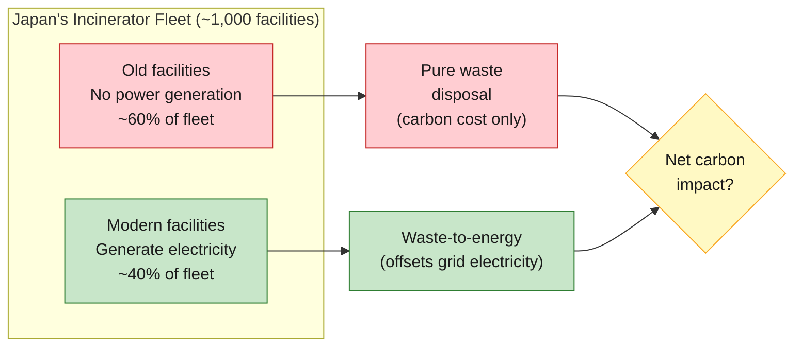
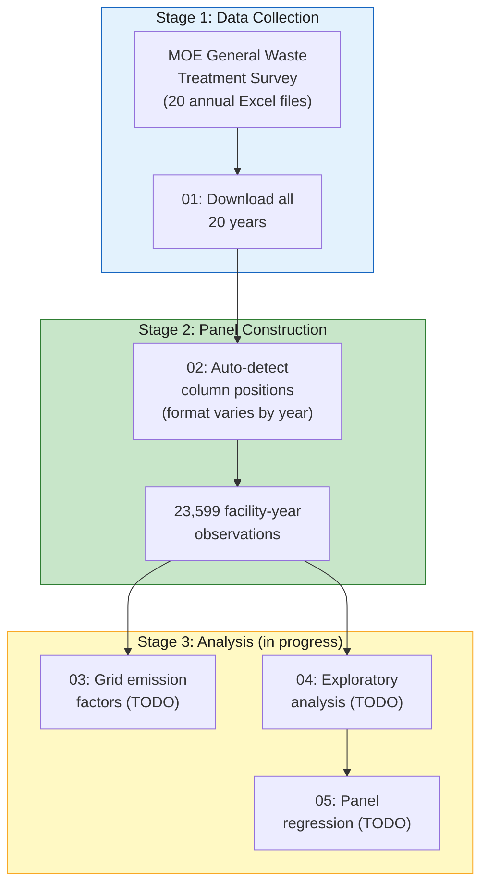
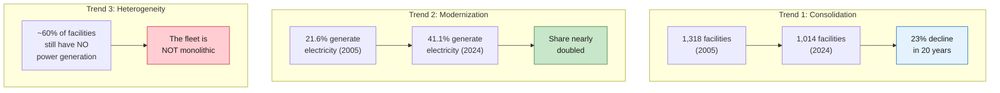

# Carbon Lock-in or Circular Transition?

**Heterogeneity in Japan's Waste Incineration Fleet and Net-Zero Compatibility**

**Author:** Pann Phetra | **Supervisor:** Prof. Han Ji | **Institution:** Ritsumeikan Asia Pacific University | **Degree:** Bachelor's Thesis, Sustainability | **Year:** 2026

> **One-sentence summary:** Japan has ~1,000 waste incinerators — the most of any country — but 70% generate no electricity. This thesis asks which facility characteristics predict energy recovery efficiency, and what that means for Japan's 2050 carbon goals.

---

## What This Thesis Is About

Japan incinerates roughly 80% of its municipal waste. The government calls energy recovery from burning waste "thermal recycling." But Japan's ~1,000 incinerators are not all the same:



Some are 40-year-old furnaces that simply burn waste. Others are modern waste-to-energy plants generating electricity that displaces fossil fuels on the grid. **The existing literature treats them as one system. This thesis disaggregates.**

---

## The Research Journey

### The Dataset

We downloaded 20 years of facility-level data from Japan's Ministry of the Environment (FY2005-2024) — every incinerator in the country, every year.



### What We Already See

Three trends are visible before any regression:



---

## The Research Question

**What facility characteristics predict energy recovery efficiency among Japan's power-generating incinerators, and how has this changed as the fleet modernizes?**

| Variable | What it measures | Coverage |
|:---------|:-----------------|:--------:|
| Energy efficiency (MWh/t) | Electricity generated per tonne of waste | 96% of subsample |
| Facility age | Years since operations began | 99.8% |
| Capacity utilization | Annual throughput / design capacity | 98.3% |
| Heating value (kJ/kg) | Energy content of waste input | 96.2% |
| Power capacity (kW) | Installed generation capacity | 98.7% of subsample |

---

## Jargon Glossary

| Term | Plain English |
|:-----|:-------------|
| **Waste-to-energy (WtE)** | Burning waste to generate electricity or heat. Japan calls this "thermal recycling." |
| **Incineration** | Burning waste at high temperatures. Japan uses it for ~80% of municipal waste. |
| **Energy recovery efficiency** | How much electricity a facility generates per tonne of waste it burns. Higher = better at extracting useful energy. |
| **Fixed effects (FE)** | A statistical method that controls for unchanging characteristics of each facility (location, design) and each year (national policy changes). Isolates what changes within a facility over time. |
| **Panel data** | Tracking the same units (facilities) across multiple time periods. Ours: ~1,000 facilities × 20 years. |
| **Grid emission factor** | How much CO2 is produced per kWh of electricity on the regional grid. If the grid is dirty (coal-heavy), displacing grid electricity with waste-to-energy saves more carbon. |
| **Capacity utilization** | What fraction of a facility's design capacity it actually uses. A 300 t/day plant processing 200 t/day has 67% utilization. |
| **Fleet heterogeneity** | The fact that Japan's incinerators are not all the same — they vary in age, size, technology, and energy recovery capability. |
| **Material metabolism** | An industrial ecology concept: how materials flow through a system (city, industry, country). Waste infrastructure is part of a city's "metabolism." |
| **Infrastructure lock-in** | Once you build a 30-year incinerator, you're committed to burning waste for 30 years, regardless of whether better options emerge. |

---

## Data Sources

| Source | What it contains | Coverage | Link |
|:-------|:----------------|:---------|:-----|
| **Japan MOE** | Facility-level incinerator data: capacity, throughput, power generation, efficiency, age, waste composition | FY2005-2024, ~1,000 facilities/year | [env.go.jp](https://www.env.go.jp/recycle/waste_tech/ippan/) |
| **METI** (TODO) | Regional grid emission factors by electric utility area | Annual, 9 regions | TBD |

---

## Repository Structure

```
incineration-thesis/
|
|-- code/
|   |-- scripts/
|   |   |-- 00_probe_estat_facility_data.py   # Initial data availability test
|   |   |-- 01_download_facility_data.py      # Download 20 years of Excel files
|   |   |-- 02_parse_facility_panel.py        # Auto-detect parser → panel CSV
|   |   |-- 03_download_grid_factors.py       # [TODO] METI grid emission factors
|   |   |-- 04_eda_facility.py                # [TODO] Exploratory analysis
|   |   |-- 05_panel_regression.py            # [TODO] Two-way FE regression
|   |   +-- 06_robustness.py                  # [TODO] Subsample & robustness checks
|   +-- notebooks/                            # Jupyter exploration
|
|-- data/
|   |-- raw/
|   |   +-- facility_annual/                  # 20 MOE Excel files (gitignored)
|   +-- processed/
|       +-- incineration_panel.csv            # 23,599 rows (gitignored)
|
|-- output/                                   # Figures and result tables
|-- research/
|   |-- literature/                           # Paper summaries
|   +-- notes/                                # Expert panel transcripts
|
|-- thesis/                                   # Chapter drafts (to be written)
|
|-- ARCHITECTURE.md                           # Technical blueprint
|-- CLAUDE.md                                 # AI-assisted research protocol
+-- requirements.txt                          # Python dependencies
```

---

## How to Reproduce

```bash
# 1. Clone and install
git clone https://github.com/Pann13223029/incineration-thesis.git
cd incineration-thesis
pip install -r requirements.txt

# 2. Download raw data (requires internet)
python code/scripts/01_download_facility_data.py

# 3. Build the panel dataset
python code/scripts/02_parse_facility_panel.py

# Output: data/processed/incineration_panel.csv (23,599 rows)
```

---

## Current Status

| Phase | Status |
|:------|:------:|
| Data investigation | Done |
| Data download (20 years) | Done |
| Panel construction | Done |
| Grid emission factors | TODO |
| Exploratory analysis | TODO |
| Panel regression | TODO |
| Thesis chapters | TODO |

---

## Related Work

This is the author's second thesis. The first thesis analyzed municipal waste *generation* across the same ~1,700 Japanese municipalities:

> Phetra, P. (2026). *Path Dependence, the Recycling Paradox, and the Limits of Machine Learning in Japanese Municipal Waste Generation.* Bachelor's Thesis, Ritsumeikan Asia Pacific University. [GitHub](https://github.com/Pann13223029/pann-apu-thesis-resources)

The first thesis found that waste systems are structurally locked in (lag-1 R²=0.916). This second thesis examines the *infrastructure* that creates that lock-in: the incinerators themselves.

---

## Acknowledgments

Prof. Han Ji (supervisor), Ritsumeikan Asia Pacific University, College of Sustainability and Tourism. Japan's Ministry of the Environment for maintaining publicly accessible facility-level waste infrastructure data.

---

*Built with [Claude Code](https://claude.ai/code)*
