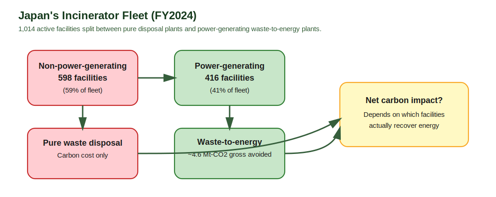
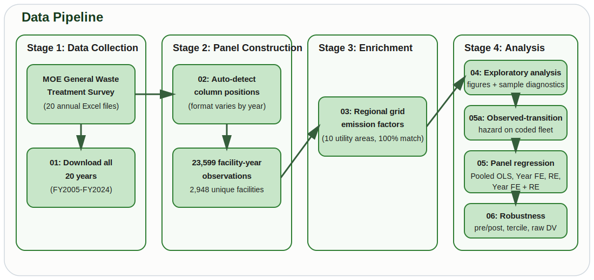
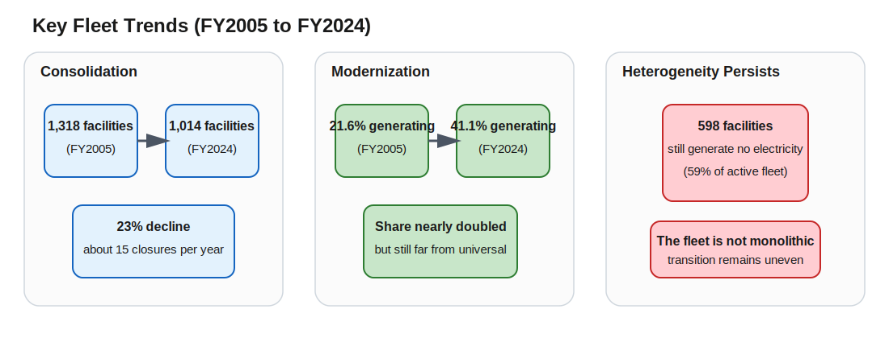

# Carbon Lock-in or Circular Transition?

**Heterogeneity in Japan's Waste Incineration Fleet and Net-Zero Compatibility**

**Author:** Pann Phetra | **Supervisor:** Prof. Han Ji | **Institution:** Ritsumeikan Asia Pacific University | **Degree:** Bachelor's Thesis, Sustainability | **Year:** 2026

> **One-sentence summary:** Japan operates ~1,000 waste incinerators — the most of any country — but 59% generate no electricity at all. This thesis separates two questions: which coded facilities first observed without generation make an observed transition into power generation, and conditional on power generation, which characteristics predict energy recovery efficiency; the evidence points to selective capital-side modernization on the extensive margin and bounded responsiveness within the generator sample on the intensive margin.

---

## The Finding in One Paragraph

Using a 20-year facility-level panel (23,599 observations across 2,948 facilities, FY2005–FY2024) from Japan's Ministry of the Environment General Waste Treatment Survey, this repo now estimates a two-part empirical design. On the extensive margin, the coded full-fleet panel yields an observed-transition risk set of 13,770 facility-years across 2,035 facilities, with 141 observed first-adoption events; the lagged adoption model uses 11,717 facility-years across 1,915 facilities and 140 events, and the main lagged logit hazard shows that facilities older than 10 years in the prior observed year are 1.1–1.8 percentage points less likely to transition into power generation while each additional 100 t/day of prior-year capacity raises transition probability by about 0.50 percentage points. A conservative pathway audit of the 141 observed transitions classifies 82 as reset/rebuild-like, 38 as continuity/in-place-upgrade-like, 20 as forward-dated or placeholder entries, and 1 as unresolved. On the intensive margin, the canonical generator-efficiency frame contains 5,683 facility-years across 1,016 facilities; across the four main specifications, facility age is consistently negative (−0.019 to −0.035 log-units/year), design capacity is positive (+0.041 to +0.103 log-units per 100 t/day), and capacity utilization is strongly positive (+0.541 to +0.779, all p < 0.001). Within-facility efficiency changes much less than efficiency differs across generators: the pooled within/total variance ratio in the canonical frame is 0.1499, falling from 0.1795 in FY2005–FY2011 to 0.0956 in FY2012–FY2024. Taken together, the results imply that sectoral progress depends heavily on capital-side modernization decisions, while operating-side gains remain meaningful but bounded within the already-generating segment.

---

## What This Thesis Is About

Japan incinerates roughly 80% of its municipal waste. The government calls energy recovery from burning waste "thermal recycling." But Japan's ~1,000 incinerators are not all the same:



Some are 40-year-old furnaces that simply burn waste. Others are modern waste-to-energy plants generating electricity that displaces fossil fuels on the grid. **The existing literature treats them as one system. This thesis disaggregates.**

---

## The Research Question

**What predicts observed transition into power generation among coded facilities first seen without it, and conditional on power generation, what predicts energy recovery efficiency among power-generating incinerators?**

---

## Data Pipeline



---

## Key Fleet Trends (FY2005 → FY2024)



---

## Methodology at a Glance

| Choice | What | Why |
|:-------|:-----|:----|
| **Empirical architecture** | Two-part design: observed first-transition hazard on coded, initially non-generating facilities, then generator-only efficiency regressions | Separates transition into generation from conditional generator performance instead of asking one selected sample to carry both claims. |
| **Adoption risk set** | 13,770 facility-years (2,035 facilities; 141 events) | Facilities first observed without power generation remain at risk until first observed adoption or exit; left-censored first-year generators are excluded from the hazard. |
| **Adoption model frame** | 11,717 facility-years (1,915 facilities; 140 events) | The hazard uses prior-year age band and prior-year capacity, so the first observed at-risk year for each facility is not estimable. |
| **Generator regression sample** | 5,683 facility-years (1,016 facilities) | Canonical frame: power-generation rows with positive throughput and positive output, official facility code present, complete model covariates, utilization capped at 1.0, and efficiency winsorized to [0.01, 0.80] MWh/t. |
| **Extensive-margin DV** | `adopt_power_this_year` | Observed first transition into power generation in the coded, initially non-generating risk set. |
| **Intensive-margin DV** | `log(energy_efficiency_mwh_per_t)` | Log transformation produces symmetric distribution and coefficients interpretable as proportional effects among generators. |
| **Main regressors** | Adoption: prior-year age bands + prior-year capacity + year FE + prefecture FE. Efficiency: facility age, design capacity, capacity utilization, heating value, grid emission factor | The extensive-margin model uses lagged predictors to avoid same-year redesign timing and reports average marginal effects from a discrete-time hazard. |
| **Robustness** | 8 generator-efficiency specifications: pre/post-Fukushima split (R1–R4), capacity tercile endpoints (R5–R6), raw DV pooled/year-FE replications (R7–R8) | Tests stability across sample splits, distributional assumptions, and variable transformations. |
| **Standard errors** | Cluster-robust, clustered at facility | Accounts for within-facility autocorrelation of errors across years. |

---

## Headline Numbers

| Metric | Value |
|:-------|:------|
| Panel observations | 23,599 facility-years |
| Unique facilities | 2,948 |
| Coded full-fleet frame | 19,827 facility-years (2,948 facilities) |
| Adoption risk set | 13,770 facility-years (2,035 facilities) |
| Adoption model frame | 11,717 facility-years (1,915 facilities) |
| Observed first-adoption events | 141 |
| Adoption age effect | −1.76 to −1.13 percentage points vs prior-year age 0–10 |
| Adoption capacity effect | +0.50 percentage points per 100 t/day of prior-year capacity |
| Pathway audit of adoption events | 82 reset/rebuild-like, 38 continuity-like, 20 forward-dated/placeholder, 1 unresolved |
| Generator regression sample | 5,683 facility-years (1,016 facilities) |
| Time coverage | FY2005 – FY2024 (20 years) |
| Facility age coefficient | −0.019 to −0.035 per year in the four main specifications |
| Design capacity coefficient | +0.041 to +0.103 log-units per 100 t/day in the four main specifications |
| Capacity utilization coefficient | +0.541 to +0.779 in the four main specifications |
| Within/total variance ratio | 0.1499 (pooled), 0.1795 (pre-Fuku), 0.0956 (post-Fuku) |
| FY2024 gross avoided CO₂ | ~4.6 Mt-CO₂ (upper bound, excludes process emissions) |
| FY2024 share non-power-generating | 59% |

---

## Jargon Glossary

| Term | Plain English |
|:-----|:-------------|
| **Waste-to-energy (WtE)** | Burning waste to generate electricity or heat. Japan calls this "thermal recycling." |
| **Energy recovery efficiency** | How much electricity a facility generates per tonne of waste it burns. Higher = better at extracting useful energy. |
| **Pooled OLS** | Ordinary least squares regression that ignores the panel structure — every observation is treated as independent. Used here as the primary estimator because within-facility variance is small. |
| **Random Effects (RE)** | A panel regression method that treats unobserved facility characteristics as random draws from a distribution. Uses both within and between variation. |
| **Panel data** | Tracking the same units (facilities) across multiple time periods. Ours: 2,948 facilities × up to 20 years. |
| **Within/between variance ratio** | The share of variation in the dependent variable that comes from changes within each facility over time, versus differences between facilities. In the canonical regression frame the pooled within/total ratio is 0.1499, meaning most variation still comes from differences between facilities. |
| **Grid emission factor** | How much CO₂ is produced per kWh of electricity on the regional grid. If the grid is dirty (coal-heavy), displacing grid electricity with waste-to-energy saves more carbon. |
| **Capacity utilization** | What fraction of a facility's design capacity it actually uses. A 300 t/day plant processing 200 t/day has 67% utilization. |
| **Fleet heterogeneity** | The fact that Japan's incinerators are not all the same — they vary in age, size, technology, and energy recovery capability. |
| **Material metabolism** | An industrial ecology concept: how materials flow through a system (city, industry, country). Waste infrastructure is part of a city's "metabolism." |
| **Infrastructure lock-in** | Once you build a 30-year incinerator, you're committed to burning waste for 30 years, regardless of whether better options emerge. |

---

## Data Sources

| Source | What it contains | Coverage | Link |
|:-------|:----------------|:---------|:-----|
| **Japan MOE General Waste Treatment Survey** | Facility-level incinerator data: capacity, throughput, power generation, efficiency, age, waste composition | FY2005–FY2024, ~1,000 facilities/year | [env.go.jp](https://www.env.go.jp/recycle/waste_tech/ippan/) |
| **Regional grid emission factors** | kg-CO₂/kWh by utility area and year | FY2005–FY2024, 10 regional utilities | Hardcoded from METI/utility publications with linear interpolation between anchor years |

---

## Repository Structure

```
incineration-thesis/
|
|-- code/
|   |-- scripts/
|   |   |-- 00_probe_estat_facility_data.py  # Initial data availability test
|   |   |-- 01_download_facility_data.py     # Download 20 years of Excel files
|   |   |-- 02_parse_facility_panel.py       # Auto-detect parser -> panel CSV
|   |   |-- 03_grid_emission_factors.py      # Regional grid factors + crosswalk
|   |   |-- 04_eda_facility.py               # Exploratory analysis + figures
|   |   |-- 05a_power_adoption.py           # Observed first-adoption hazard on coded fleet
|   |   |-- 05_panel_regression.py           # Generator-efficiency frame + 4 main models
|   |   |-- 06_robustness.py                 # 8 robustness specifications
|   |   |-- 07_rebuild_analysis.py           # One-command rebuild + repo-level claim verification
|   |   |-- 08_verify_claims.py              # Checks thesis-facing claims against canonical outputs
|   |   |-- 09_export_defense_slides.py      # Reproducible HTML/PDF defense-deck export
|   |   |-- 10_package_defense_bundle.py     # Frozen local defense bundle
|   |   |-- 11_package_review_packets.py     # Frozen supervisor/submission packets
|   |   |-- 12_freeze_checkpoint.py          # Freeze a sendable milestone with packet hashes
|   |   |-- 13_start_review_round.py         # Start a dated supervisor-feedback intake workspace
|   |   |-- 14_generate_checkpoint_delta.py  # Summarize changes since the last frozen checkpoint
|   |   +-- panel_utils.py                   # Shared sample-construction and manifest helpers
|   +-- notebooks/                           # Jupyter exploration
|
|-- data/
|   |-- README.md                            # Provenance, licensing, schema
|   |-- raw/
|   |   +-- facility_annual/                 # 20 MOE Excel files (FY2005-FY2024, published)
|   +-- processed/
|       |-- incineration_panel.csv           # Base panel (published, 23,599 rows)
|       |-- incineration_panel_enriched.csv  # With grid factors (published)
|       |-- grid_emission_factors.csv        # Regional factors by year
|       +-- prefecture_utility_crosswalk.csv # Prefecture -> utility mapping
|
|-- thesis/
|   |-- thesis.tex                           # Authoritative LaTeX source
|   |-- figures/                             # EDA figures used in thesis
|   |-- 00-abstract.md                       # (SUPERSEDED - draft)
|   |-- 01-introduction.md                   # (SUPERSEDED - draft)
|   |-- ...                                  # (SUPERSEDED - drafts)
|   +-- 06-conclusion.md                     # (SUPERSEDED - draft)
|
|-- output/                                  # Generated figures, tables, sample report, manifests
|-- .github/
|   +-- workflows/
|       +-- verify.yml                       # CI backstop for rebuild, verification, and packet smoke checks
|-- research/
|   |-- literature/                          # Paper summaries
|   |-- notes/                               # Panel protocol, supervisor brief, defense notes, verification reports
|   |-- packets/                             # Curated supervisor/submission packet workflow
|   |-- review-rounds/                       # Local feedback-intake workspaces for supervisor/reviewer rounds
|   +-- checkpoints/                         # Local sendable-milestone freezing workflow
|
|-- ARCHITECTURE.md                          # Technical blueprint
|-- AGENTS.md                                # Assistant-agnostic repo workflow
|-- CLAUDE.md                                # Thin compatibility wrapper
|-- .node-version                            # Pinned Node runtime for slide/deck tooling
|-- package.json                             # Local slide-export tooling (Marp CLI)
+-- requirements.txt                         # Python dependencies
```

**Note on the markdown chapter files:** These were the original authoring drafts. The authoritative version of every chapter now lives in `thesis/thesis.tex`, which has been through two rounds of expert-panel review and factual correction since the Markdown files were last touched. The Markdown files carry a `SUPERSEDED` header comment at the top.

---

## How to Reproduce

```bash
# 1. Clone and install
git clone https://github.com/Pann13223029/incineration-thesis.git
cd incineration-thesis
python3 -m venv .venv
.venv/bin/pip install -r requirements.txt
npm install

# 2. Optional: download raw data (requires internet)
.venv/bin/python code/scripts/01_download_facility_data.py

# 3. Rebuild all thesis-facing analysis artifacts from the checked-in raw files
.venv/bin/python code/scripts/07_rebuild_analysis.py

# 4. Optional: rerun only the repo-level claim/evidence verifier
.venv/bin/python code/scripts/08_verify_claims.py

# 5. Optional: export the defense deck to local presentation artifacts
npm run slides:export

# 6. Optional: also export a PDF deck if Chrome/Edge is available locally
npm run slides:export:pdf

# 7. Optional: package a frozen local defense bundle
npm run slides:bundle

# 8. Optional: build frozen supervisor and submission packets
npm run packets:build

# 9. Optional: freeze a sendable checkpoint from the current verified state
npm run checkpoint:freeze

# 10. Optional: start a structured supervisor-feedback round
npm run review:round:start
```

The canonical sample definition is written to `output/sample_definition.md`, the extensive-margin results to `output/adoption_results.md`, the event-level pathway audit to `output/adoption_pathway_audit.csv`, the repo-level sync report to `output/claim_verification.md`, the claim-to-evidence bridge to `output/claim_evidence_map.md`, the packet delta note is generated locally at `output/checkpoint_delta.md` during packet builds, each stage writes a JSON provenance record under `output/manifests/`, the defense deck tooling writes local artifacts under `research/slides/dist/`, the review-packet workflow writes frozen supervisor/submission packets under `research/packets/dist/`, the checkpoint freezer writes auditable local milestones under `research/checkpoints/dist/`, and the review-round workflow writes dated supervisor-feedback workspaces under `research/review-rounds/dist/`.

For any real supervisor or submission checkpoint, the default operating mode is: run `npm run packets:build`, review the frozen packet outputs, and only then freeze a sendable milestone with `npm run checkpoint:freeze`. Loose PDFs are for drafting, not for reference baselines. After a freeze, the newest baseline is always available at the stable local alias `research/checkpoints/latest-sendable/`.

To compile the thesis PDF: upload `thesis/thesis.tex` and the `thesis/figures/` directory to Overleaf (or run `pdflatex thesis.tex` locally with natbib, booktabs, tabularx, and graphicx installed).

---

## Current Status

| Phase | Status |
|:------|:------:|
| Data investigation | Done |
| Data download (20 years) | Done |
| Panel construction | Done |
| Grid emission factors | Done |
| Exploratory analysis | Done |
| Power-adoption model | Done |
| Panel regression | Done |
| Robustness checks | Done |
| All 7 chapters drafted | Done |
| LaTeX conversion | Done |
| Reference verification (26 refs, 0 fabricated) | Done |
| Expert panel review (3 attack rounds + holistic grade + A-push) | Done |
| Ready for supervisor review | **Yes** |

---

## Related Work

This is the author's second thesis. The first thesis analyzed municipal waste *generation* across the same ~1,700 Japanese municipalities:

> Phetra, P. (2026). *Path Dependence, the Recycling Paradox, and the Limits of Machine Learning in Japanese Municipal Waste Generation.* Bachelor's Thesis, Ritsumeikan Asia Pacific University. [GitHub](https://github.com/Pann13223029/pann-apu-thesis-resources)

The first thesis found that waste *generation* is structurally locked in (lag-1 R² = 0.916). This second thesis examines the *infrastructure* that creates a parallel lock-in on the *disposal* side: the incinerators themselves. Taken together, the two theses argue that Japan's waste system is locked in on both ends — what goes in and how it is processed — which has direct implications for the country's 2050 net-zero trajectory.

---

## Acknowledgments

Prof. Han Ji (supervisor), Ritsumeikan Asia Pacific University, College of Sustainability and Tourism. Japan's Ministry of the Environment for maintaining publicly accessible facility-level waste infrastructure data.

---

*Built with [Claude Code](https://claude.ai/code)*
