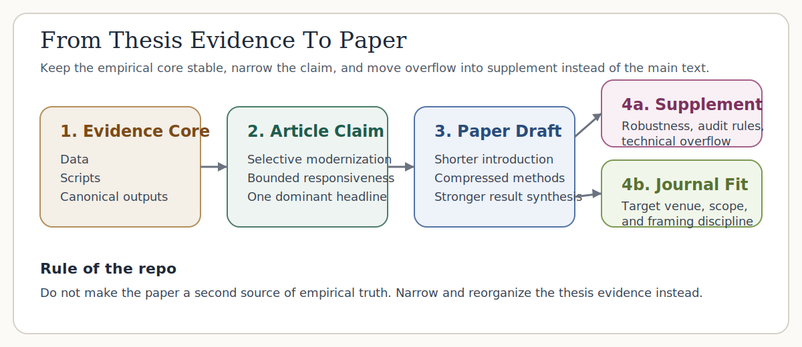
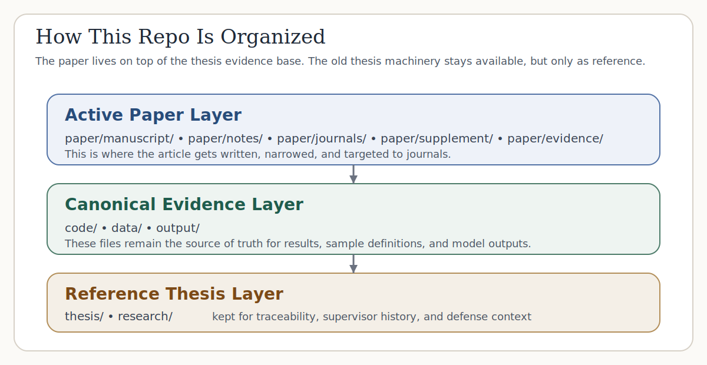

# From Thesis To Paper

This repository is a **paper-focused derivative workspace** cloned from the defended thesis repo on Japan's waste-incineration fleet.

The goal here is different from the original thesis repo:

- keep the **empirical core** intact
- preserve the full thesis as a **reference baseline**
- make the **active writing target** a journal-style paper
- separate **paper drafting** from supervisor packets, viva prep, and thesis operations

> **One-sentence aim:** turn a defense-ready bachelor's thesis into a tighter article built around one dominant claim: **selective modernization on the adoption margin and bounded responsiveness on the efficiency margin**.

---

## What Is Active Here

The active paper workspace lives under [`paper/`](paper/).

- active manuscript draft: [`paper/manuscript/paper.md`](paper/manuscript/paper.md)
- article claim stack: [`paper/notes/claim-stack.md`](paper/notes/claim-stack.md)
- thesis-to-paper conversion map: [`paper/notes/thesis-to-paper-map.md`](paper/notes/thesis-to-paper-map.md)
- target journals: [`paper/journals/target-journals.md`](paper/journals/target-journals.md)
- supplement plan: [`paper/supplement/supplement-outline.md`](paper/supplement/supplement-outline.md)

The **canonical evidence base** still lives in:

- [`code/`](code/)
- [`data/`](data/)
- [`output/`](output/)

The original thesis and its delivery machinery are retained as **reference material**, not the active writing target:

- thesis source: [`thesis/`](thesis/)
- legacy thesis ops and defense materials: [`research/`](research/)

---

## The Working Logic

The thesis repo answered a big question.
This repo narrows that work into a paper pipeline.



The workflow is:

`thesis evidence core -> article claim -> paper manuscript -> supplement -> journal targeting`

That means this repo is **not** trying to keep the whole thesis alive as the main product. It is trying to extract one strong paper from it.

---

## What Stays Canonical

Even in a paper repo, not everything becomes negotiable.

## Current Empirical Snapshot

The current evidence base covers 23,599 observations across 2,948 facilities.
The adoption risk set contains 13,770 facility-years across 2,035 facilities,
with 141 observed first-adoption events; the lagged adoption model uses 11,717
facility-years across 1,915 facilities and 140 events. Relative to prior-year
age 0–10, older facilities are 1.1–1.8 percentage points less likely to record
observed transition into generation, while prior-year capacity adds +0.50
percentage points per 100 t/day. The pathway audit classifies 82 as
reset/rebuild-like, 38 as continuity/in-place-upgrade-like, 20 as forward-dated
or placeholder entries, and 1 as unresolved. The canonical generator-efficiency
frame contains 5,683 facility-years across 1,016 facilities. Across the main
efficiency specifications, facility-age coefficients range from −0.019 to
−0.035, capacity from +0.041 to +0.103, and utilization from +0.541 to +0.779.
The within/total variance ratio is 0.1499, falling from 0.1795 in
FY2005–FY2011 to 0.0956 in FY2012–FY2024.

| Headline | Current value |
|:--|:--|
| Adoption age effect | −1.76 to −1.13 percentage points vs prior-year age 0–10 |
| Adoption capacity effect | +0.50 percentage points per 100 t/day of prior-year capacity |
| Pathway audit of adoption events | 82 reset/rebuild-like, 38 continuity-like, 20 forward-dated/placeholder, 1 unresolved |
| Within/total variance ratio | 0.1499 (pooled), 0.1795 (pre-Fuku), 0.0956 (post-Fuku) |

Verifier-aligned current facts:

- Adoption risk set: 13,770 facility-years across 2,035 facilities, with 141 observed first-adoption events
- Lagged adoption model: 11,717 facility-years across 1,915 facilities and 140 events
- Pathway audit: 82 as reset/rebuild-like, 38 as continuity/in-place-upgrade-like, 20 as forward-dated or placeholder entries, and 1 as unresolved
- Main efficiency age range: −0.019 to −0.035
- Variance structure: 0.1499, falling from 0.1795 in FY2005–FY2011 to 0.0956 in FY2012–FY2024

### Canonical evidence

These remain the source of truth for current results:

- [`output/sample_definition.md`](output/sample_definition.md)
- [`output/adoption_results.md`](output/adoption_results.md)
- [`output/regression_results.md`](output/regression_results.md)
- [`output/robustness_results.md`](output/robustness_results.md)
- [`output/data_quality_sensitivity.md`](output/data_quality_sensitivity.md)
- [`output/claim_evidence_map.md`](output/claim_evidence_map.md)
- [`output/claim_verification.md`](output/claim_verification.md)

### Reference baseline

These remain the archival record of what the thesis actually defended:

- [`thesis/thesis.tex`](thesis/thesis.tex)
- [`research/`](research/)

### Active paper draft

This is where the article should now evolve:

- [`paper/manuscript/paper.md`](paper/manuscript/paper.md)

---

## Repo Layers



The repo now has three practical layers:

1. **Evidence core**
   Data, scripts, outputs, and verification.

2. **Active paper layer**
   The manuscript, claim stack, supplement plan, and journal strategy.

3. **Reference thesis layer**
   The original thesis source and supervision/defense artifacts kept for backward traceability.

---

## Where To Start

If you want the paper project in the shortest path:

1. Read [`paper/manuscript/paper.md`](paper/manuscript/paper.md).
2. Read [`paper/notes/claim-stack.md`](paper/notes/claim-stack.md).
3. Read [`paper/notes/thesis-to-paper-map.md`](paper/notes/thesis-to-paper-map.md).
4. Use the synced evidence snapshot under [`paper/evidence/`](paper/evidence/) for article drafting support.

If you need the defended thesis context:

- [`thesis/thesis.tex`](thesis/thesis.tex)
- [`output/claim_evidence_map.md`](output/claim_evidence_map.md)

---

## Paper Commands

This repo now adds paper-first commands.

```bash
npm run paper:check
npm run paper:sync
```

What they do:

- `paper:check` verifies the core output artifacts needed by the paper workspace exist
- `paper:sync` copies the current canonical output artifacts into `paper/evidence/current/` and refreshes the evidence index

The old thesis-support commands are still available, but are explicitly marked as legacy:

- `npm run legacy:slides:export`
- `npm run legacy:slides:export:pdf`
- `npm run legacy:slides:bundle`
- `npm run legacy:packets:build`
- `npm run legacy:supervisor:ready`
- `npm run legacy:checkpoint:freeze`
- `npm run legacy:review:round:start`

---

## Recommended Paper Direction

The highest-leverage single-paper direction remains:

**Selective modernization and bounded responsiveness in Japan's waste-incineration fleet**

That implies:

- one dominant headline
- one named frame
- lighter literature review in the main text
- compressed methods in the article body
- a stronger supplement instead of a longer narrative

This repo is structured around that path.

---

## Repository Structure

```text
incineration-paper/
|
|-- paper/
|   |-- manuscript/                    # active paper draft
|   |-- notes/                         # claim stack, conversion map, rewrite logic
|   |-- journals/                      # target-journal strategy
|   |-- supplement/                    # supplement planning
|   |-- evidence/                      # synced paper-facing snapshots of canonical outputs
|   |-- figures/
|   +-- tables/
|
|-- code/                              # empirical pipeline retained from thesis repo
|-- data/                              # source and processed data
|-- output/                            # canonical generated artifacts
|-- thesis/                            # reference thesis source
|-- research/                          # legacy thesis review / defense / packet artifacts
|-- docs/figures/                      # README-facing diagrams
|
|-- README.md
|-- ARCHITECTURE.md
|-- AGENTS.md
|-- package.json
|-- requirements.txt
```

---

## Safety Note

This repo was cloned from the thesis workspace, but it is now intended to diverge.

- the active Git remote has been renamed to `thesis-origin`
- do **not** push this repo back to the thesis remote
- if you want to publish this as its own repository later, add a new `origin`

---

## Status

This repo is ready for:

- paper framing work
- article rewriting
- supplement planning
- journal targeting

It is **not** intended to replace the thesis repo as the source of defended truth. It is the next-stage paper lab built from that truth.
