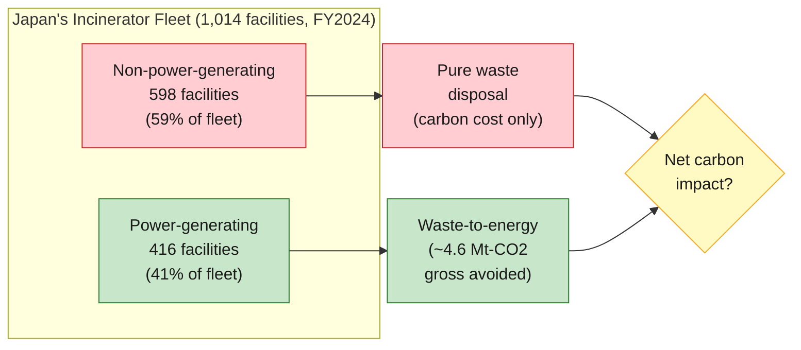
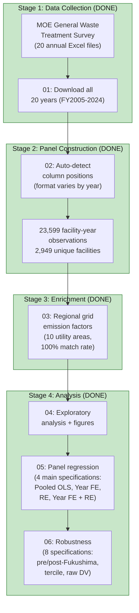
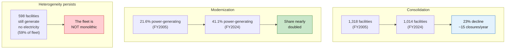

# Carbon Lock-in or Circular Transition?

**Heterogeneity in Japan's Waste Incineration Fleet and Net-Zero Compatibility**

**Author:** Pann Phetra | **Supervisor:** Prof. Han Ji | **Institution:** Ritsumeikan Asia Pacific University | **Degree:** Bachelor's Thesis, Sustainability | **Year:** 2026

> **One-sentence summary:** Japan operates ~1,000 waste incinerators — the most of any country — but 59% generate no electricity at all. This thesis asks which facility characteristics predict energy recovery efficiency, finds that within-facility efficiency is nearly fixed over time (87% of variation is between facilities, not within them), and argues that this is strongly consistent with infrastructure lock-in and that Japan's net-zero trajectory in the waste sector therefore depends on replacing old facilities rather than optimising them.

---

## The Finding in One Paragraph

Using a 20-year facility-level panel (23,599 observations across 2,949 facilities, FY2005–FY2024) from Japan's Ministry of the Environment General Waste Treatment Survey, this thesis identifies three robust determinants of energy recovery efficiency among power-generating incinerators: facility age (−2.8% to −4.3% per year, p < 0.001), design capacity (+0.08 to +0.10 log-units per 100 t/day, p < 0.001), and capacity utilization (+0.58 to +0.62, p < 0.001). The single most consequential finding, however, is not a regression coefficient: it is that within-facility efficiency is nearly fixed over time. Only about 13% of efficiency variation is within facilities; the remaining 87% is between them, and this ratio is stable across the pre- and post-Fukushima subsamples despite the large shock to electricity prices and policy incentives. This is the empirical signature of infrastructure lock-in as defined by Seto et al. (2016): facility-level performance responds to incentives only within a narrow envelope set by the original design. The policy implication is direct: fleet-wide improvement passes through construction and retirement decisions, not through operational intervention at already-built facilities.

---

## What This Thesis Is About

Japan incinerates roughly 80% of its municipal waste. The government calls energy recovery from burning waste "thermal recycling." But Japan's ~1,000 incinerators are not all the same:



Some are 40-year-old furnaces that simply burn waste. Others are modern waste-to-energy plants generating electricity that displaces fossil fuels on the grid. **The existing literature treats them as one system. This thesis disaggregates.**

---

## The Research Question

**What facility characteristics predict energy recovery efficiency among Japan's power-generating incinerators, and how has this changed as the fleet modernizes?**

---

## Data Pipeline



---

## Key Fleet Trends (FY2005 → FY2024)



---

## Methodology at a Glance

| Choice | What | Why |
|:-------|:-----|:----|
| **Primary estimator** | Pooled OLS + Random Effects (RE) | The within-to-total variance ratio is only ~0.13, so facility FE would discard 87% of the dependent-variable variation and yield imprecise estimates. Age is also nearly collinear with year FE in a two-way FE specification. |
| **Regression sample** | 6,575 facility-years (power-generating, winsorised) | Efficiency measure requires positive electricity output; winsorising at [0.01, 0.80] MWh/t removes reporting errors. |
| **Dependent variable** | log(energy_efficiency_mwh_per_t) | Log transformation produces symmetric distribution and coefficients interpretable as proportional effects. |
| **Main regressors** | Facility age, design capacity (per 100 t/day), capacity utilization, heating value, grid emission factor | Theoretical priors from industrial-ecology / lock-in literature. |
| **Robustness** | 8 specifications: pre/post-Fukushima split (R1–R4), capacity tercile endpoints (R5–R6), raw DV (R7–R8) | Tests stability across sample splits, distributional assumptions, and variable transformations. |
| **Standard errors** | Cluster-robust, clustered at facility | Accounts for within-facility autocorrelation of errors across years. |

---

## Headline Numbers

| Metric | Value |
|:-------|:------|
| Panel observations | 23,599 facility-years |
| Unique facilities | 2,949 |
| Regression sample | 6,575 facility-years (947 facilities) |
| Time coverage | FY2005 – FY2024 (20 years) |
| Facility age coefficient | −0.028 to −0.043 per year (p < 0.001) |
| Design capacity coefficient | +0.08 to +0.10 log-units per 100 t/day |
| Capacity utilization coefficient | +0.58 to +0.62 |
| Within/total variance ratio | 0.13 (pooled), 0.10 (pre-Fuku), 0.07 (post-Fuku) |
| FY2024 gross avoided CO₂ | ~4.6 Mt-CO₂ (upper bound, excludes process emissions) |
| FY2024 share non-power-generating | 59% |

---

## Jargon Glossary

| Term | Plain English |
|:-----|:-------------|
| **Waste-to-energy (WtE)** | Burning waste to generate electricity or heat. Japan calls this "thermal recycling." |
| **Energy recovery efficiency** | How much electricity a facility generates per tonne of waste it burns. Higher = better at extracting useful energy. |
| **Pooled OLS** | Ordinary least squares regression that ignores the panel structure — every observation is treated as independent. Used here as the primary estimator because within-facility variance is small. |
| **Random Effects (RE)** | A panel regression method that treats unobserved facility characteristics as random draws from a distribution. Uses both within and between variation. |
| **Panel data** | Tracking the same units (facilities) across multiple time periods. Ours: 2,949 facilities × up to 20 years. |
| **Within/between variance ratio** | The share of variation in the dependent variable that comes from changes within each facility over time, versus differences between facilities. A ratio of 0.13 means 87% of variation is between facilities — facilities differ from each other much more than they change over time. |
| **Grid emission factor** | How much CO₂ is produced per kWh of electricity on the regional grid. If the grid is dirty (coal-heavy), displacing grid electricity with waste-to-energy saves more carbon. |
| **Capacity utilization** | What fraction of a facility's design capacity it actually uses. A 300 t/day plant processing 200 t/day has 67% utilization. |
| **Fleet heterogeneity** | The fact that Japan's incinerators are not all the same — they vary in age, size, technology, and energy recovery capability. |
| **Material metabolism** | An industrial ecology concept: how materials flow through a system (city, industry, country). Waste infrastructure is part of a city's "metabolism." |
| **Infrastructure lock-in** | Once you build a 30-year incinerator, you're committed to burning waste for 30 years, regardless of whether better options emerge. |

---

## Data Sources

| Source | What it contains | Coverage | Link |
|:-------|:----------------|:---------|:-----|
| **Japan MOE General Waste Treatment Survey** | Facility-level incinerator data: capacity, throughput, power generation, efficiency, age, waste composition | FY2005–FY2024, ~1,000 facilities/year | [env.go.jp](https://www.env.go.jp/recycle/waste_tech/ippan/) |
| **Regional grid emission factors** | kg-CO₂/kWh by utility area and year | FY2005–FY2024, 10 regional utilities | Hardcoded from METI/utility publications with linear interpolation between anchor years |

---

## Repository Structure

```
incineration-thesis/
|
|-- code/
|   |-- scripts/
|   |   |-- 00_probe_estat_facility_data.py  # Initial data availability test
|   |   |-- 01_download_facility_data.py     # Download 20 years of Excel files
|   |   |-- 02_parse_facility_panel.py       # Auto-detect parser -> panel CSV
|   |   |-- 03_grid_emission_factors.py      # Regional grid factors + crosswalk
|   |   |-- 04_eda_facility.py               # Exploratory analysis + figures
|   |   |-- 05_panel_regression.py           # Pooled OLS, Year FE, RE models
|   |   +-- 06_robustness.py                 # 8 robustness specifications
|   +-- notebooks/                           # Jupyter exploration
|
|-- data/
|   |-- README.md                            # Provenance, licensing, schema
|   |-- raw/
|   |   +-- facility_annual/                 # 20 MOE Excel files (FY2005-FY2024, published)
|   +-- processed/
|       |-- incineration_panel.csv           # Base panel (published, 23,599 rows)
|       |-- incineration_panel_enriched.csv  # With grid factors (published)
|       |-- grid_emission_factors.csv        # Regional factors by year
|       +-- prefecture_utility_crosswalk.csv # Prefecture -> utility mapping
|
|-- thesis/
|   |-- thesis.tex                           # Authoritative LaTeX source
|   |-- figures/                             # EDA figures used in thesis
|   |-- 00-abstract.md                       # (SUPERSEDED - draft)
|   |-- 01-introduction.md                   # (SUPERSEDED - draft)
|   |-- ...                                  # (SUPERSEDED - drafts)
|   +-- 06-conclusion.md                     # (SUPERSEDED - draft)
|
|-- output/                                  # Generated figures and tables
|-- research/
|   |-- literature/                          # Paper summaries
|   +-- notes/                               # Expert panel transcripts, verification reports
|
|-- ARCHITECTURE.md                          # Technical blueprint
|-- CLAUDE.md                                # AI-assisted research protocol
+-- requirements.txt                         # Python dependencies
```

**Note on the markdown chapter files:** These were the original authoring drafts. The authoritative version of every chapter now lives in `thesis/thesis.tex`, which has been through two rounds of expert-panel review and factual correction since the Markdown files were last touched. The Markdown files carry a `SUPERSEDED` header comment at the top.

---

## How to Reproduce

```bash
# 1. Clone and install
git clone https://github.com/Pann13223029/incineration-thesis.git
cd incineration-thesis
pip install -r requirements.txt

# 2. Download raw data (requires internet)
python code/scripts/01_download_facility_data.py

# 3. Build the panel dataset
python code/scripts/02_parse_facility_panel.py

# 4. Enrich with grid emission factors
python code/scripts/03_grid_emission_factors.py

# 5. Exploratory analysis
python code/scripts/04_eda_facility.py

# 6. Panel regression (four main specifications)
python code/scripts/05_panel_regression.py

# 7. Robustness checks (eight specifications)
python code/scripts/06_robustness.py
```

To compile the thesis PDF: upload `thesis/thesis.tex` and the `thesis/figures/` directory to Overleaf (or run `pdflatex thesis.tex` locally with natbib, booktabs, tabularx, and graphicx installed).

---

## Current Status

| Phase | Status |
|:------|:------:|
| Data investigation | Done |
| Data download (20 years) | Done |
| Panel construction | Done |
| Grid emission factors | Done |
| Exploratory analysis | Done |
| Panel regression | Done |
| Robustness checks | Done |
| All 7 chapters drafted | Done |
| LaTeX conversion | Done |
| Reference verification (26 refs, 0 fabricated) | Done |
| Expert panel review (3 attack rounds + holistic grade + A-push) | Done |
| Ready for supervisor review | **Yes** |

---

## Related Work

This is the author's second thesis. The first thesis analyzed municipal waste *generation* across the same ~1,700 Japanese municipalities:

> Phetra, P. (2026). *Path Dependence, the Recycling Paradox, and the Limits of Machine Learning in Japanese Municipal Waste Generation.* Bachelor's Thesis, Ritsumeikan Asia Pacific University. [GitHub](https://github.com/Pann13223029/pann-apu-thesis-resources)

The first thesis found that waste *generation* is structurally locked in (lag-1 R² = 0.916). This second thesis examines the *infrastructure* that creates a parallel lock-in on the *disposal* side: the incinerators themselves. Taken together, the two theses argue that Japan's waste system is locked in on both ends — what goes in and how it is processed — which has direct implications for the country's 2050 net-zero trajectory.

---

## Acknowledgments

Prof. Han Ji (supervisor), Ritsumeikan Asia Pacific University, College of Sustainability and Tourism. Japan's Ministry of the Environment for maintaining publicly accessible facility-level waste infrastructure data.

---

*Built with [Claude Code](https://claude.ai/code)*
