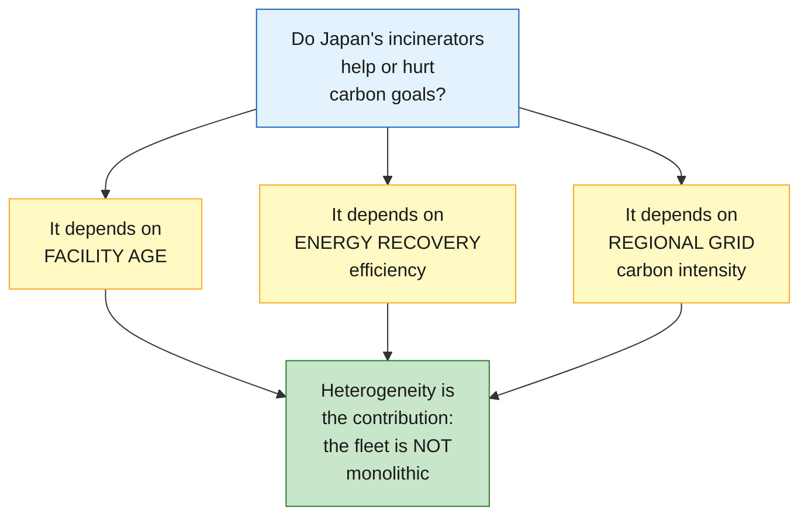

# Carbon Lock-in or Circular Transition?

**Heterogeneity in Japan's Waste Incineration Fleet and Net-Zero Compatibility**

**Author:** Pann Phetra | **Supervisor:** Prof. Han Ji | **Institution:** Ritsumeikan Asia Pacific University

> **Status:** Data investigation phase. Determining whether facility-level incinerator data is accessible before committing to methodology.

---

## The Question

Japan operates ~1,004 waste incinerators — the most of any country. The government calls energy recovery from burning waste "thermal recycling." But these facilities vary enormously: some are 40-year-old furnaces with no energy recovery; others are modern plants generating electricity. **Which ones help Japan's 2050 carbon goals, and which ones undermine them?**

---

## What We're Investigating



---

## Current Phase: Data Investigation

Before committing to methodology, we need to verify data availability:

| Data Source | What we need | Status |
|:-----------|:-------------|:------:|
| MOE General Waste Survey (e-Stat) | Facility-level incinerator data | Testing |
| NIES Visualization Tool | Power generation, operational rates by facility | To verify |
| MOE Carbon Inventory | Prefecture-level waste CO2 | To locate |
| Regional grid emission factors | By electric utility area | To locate |

**Decision rule:** If facility-level data is downloadable → facility-level panel. If not → prefecture-level panel (still a strong design).

---

## Repository Structure

```
incineration-thesis/
├── code/
│   ├── scripts/          # Numbered Python scripts
│   └── notebooks/        # Jupyter exploration
├── data/
│   ├── raw/              # Downloaded government data (gitignored)
│   └── processed/        # Cleaned datasets (gitignored)
├── output/               # Figures and result tables
├── research/
│   ├── literature/       # Paper summaries
│   └── notes/            # Expert panel transcripts
├── thesis/               # Chapter drafts
├── CLAUDE.md             # AI-assisted research protocol
└── requirements.txt      # Python dependencies
```

---

*Built with [Claude Code](https://claude.ai/code)*
