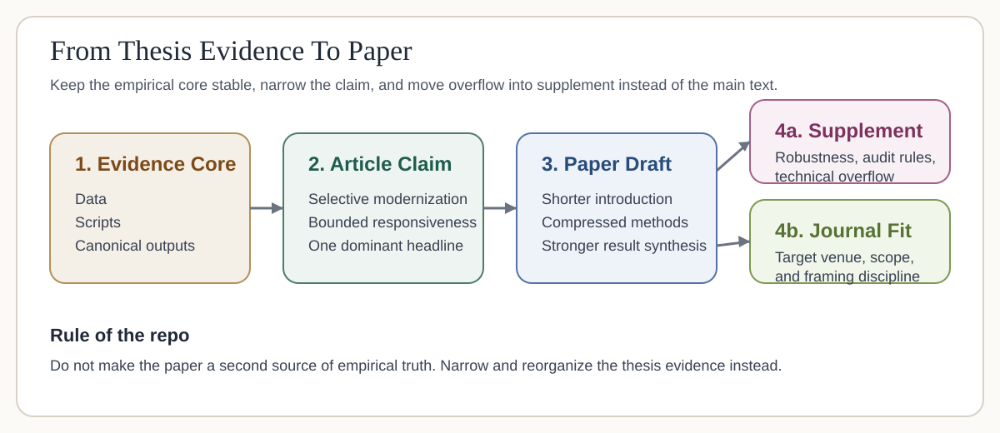

# Incineration Paper Workspace

This is a private, paper-focused derivative workspace for the Japan waste-incineration study. It preserves the empirical core from the thesis repo, but the active product here is a journal-style paper.

The paper's working claim is narrow:

> Japan's incineration-fleet transition is better read as two linked but distinct margins: selective first reporting of installed generation capacity and structured electricity-recovery performance among operating generators.

## Start Here

Use this order if you are new to the repo:

1. Read the active manuscript: [`paper/manuscript/paper.md`](paper/manuscript/paper.md).
2. Check the current status: [`paper/submission/current-status.md`](paper/submission/current-status.md).
3. Check the claim discipline: [`paper/notes/claim-stack.md`](paper/notes/claim-stack.md).
4. Check the evidence map: [`output/claim_evidence_map.md`](output/claim_evidence_map.md).
5. Open the current PDF with the [browser-compatible viewer](https://raw.githack.com/Pann13223029/incineration-paper/main/paper/share/waste-management-manuscript-latex.pdf).
6. If the browser viewer is unavailable, [download the PDF directly from GitHub](https://github.com/Pann13223029/incineration-paper/raw/refs/heads/main/paper/share/waste-management-manuscript-latex.pdf) or read the [Markdown manuscript](paper/manuscript/paper.md).

For architecture and workflow rules, read [`ARCHITECTURE.md`](ARCHITECTURE.md). For assistant-specific rules, read [`AGENTS.md`](AGENTS.md).

## Current Evidence Anchors

These facts are generated from the canonical pipeline and checked by `code/scripts/08_verify_claims.py`.

The current evidence base covers 23,599 observations across 2,948 facilities. The entry risk set contains 13,770 facility-years across 2,035 facilities, with 141 installed-capacity entry events. The exact one-fiscal-year lagged entry model uses 10,823 facility-years across 1,911 facilities and 98 retained events. Use these counts deliberately: 141 is the descriptive event universe, while 98 is the stricter exact-year hazard subset. Relative to prior-year age 0-10, older facilities are 1.2–1.9 percentage points less likely to report positive installed capacity, while prior-year capacity adds +0.45 percentage points per 100 t/day. The event is operationally meaningful but not identical to output: 135 of 141 entrants report positive output by the following year. Attrition is also explicit: 1,305 of 1,894 non-entrants (68.9%) are last observed before FY2024, which is treated as panel exit rather than verified closure. The pathway audit classifies 50 as reset/rebuild-like, 36 as continuity/in-place-upgrade-like, 12 as forward-dated or placeholder entries, 42 as timing-ambiguous non-adjacent coded-row events, and 1 as unresolved. The canonical generator performance frame contains 5,683 facility-years across 1,016 facilities. Across the main electricity-recovery specifications, facility-age coefficients range from −0.014 to −0.035, capacity from +0.034 to +0.105, and utilization from +0.543 to +0.776. The within/total variance ratio is 0.1499, falling from 0.1795 in FY2005–FY2009 to 0.0956 in FY2013–FY2024. The pooled within-year rank correlation across 4,368 exact adjacent-year pairs is 0.9325.

| Headline | Current value |
|:--|:--|
| Capacity-entry age effect | −1.94 to −1.24 percentage points vs prior-year age 0–10 |
| Capacity-entry scale effect | +0.45 percentage points per 100 t/day of prior-year capacity |
| Pathway audit of entry events | 50 reset/rebuild-like, 36 continuity-like, 12 forward-dated/placeholder, 42 timing-ambiguous, 1 unresolved |
| Within/total variance ratio | 0.1499 (pooled), 0.1795 (early coded), 0.0956 (later coded) |
| Adjacent-year rank persistence | 0.9325 across 4,368 exact pairs |

## Repository Logic



The repo has three layers:

| Layer | Role | Main paths |
|:--|:--|:--|
| Evidence core | Source data, processing, model outputs, and claim verification | [`data/`](data/), [`code/`](code/), [`output/`](output/) |
| Active paper layer | Manuscript, supplement, figures, submission assets, and paper-facing evidence snapshots | [`paper/`](paper/) |
| Reference thesis layer | Defended thesis source and legacy supervision/defense materials | [`thesis/`](thesis/), [`research/`](research/) |

Do not make the manuscript a second source of empirical truth. Paper prose stays downstream of `output/*`.

## Canonical Files

| Need | Use |
|:--|:--|
| Current sample counts and model facts | [`output/sample_definition.md`](output/sample_definition.md), [`output/adoption_results.md`](output/adoption_results.md), [`output/regression_results.md`](output/regression_results.md) |
| Robustness and data-quality checks | [`output/robustness_results.md`](output/robustness_results.md), [`output/data_quality_sensitivity.md`](output/data_quality_sensitivity.md), [`output/identifier_gap_audit.md`](output/identifier_gap_audit.md) |
| Claim synchronization status | [`output/claim_verification.md`](output/claim_verification.md) |
| Claim-to-evidence bridge | [`output/claim_evidence_map.md`](output/claim_evidence_map.md) |
| Active paper manuscript | [`paper/manuscript/paper.md`](paper/manuscript/paper.md), [`paper/manuscript/paper.tex`](paper/manuscript/paper.tex) |
| Current reading PDF | [Open in browser](https://raw.githack.com/Pann13223029/incineration-paper/main/paper/share/waste-management-manuscript-latex.pdf) · [Download from GitHub](https://github.com/Pann13223029/incineration-paper/raw/refs/heads/main/paper/share/waste-management-manuscript-latex.pdf) |

## Reproducible Setup

Expected local tools:

- Python matching [`.python-version`](.python-version)
- Node matching [`.node-version`](.node-version)
- Tectonic for LaTeX PDF builds
- Google Chrome only if you intentionally use browser PDF export

Recommended setup:

```bash
python3 -m venv .venv
.venv/bin/pip install -r requirements.txt
npm install
```

The GitHub workflow uses a virtual environment plus `npm ci`. Local package scripts call `.venv/bin/python`, so create the virtual environment before running `npm run ...` commands.

## Workflow Gates

Use the lightest workflow that matches the change.

| Change type | Required action |
|:--|:--|
| Prose-only paper edit | Edit `paper/manuscript/paper.md`; rebuild artifacts if you need updated share files. |
| Claim wording edit with current numbers | Run `npm run claims:verify`. |
| Evidence or model change | Run `npm run analysis:rebuild`, then `npm run paper:sync`, then `npm run claims:verify`. |
| Submission artifact refresh | Run `npm run paper:export:nopdf` for portable Markdown/HTML/DOCX export; run `npm run paper:build:latex` for the authoritative PDF. |
| Before pushing | Run `npm run paper:check`, `npm run claims:verify`, and `git diff --check`. |

## Commands

```bash
npm run paper:check
npm run paper:sync
npm run claims:verify
npm run analysis:rebuild
npm run paper:export:nopdf
npm run paper:build:latex
```

Command meanings:

| Command | Meaning |
|:--|:--|
| `paper:check` | Confirms required paper evidence artifacts exist in `output/`. |
| `paper:sync` | Copies current canonical evidence into `paper/evidence/current/`. |
| `claims:verify` | Checks important claims and stale-pattern guards in active paper-facing repo docs. |
| `analysis:rebuild` | Rebuilds the empirical outputs and claim verification from raw/processed data. |
| `paper:export:nopdf` | Generates portable submission Markdown, HTML, and DOCX without relying on Chrome PDF export. |
| `paper:build:latex` | Rebuilds figures and the tracked LaTeX reading PDF. |

## Paper Direction

The best current direction remains one integrated article:

**Selective entry and structured electricity-recovery performance in Japan's waste-incineration fleet**

Keep the article narrow:

- one dominant contribution
- linked adoption and electricity-recovery margins
- calibrated mechanism language
- compact main text
- stronger supplement for data-quality, robustness, and pathway details

Avoid scope creep:

- do not claim unique replacement identification
- do not turn the paper into a full policy-optimization study
- do not generalize Japan automatically to every national waste system
- do not treat heat recovery as measured if the panel only supports electricity cleanly

## Directory Map

```text
incineration-paper/
|
|-- paper/
|   |-- manuscript/                    # active paper draft and LaTeX source
|   |-- notes/                         # claim stack, paper budget, reviewer rubric
|   |-- references/                    # citation plan and selected references
|   |-- journals/                      # target-journal strategy
|   |-- supplement/                    # supplement text and outline
|   |-- evidence/                      # synced paper-facing output snapshots
|   |-- figures/                       # paper figure scripts and rendered figures
|   |-- submission/                    # local submission package artifacts
|   +-- share/                         # tracked cross-device reading PDF
|
|-- code/                              # empirical and export pipeline
|-- data/                              # raw and processed data
|-- output/                            # canonical generated artifacts
|-- thesis/                            # defended thesis baseline
|-- research/                          # legacy thesis review / defense / packet artifacts
|-- docs/figures/                      # README-facing diagrams
|
|-- README.md
|-- ARCHITECTURE.md
|-- AGENTS.md
|-- package.json
|-- requirements.txt
```

## Safety Rules

- `origin` is the active paper repo: `https://github.com/Pann13223029/incineration-paper.git`.
- `thesis-origin` points back to the thesis baseline and should not receive paper commits.
- Keep source-of-truth numbers in generated `output/*` files.
- Update `README.md`, `ARCHITECTURE.md`, and `AGENTS.md` when workflow boundaries change.
