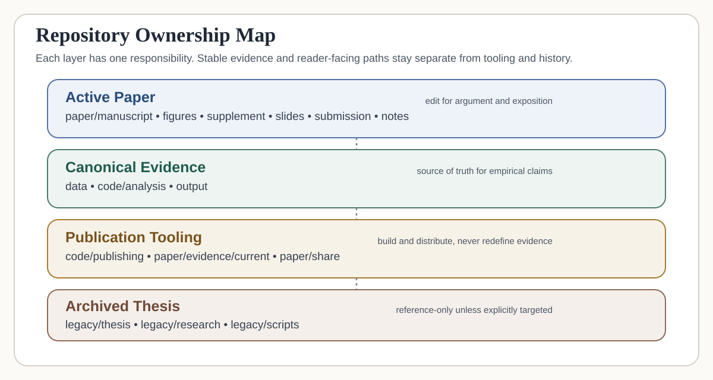

# Incineration Paper Workspace

This repository develops a journal-style paper from Japan's Ministry of the Environment (MOE) municipal waste-incineration facility records for FY2005-FY2024. It diagnoses three distinct margins:

1. Coverage: how different are facility participation and waste-volume coverage?
2. Transition: which prior-year characteristics are associated with first reporting positive installed electrical capacity?
3. Components: how do raw installed kW, annual capacity factor, and waste loading combine in gross output?

The central descriptive contrast is simple but important: in FY2024, 41.1% of analytical facility records report installed generation capacity, while positive-output facilities handle 80.1% of recorded throughput and installed-generation facilities represent 70.5% of waste-processing design capacity. The paper therefore distinguishes facility counts, waste-volume coverage, entry into installed capacity, and conditional generator components.

Gross generation intensity in MWh per tonne is an administrative output ratio. It is not treated as net export, useful-heat recovery, lifecycle benefit, R1 efficiency, or an independent measure of operational efficiency.

## Start Here

1. Read the public journal draft: [`paper/manuscript/paper.md`](paper/manuscript/paper.md).
2. Check the revision state: [`paper/submission/current-status.md`](paper/submission/current-status.md).
3. Read the generated evidence summary: [`output/sample_definition.md`](output/sample_definition.md).
4. Trace claims to evidence: [`output/claim_evidence_map.md`](output/claim_evidence_map.md).
5. Read the current PDF with the [browser-compatible viewer](https://raw.githack.com/Pann13223029/incineration-paper/main/paper/share/waste-management-manuscript-latex.pdf), or [download it from GitHub](https://github.com/Pann13223029/incineration-paper/raw/refs/heads/main/paper/share/waste-management-manuscript-latex.pdf).

The tracked PDF is a reading artifact, not a source of empirical truth. Check the current-status page before treating it as verified.

## Evidence At A Glance

| Evidence block | Current audited value |
|:--|:--|
| Source records | 23,599 parsed rows; 23,593 unique retained records |
| Longitudinal identity | 1,690 stable administrative facility lineages; 1,767 asset episodes; 16 accepted uncertain links exposed |
| Official-code discontinuities | Codes absent in FY2010-FY2012; zero FY2019-FY2020 code overlap |
| Restored FY2019-FY2020 continuity | 1,064 stable-lineage links |
| Installed-capacity entries | 55 descriptive events |
| Broad exact-year Firth frame | 15,154 rows; 1,137 lineages; 35 events |
| Prior-operation Firth frame | 13,072 rows; 1,019 lineages; 33 events |
| Continuity and identity sensitivities | Same episode: 15,095/1,135/24; identity certain: 15,107/1,130/35 rows/lineages/events |
| Revised scale result | Broad 300-versus-100 t/day OR 6.72 (95% lineage-bootstrap CI 4.31-12.46); 1,999 bootstraps per frame |
| Event influence | 24 continuity-lineage and 11 rebuild-like modeled events; all event attacks retain OR 6.12-7.30 |
| FY2024 count-volume contrast | 41.1% facility participation; 80.1% throughput coverage; 70.5% design-capacity share |
| Generator component frame | 6,511 engineering-valid rows across 493 lineages |
| Adjusted component contrast | Older cohorts have 79.1%, 58.6%, and 23.5% lower installed kW; not lower annual capacity factors |

`stable_site_id` is a reproducible, audited administrative lineage reconstructed from annual records. It is not proof that one immutable physical site, owner, or equipment configuration persisted unchanged. `asset_episode_id` separates reported configuration resets within a lineage, but it is still based on administrative evidence.

Administrative disappearance is not modeled because the survey alone cannot distinguish closure, recoding, consolidation, or reporting change.

## Repository Logic



| Layer | Role | Main paths |
|:--|:--|:--|
| Evidence core | Raw sources, identity reconstruction, analysis, audits, and canonical outputs | [`data/`](data/), [`code/analysis/`](code/analysis/), [`output/`](output/) |
| Active paper | Manuscript, supplement, figures, slides, and submission materials | [`paper/`](paper/) |
| Publication tooling | Evidence sync, export, PDF, and presentation builds | [`code/publishing/`](code/publishing/) |
| Archived thesis | Defended thesis and historical support materials | [`legacy/`](legacy/) |

The evidence hierarchy is one-way:

```text
raw workbooks
  -> parsed and identity-audited data
  -> canonical output/* evidence
  -> paper/evidence/current synchronized copies
  -> manuscript and supplement
  -> submission and share artifacts
```

Do not hand-edit generated evidence to make prose agree with a preferred result. Change the pipeline, rebuild, synchronize, and then revise the paper.

## Canonical Files

| Need | Use |
|:--|:--|
| Raw-file hashes, URLs, and schema decisions | [`output/raw_data_provenance.md`](output/raw_data_provenance.md), [`output/raw_data_manifest.csv`](output/raw_data_manifest.csv), [`output/raw_workbook_schema_map.csv`](output/raw_workbook_schema_map.csv) |
| Identity reconstruction and code discontinuities | [`output/facility_identity_audit.md`](output/facility_identity_audit.md), [`output/identity_low_margin_links.csv`](output/identity_low_margin_links.csv), [`output/identifier_gap_audit.md`](output/identifier_gap_audit.md) |
| Sample definitions and FY2024 coverage | [`output/sample_definition.md`](output/sample_definition.md), [`output/fleet_decomposition.md`](output/fleet_decomposition.md) |
| Entry model | [`output/scientific_revision_results.md`](output/scientific_revision_results.md), [`output/revised_entry_results.csv`](output/revised_entry_results.csv), [`output/revised_entry_influence.csv`](output/revised_entry_influence.csv) |
| Generator component models | [`output/raw_quantity_component_results.csv`](output/raw_quantity_component_results.csv), [`output/figure3_adjusted_components.csv`](output/figure3_adjusted_components.csv), [`output/regression_results.md`](output/regression_results.md) |
| Robustness and data quality | [`output/robustness_results.md`](output/robustness_results.md), [`output/data_quality_sensitivity.md`](output/data_quality_sensitivity.md) |
| Claim verification | [`output/claim_verification.md`](output/claim_verification.md), [`output/claim_evidence_map.md`](output/claim_evidence_map.md) |
| Public journal prose | [`paper/manuscript/paper.md`](paper/manuscript/paper.md), [`paper/manuscript/paper.tex`](paper/manuscript/paper.tex) |
| Comprehensive professor prose | [`paper/manuscript/professor/paper.md`](paper/manuscript/professor/paper.md), [`paper/manuscript/professor/paper.tex`](paper/manuscript/professor/paper.tex) |
| Current reading PDF | [Open in browser](https://raw.githack.com/Pann13223029/incineration-paper/main/paper/share/waste-management-manuscript-latex.pdf) or [download from GitHub](https://github.com/Pann13223029/incineration-paper/raw/refs/heads/main/paper/share/waste-management-manuscript-latex.pdf) |

## Reproduce And Verify

Expected local tools are Python matching [`.python-version`](.python-version), Node matching [`.node-version`](.node-version), and Tectonic for the LaTeX build.

```bash
python3 -m venv .venv
.venv/bin/pip install -r requirements.txt
npm install

npm run analysis:test
npm run analysis:rebuild
npm run paper:sync
npm run paper:check
npm run claims:verify
npm run paper:export:nopdf
npm run paper:build:latex
npm run paper:build:professor
npm run repo:check
```

| Command | Purpose |
|:--|:--|
| `analysis:rebuild` | Run the canonical empirical pipeline from parsing through claim checks. |
| `analysis:test` | Benchmark the custom Firth estimator against a closed-form separated table and an independent optimizer. |
| `paper:sync` | Copy selected canonical outputs into `paper/evidence/current/`. |
| `paper:check` | Fail if required evidence is missing or synchronized copies are stale. |
| `claims:verify` | Check registered high-risk claims and stale-language guards. |
| `paper:export:nopdf` | Build portable Markdown, HTML, and DOCX submission artifacts. |
| `paper:build:latex` | Build figures and the public journal reading PDF. |
| `paper:build:professor` | Build the comprehensive professor reading PDF. |
| `repo:check` | Validate required paths, Markdown links, and journal-format gates. |

See [`ARCHITECTURE.md`](ARCHITECTURE.md) for stage ownership and [`AGENTS.md`](AGENTS.md) for editing rules.

## Scope Boundaries

- The design is observational and does not identify a causal retrofit effect.
- A first reported positive installed capacity is not automatically a retrofit, replacement, or first physical operation.
- Stable administrative lineages are audited links, not verified immutable physical assets.
- Gross output is not net electricity export, useful heat, avoided emissions, or a full plant-efficiency measure.
- Heat recovery, closure histories, intervention costs, and engineering-frontier optimization require additional data.

The defended thesis remains under [`legacy/`](legacy/) and is reference-only unless a task explicitly targets it.
