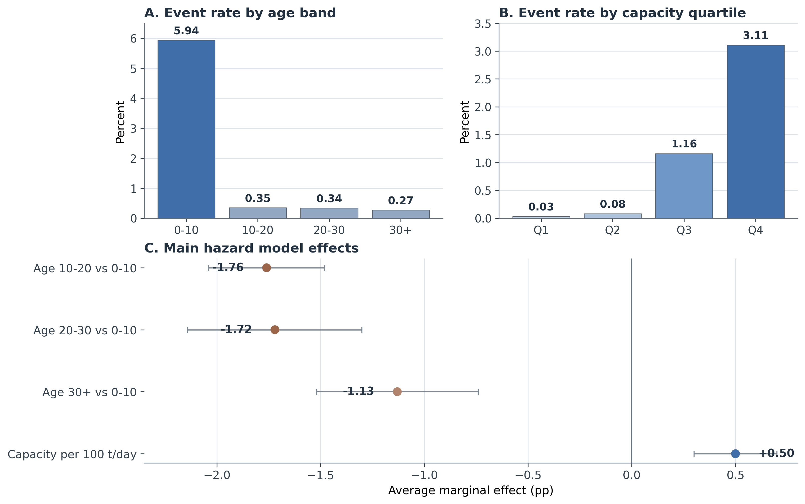
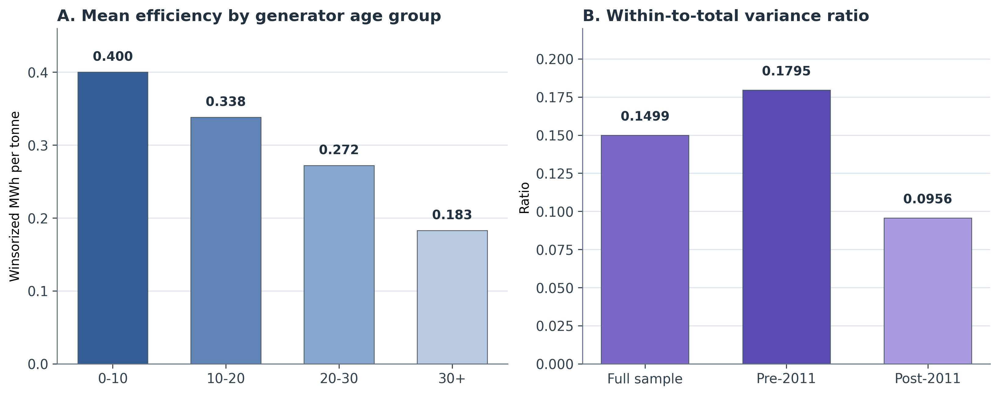

# Selective Modernization and Bounded Responsiveness in Japan's Waste-Incineration Fleet: A Facility-Level Panel Study

## Abstract

Japan relies heavily on municipal waste incineration, yet a large share of its
incineration fleet still does not convert waste heat into electricity. A
one-average-fleet view therefore risks conflating two different questions: who
records observed transition into generation at all, and how plants perform once
they already generate. Prior work often studies fleets in aggregate or studies
generators only, which blurs those two estimands. This paper separates them in
a national facility-level panel built from Ministry of the Environment data for
FY2005-FY2024. It first models observed transition into generation among coded
facilities first seen without it, then models energy recovery efficiency among
operating generators. Within the coded at-risk frame, transition is selective
rather than diffuse: older facilities are less likely than 0-10 year
facilities to record transition in the next observed year, while larger
facilities are more likely to do so. Within the canonical generator frame,
efficiency is lower at older plants and higher at larger, more fully utilized
ones, while between-facility heterogeneity dominates within-facility movement.
Taken together, the fleet looks less like one gradual modernization process
than like selective entry into generation alongside bounded performance within
generation. These patterns are descriptive within the paper's linked samples,
not causal estimates of a single modernization mechanism. For comparable
municipal fleet studies, the broader lesson is methodological: adoption and
conditional performance should be modeled separately before they are
interpreted together.

**Keywords:** waste incineration; waste-to-energy; Japan; energy recovery;
facility panel; transition

## 1. Introduction

Japan operates one of the world's most incineration-dependent municipal waste
systems, yet a large share of the fleet still burns waste without generating
electricity from the heat it produces (Ministry of the Environment Japan, 2022;
Uno, 2015; Tabata & Tsai, 2016). Sectoral planning increasingly treats that
gap as part of the waste sector's decarbonization challenge rather than as a
narrow engineering issue (Yamada et al., 2023). The transition problem is
therefore not whether incineration exists, but which facilities move into
useful energy recovery and what performance looks like once they do.

That pattern is easy to flatten into one average fleet story. But the relevant
questions are not the same. One is extensive: which facilities record observed
transition into power generation at all? The other is intensive: among plants
that already generate, which facilities achieve high energy recovery efficiency?
Treating those margins as one process can obscure whether the main bottleneck
lies in entry into generation or in performance once entry has already
occurred.

This paper estimates both margins in one national facility-level panel. Its
contribution is not simply that it studies Japan, but that it uses one linked
dataset to show how the same fleet looks different when the question is entry
into generation rather than mature performance within generation. Within the
coded at-risk frame, observed transition is selective toward younger and larger
facilities. Within the canonical generator frame, efficiency is strongly
structured by age, scale, and utilization, while within-facility movement
remains limited relative to between-facility heterogeneity. A fleet-average
view would therefore understate both the selectivity of entry and the
persistence of performance hierarchy inside the generating segment.

The gap addressed here is therefore narrower than a generic claim that Japan has
been understudied. Fleet-level waste-to-energy studies can describe system
trajectories, while generator-only studies can explain conditional performance.
What remains rare is one linked municipal-fleet analysis that estimates both
margins and asks whether they tell the same modernization story. Japan makes
that contrast especially visible because a substantial non-generating segment
remains active alongside a smaller modern generating segment. The broader claim
is correspondingly narrow: in similar fleet-transition settings, separate
models of adoption and conditional performance can reveal bottlenecks that a
single average treatment would miss.

The rest of the paper proceeds as follows. Section 2 positions the paper against
the literature most relevant to the analytical split. Section 3 introduces the
two linked analytical frames and the main estimation choices. Section 4 reports
the adoption and efficiency results in sequence, then ties them together.
Section 5 interprets the combined finding, explains what the data still cannot
identify, and states a short set of evidence-consistent implications. Section 6
concludes.

## 2. Literature Positioning

This paper speaks to three literatures: waste-to-energy systems, facility-level
efficiency analysis, and infrastructure lock-in. The point is not to survey
them exhaustively, but to locate a narrower gap: existing work can describe
fleets in aggregate or explain generator performance conditional on operation,
yet it rarely estimates both margins in one linked municipal-fleet design.

Work on waste-to-energy systems often documents national trajectories,
technology choices, or lifecycle implications of thermal treatment (Astrup et
al., 2015; Sun et al., 2018). Japan-specific work has mostly emphasized
technology upgrading, heat-use constraints, or sectoral decarbonization
scenarios rather than facility-level transition modeling (Uno, 2015; Tabata &
Tsai, 2016; Yamada et al., 2023). That literature is important for sectoral
context, but it often treats the incineration fleet as a category. It can show
whether energy recovery is growing, yet it is less well suited to
distinguishing facilities that enter generation from those that do not.

Facility-level efficiency studies are closer to the present paper, but they
typically begin with plants that already generate or focus on technical
performance conditional on operation. Studies in Taiwan, for example, evaluate
the efficiency of operating incinerators by decomposing waste-treatment,
electricity-generation, or revenue performance within existing plants (Chen et
al., 2012; Yeh, 2020). Recent Chinese plant-level work is likewise highly
informative about performance differentials within the generating segment (Cui
et al., 2026), but it does not directly address the modernization margin
between non-generating and generating facilities. In that sense, such studies
answer the intensive-margin question while leaving the extensive-margin
question open.

The lock-in literature adds a different expectation: infrastructure performance
may be shaped by durable design choices, inherited scale, and institutional
arrangements rather than by frequent large reversals at mature facilities
(Unruh, 2000; Seto et al., 2016). The useful implication here is empirical
rather than grand-theoretical. If design-conditioned heterogeneity dominates,
cross-facility differences should matter more than large within-facility
reversals over time. That expectation is only partially visible if entry into
generation and performance within generation are never separated.

These strands imply a clearer contribution than a generic claim of novelty.
Fleet-level work can show whether energy recovery is spreading, while
generator-only work can show what shapes performance once generation already
exists. What remains uncommon is a single facility panel that estimates both
margins and tests whether they point to the same modernization bottleneck. This
paper contributes that linked design.

## 3. Data and Design

The analysis uses the Ministry of the Environment's General Waste Treatment
Survey for FY2005-FY2024 (Ministry of the Environment Japan, 2022). The full
panel contains 23,599 facility-year rows.
Within that, the coded full-fleet frame contains 19,827 observations across
2,948 facilities with usable identifiers. This paper uses two linked samples
because one sample cannot answer both parts of the transition problem.

The first analytical frame is the coded adoption frame. It includes facilities
first observed without power generation and follows them until they either
record observed transition into generation or remain non-generating in the panel
window. After excluding left-censored facilities already generating in their
first observed year, the adoption risk set contains 13,770 facility-years across
2,035 facilities, with 141 observed first-adoption events. The main adoption
model is a lagged discrete-time logit hazard estimated on 11,717 observations
across 1,915 facilities and 140 retained events. Predictors are prior-year age
band and prior-year design capacity, with year fixed effects, prefecture fixed
effects, and facility-clustered standard errors. This is an observed-transition
model, not a complete structural model of all possible modernization pathways.

The second analytical frame is the canonical generator frame. It contains
operating facilities with positive throughput and positive power output, after
standard cleaning and a bounded efficiency measure. The regression frame
contains 5,683 observations across 1,016 facilities. The dependent variable is
winsorized log electricity generated per tonne processed. Main predictors are
facility age, design capacity, capacity utilization, waste heating value, and a
grid-emission control. The main specifications are pooled OLS, year fixed
effects, random effects, and year fixed effects plus random effects, all used as
structured descriptive models rather than clean structural estimates
(Wooldridge, 2010).

The two layers belong in one paper because they answer sequential parts of the
same modernization problem. The adoption layer identifies which facilities
appear to enter the generating regime at all. The efficiency layer identifies
whether large gains remain available once facilities are already inside that
regime. Without the first layer, the paper would reduce transition to generator
performance alone. Without the second, it would say who enters generation but
not whether large efficiency gaps remain inside the generating segment.

The main identification limits are explicit. In the adoption layer, the paper
models observed transition within the coded risk set, not unrestricted fleet-
wide modernization. In the efficiency layer, age is closely tied to time and
within-facility movement is limited, so the defended interpretation is one of
structured conditional association rather than strict causal identification. The
paper therefore aims for disciplined inference rather than maximal causal reach.
All reported effects should be read as conditional associations within the
specified samples, not as estimates of structural causality or policy effects.
The paper does not claim that the low within-facility variance ratio resolves
all fixed-effects concerns; instead, it uses that variance structure to
motivate why a cross-facility descriptive model remains substantively useful
for the question at hand.

**Table 1. Linked analytical framework**

| Margin | Linked sample | Empirical question | Paper role |
|:--|:--|:--|:--|
| Adoption margin | Coded at-risk frame: 13,770 facility-years, 2,035 facilities, 141 observed first-adoption events | Which facilities record observed transition into generation? | Shows whether entry into generation is selective rather than diffuse |
| Efficiency margin | Canonical generator frame: 5,683 observations across 1,016 operating generators | How does performance vary once generation already exists? | Shows whether mature generator performance remains bounded |
| Synthesis | Two linked but non-identical analytical frames | Would one average-fleet view misstate the modernization bottleneck? | Shows why entry and mature performance should not be read as one average process |

*Note: the adoption margin is estimated with a lagged discrete-time hazard. The
efficiency margin is estimated with descriptive pooled, year-FE, and RE panel
specifications.*

## 4. Results

### 4.1 Adoption into generation is selective rather than diffuse

The adoption results show a strongly selective transition pattern. In the risk
set, annual event rates collapse after age 10 and rise sharply across capacity
quartiles. Facilities aged 0-10 years account for 102 first-adoption events,
while the three older age bands together account for only 39. By capacity, the
largest quartile accounts for 99 first-adoption events, whereas the smallest
quartile records only 1.

The discrete-time logit hazard compresses that pattern into a clear main result.
Relative to 0-10 year facilities, plants aged 10-20 years are about 1.76
percentage points less likely to record transition in the next observed year,
plants aged 20-30 years are about 1.72 percentage points less likely, and plants
aged 30 years or more are about 1.13 percentage points less likely. Each
additional 100 t/day of prior-year design capacity raises annual transition
probability by about 0.50 percentage points. The sign pattern is stable in the
complementary log-log and linear probability robustness variants.

This is not the pattern one would expect from diffuse late-life conversion of
the old small-plant segment. Observed transition is concentrated among
facilities that were already younger and larger before the event year. The
extensive margin therefore looks like selective modernization rather than broad
catch-up across the whole fleet.

The pathway audit supports that interpretation without turning it into a stronger
mechanism claim than the data earn. Among the 141 observed adoption events, 82
are classified as reset- or rebuild-like, 38 as continuity-type upgrades, 20 as
forward-dated or placeholder entries, and 1 as unresolved. This is descriptive
pathway evidence, not mechanism identification. That distribution shows that
capital-side selectivity is empirically present, but it does not
uniquely identify replacement, major refurbishment, or new build as the single
pathway. In the main text, the audit therefore functions as a credibility guard
rather than as a coequal source of originality.

**Table 2. Main lagged hazard results for observed transition into generation**

| Variable | AME (pp) | SE (pp) |
|:--|--:|--:|
| Prior-year age 10-20 yrs (vs 0-10) | -1.76 | 0.28 |
| Prior-year age 20-30 yrs (vs 0-10) | -1.72 | 0.42 |
| Prior-year age 30+ yrs (vs 0-10) | -1.13 | 0.39 |
| Prior-year capacity (per 100 t/day) | 0.50 | 0.20 |

| Model summary | Value |
|:--|--:|
| Observations | 11,717 |
| Facilities | 1,915 |
| First-adoption events | 140 |
| Pseudo-R-squared | 0.1842 |

*Note: entries are average marginal effects in percentage points from the main
lagged logit hazard with year and prefecture fixed effects and facility-clustered
standard errors.*

### 4.2 Performance within generation is bounded and strongly structured

The generator results tell a different but complementary story. In the canonical
generator frame, efficiency is consistently lower at older facilities and higher
at larger and more fully utilized ones. Across the main specifications, the age
coefficient remains negative, the capacity coefficient remains positive, and the
utilization coefficient remains positive. The magnitudes differ across models,
but the sign pattern is stable, and the emphasis stays on structured
association rather than on any single structural parameter.

The strongest descriptive result is not one coefficient but the variance
structure. The within-to-total variance ratio of pooled log-efficiency is
0.1499. In other words, the large majority of variation in the dependent
variable is between facilities rather than within facilities over time. The
ratio remains low in both the pre-Fukushima and post-Fukushima windows, falling
from 0.1795 before 2011 to 0.0956 after 2011. That pattern does not prove
irreversibility, but it is hard to reconcile with a world in which mature
generators frequently undergo large late-life reversals that reshape the fleet
distribution. It also does not identify vintage effects separately from all
other durable plant characteristics; more narrowly, it supports cross-facility
descriptive comparison, not clean causal isolation of vintage itself.

The efficiency margin therefore looks bounded rather than static. Facilities do
respond within a design envelope, especially through utilization and operational
discipline, but the cross-sectional hierarchy remains strong. Older facilities
systematically underperform younger ones; larger plants systematically
outperform smaller ones; and utilization matters more as a supporting lever
within the generating segment than as a fleet-wide equalizer.

This is why the intensive margin cannot be inferred from the adoption margin
alone. A facility can be inside generation without being close to the frontier,
yet the evidence also suggests that operations alone are unlikely to erase large
vintage and scale gaps once plants are mature. Conditional performance is
therefore a bounded-performance problem rather than a simple continuation of the
entry problem.

**Table 3. Core conditional-efficiency specifications in the canonical generator frame**

| Variable | Model 1 Pooled OLS | Model 2 Year FE | Model 3 RE | Model 4 Year FE + RE |
|:--|--:|--:|--:|--:|
| Facility age (years) | -0.0279*** | -0.0348*** | -0.0188*** | -0.0332*** |
|  | (0.0022) | (0.0022) | (0.0025) | (0.0021) |
| Capacity (100 t/day) | 0.0874*** | 0.1030*** | 0.0405*** | 0.0519*** |
|  | (0.0083) | (0.0086) | (0.0083) | (0.0096) |
| Capacity utilization | 0.7468*** | 0.7789*** | 0.6199*** | 0.5411*** |
|  | (0.1421) | (0.1346) | (0.0997) | (0.0943) |
| Heating value (MJ/kg) | 0.0010 | 0.0032 | 0.0006 | 0.0012 |
|  | (0.0023) | (0.0021) | (0.0012) | (0.0010) |
| Grid EF (kg-CO2/kWh) | 0.3182 | -0.4466 | 1.6333*** | -0.1951 |
|  | (0.2219) | (0.2714) | (0.1965) | (0.2101) |
| Observations | 5,683 | 5,683 | 5,683 | 5,683 |
| Facilities | 1,016 | 1,016 | 1,016 | 1,016 |
| R-squared | 0.2470 | 0.3721 | 0.1647 | 0.3076 |

*Note: standard errors are in parentheses. `***` p < 0.01. Coefficients are
reported as structured conditional associations rather than as strict structural
parameters.*

### 4.3 Why the two results belong together

Read together, the two margins change the story the fleet appears to tell. The
adoption results show that entry into generation is already selective before
conditional efficiency is considered, while the efficiency results show that
large performance gaps inside the generating segment are not easily erased
through within-facility movement alone. A one-average-fleet model would flatten
those margins into a single modernization narrative and would therefore
understate both the selectivity of entry and the persistence of cross-facility
performance differences.

## 5. Discussion

The paper's main interpretive claim is methodological: in this fleet, entry
into generation and performance within generation are linked but distinct
estimands. Modeling them separately shows that the weakest part of the fleet
and the mature generating segment are constrained in different ways.

The substantive interpretation is correspondingly two-part. On the adoption
margin, the data do not support a story of broad late conversion among old small
plants. Observed transition is concentrated among younger and larger facilities,
and the pathway audit shows more reset- or rebuild-like cases than continuity-
type upgrades. On the efficiency margin, age, scale, and utilization matter
strongly, while within-facility movement remains modest relative to the cross-
sectional hierarchy. The evidence is therefore more consistent with
capital-intensive pathways at the weak end of the fleet than with diffuse
late-life catch-up, while responsiveness within the generating segment appears
bounded.

That interpretation should remain calibrated. The pathway audit does not prove
that replacement is the unique pathway of modernization. The regression results
do not provide strict causal estimates of vintage lock-in. Alternative
interpretations remain possible, including reporting compression, unobserved
retrofit histories, and institutional constraints that limit operational
responses. The defended claim is narrower: the data support a selective
modernization process and bounded performance envelope, not a uniquely identified
mechanism or a full causal hierarchy.

These are implications, not estimated policy rankings. For the weakest segment,
especially older non-generators and small plants, the evidence points more
toward capital-renewal planning than toward diffuse late-life operational
improvement. For the already-generating segment, utilization, routing, and
selective upgrading remain real levers, but they appear more likely to preserve
or modestly improve performance within the existing envelope than to eliminate
large inherited gaps. For municipal waste planners, that split argues for
triage rather than one generic modernization program: asset renewal matters
most where generation is still absent, while operational and selective upgrade
choices matter more once generation already exists.

## 6. Conclusion

Japan's incineration transition is not one smooth modernization process. Within
the coded adoption frame, observed entry into generation is selective rather
than diffuse. Within the canonical generator frame, performance remains
stratified by age, scale, and utilization, with limited within-facility
movement relative to between-facility differences. Read together, those
margins show why a one-average-fleet view can misstate the modernization
bottleneck. The paper does not identify one unique pathway or intervention
hierarchy, but it does show why municipal fleet studies gain by separating
adoption from conditional performance.

## Acknowledgements

The author thanks Prof. Han Ji for supervision and critical feedback during the
development of the underlying thesis project from which this paper is derived.

## Funding

This research did not receive any specific grant from funding agencies in the
public, commercial, or not-for-profit sectors.

## CRediT Authorship Contribution Statement

Pann Phetra: Conceptualization, Data curation, Formal analysis, Investigation,
Methodology, Visualization, Writing - original draft, Writing - review &
editing.

## Declaration of Competing Interest

The author declares no known competing financial interests or personal
relationships that could have appeared to influence the work reported in this
paper.

## Data Availability

The facility-level source data are derived from the Ministry of the Environment
Japan General Waste Treatment Survey. Processed study outputs, manuscript
figures, and the associated reproducible analysis workspace can be provided by
the author on reasonable request.

## Generative AI And AI-Assisted Technologies Statement

During the preparation of this manuscript, the author used OpenAI Codex and
Anthropic Claude to support drafting, language revision, and organizational
planning. After using these tools, the author reviewed and edited the content as
needed and takes full responsibility for the content of the manuscript.

## References

Astrup, T. F., Tonini, D., Turconi, R., & Boldrin, A. (2015). Life cycle
assessment of thermal waste-to-energy technologies: Review and recommendations.
*Waste Management*, *37*, 104-115.
https://doi.org/10.1016/j.wasman.2014.06.011

Cui, J., Cui, Y., Li, J., Gao, X., Wei, W., Chen, Y., Ma, W., Zhu, N., Geng,
Y., Zhao, Y., & Lou, Z. (2026). Efficiency hierarchy and optimization of waste
incineration in China to balance disposal and energy supply. *Nature
Communications*, *17*(1), Article 3069.
https://doi.org/10.1038/s41467-026-69897-w

Chen, P.-C., Chang, C.-C., Yu, M.-M., & Hsu, S.-H. (2012). Performance
measurement for incineration plants using multi-activity network data
envelopment analysis: The case of Taiwan. *Journal of Environmental
Management*, *93*(1), 95-103. https://doi.org/10.1016/j.jenvman.2011.08.011

Ministry of the Environment Japan. (2022). *General waste treatment survey:
Summary report FY2021*. Environmental Management Bureau, Ministry of the
Environment Japan. https://www.env.go.jp/recycle/waste_tech/ippan/r3/index.html
(accessed 18 April 2026).

Seto, K. C., Davis, S. J., Mitchell, R. B., Stokes, E. C., Unruh, G., &
Urge-Vorsatz, D. (2016). Carbon lock-in: Types, causes, and policy
implications. *Annual Review of Environment and Resources*, *41*(1), 425-452.
https://doi.org/10.1146/annurev-environ-110615-085934

Sun, L., Fujii, M., Tasaki, T., Dong, H., & Ohnishi, S. (2018). Improving waste
to energy rate by promoting an integrated municipal solid-waste management
system. *Resources, Conservation and Recycling*, *136*, 289-296.
https://doi.org/10.1016/j.resconrec.2018.05.005

Tabata, T., & Tsai, P. (2016). Heat supply from municipal solid waste
incineration plants in Japan: Current situation and future challenges. *Waste
Management & Research*, *34*(4), 345-351.
https://doi.org/10.1177/0734242X15617009

Uno, S. (2015). Trends in Waste-to-Energy Technologies for High Efficiency
Power Generation. *Material Cycles and Waste Management Research*, *26*(2),
114-119. https://doi.org/10.3985/mcwmr.26.114

Unruh, G. C. (2000). Understanding carbon lock-in. *Energy Policy*, *28*(12),
817-830. https://doi.org/10.1016/S0301-4215(00)00070-7

Wooldridge, J. M. (2010). *Econometric analysis of cross section and panel
data* (2nd ed.). MIT Press.

Yamada, K., Ii, R., Yamamoto, M., Ueda, H., & Sakai, S. (2023). Japan's
greenhouse gas reduction scenarios toward net zero by 2050 in the material
cycles and waste management sector. *Journal of Material Cycles and Waste
Management*, *25*(4), 1807-1823.
https://doi.org/10.1007/s10163-023-01650-7

Yeh, L.-T. (2020). Analysis of the dynamic electricity revenue inefficiencies
of Taiwan's municipal solid waste incineration plants using data envelopment
analysis. *Waste Management*, *107*, 28-35.
https://doi.org/10.1016/j.wasman.2020.03.040
