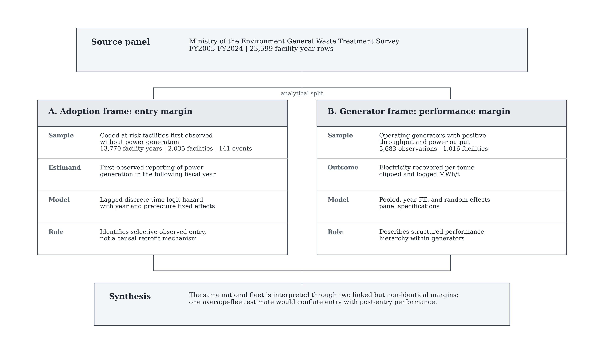

# Selective Entry and Structured Electricity-Recovery Performance in Japan's Waste-Incineration Fleet: A Facility-Level Panel Study

## Abstract

Japan relies heavily on municipal waste incineration, yet by fiscal year (FY)
2024 only 41.1% of facilities in the panel are flagged as power-generating.
This creates a two-margin modernization problem. Facilities outside electricity
recovery face an entry margin, while existing generators face a
conditional-performance margin. Fleet-average studies blur those margins, and
generator-only studies miss the entry margin altogether. Using Ministry of the
Environment data for FY2005-FY2024, this paper estimates both margins in one
national facility panel.
It asks whether first observed entry into generation is associated with
prior-year age and capacity, how electricity recovered per tonne is associated
with observed facility and operating conditions among identifiable generators,
and whether those two margins support one average-fleet modernization
interpretation. Entry is selective rather than diffuse: facilities older than
ten years are less likely to record transition in the next fiscal year, while
larger facilities are more likely to do so. Among operating generators,
electricity recovery intensity is lower at older plants and higher at larger,
more fully utilized ones, while between-facility heterogeneity dominates
within-facility movement. An aggregate view therefore understates both the
selectivity of entry and the persistence of performance hierarchy. These
patterns are descriptive within the linked samples, not causal estimates of a
single modernization mechanism. For municipal fleet planning, non-generators
and mature generators should not be managed as one average segment.

**Keywords:** waste incineration; waste-to-energy; Japan; energy recovery;
facility panel; transition

## 1. Introduction

Japan operates one of the world's most incineration-dependent municipal waste
systems, yet many facilities still burn waste without generating electricity
from the heat they produce (Ministry of the Environment Japan, 2022; Uno, 2015;
Tabata & Tsai, 2016; Sakai et al., 2011). In fiscal year (FY) 2024, 41.1% of
facilities in the panel are flagged as power-generating, leaving most facilities
outside electricity recovery. This is not a marginal technical detail. For
decades, Japanese municipal waste governance has relied on thermal treatment for
hygienic disposal, volume reduction, and local waste autonomy, while limited
landfill space and strict environmental controls pushed municipalities toward
sophisticated incineration infrastructure (Brunner & Rechberger, 2015; Sakai et
al., 2011). Sectoral planning now treats the remaining electricity-generation
gap as part of the waste sector's decarbonization challenge (Yamada et al.,
2023; Greenhouse Gas Inventory Office of Japan & Ministry of the Environment
Japan, 2024). The transition problem is therefore not whether Japan uses
incineration. It is whether observed entry into electricity recovery is
patterned across facilities and how electricity recovery intensity varies once
generation is present.

Aggregate fleet summaries flatten two distinct questions. One is extensive:
which facilities record observed transition into power generation at all? The
other is intensive: among plants that already generate, which facilities achieve
high electricity recovery per tonne? The system can therefore look uniformly
slow in the mean while combining selective entry at one end of the fleet with
persistent performance hierarchy at the other.

### Research questions

This paper asks three descriptive, sample-bounded research questions. In the
table, RQ denotes research question:

| RQ | Margin | Question |
|:--|:--|:--|
| RQ1 | Entry margin | Among coded facilities first observed without power generation, which prior-year age and capacity profiles are associated with first observed reporting of power generation in the following fiscal year? |
| RQ2 | Generator-performance margin | Among identifiable operating generators, how is electricity recovered per tonne associated with facility age, design capacity, utilization, heating value, and common fiscal-year conditions? |
| RQ3 | Synthesis | Taken together, do the observed entry pattern and generator-frame performance associations support one average-fleet modernization interpretation, or do they indicate distinct adoption and performance problems within the same incineration system? |

The contribution is not a causal estimate of retrofit effects or a technical
optimization model. It is a linked facility-panel decomposition that shows why
observed entry into generation and conditional generator performance should be
modeled separately before being interpreted together. The paper uses two linked
samples: one follows non-generating facilities until they first report
electricity generation, and the other compares identifiable operating
generators over time. In the first sample, observed transition is selective
toward younger and larger facilities. In the second, electricity recovery
intensity is strongly structured by age, scale, and utilization, while
within-facility movement remains limited relative to between-facility
heterogeneity. The same fleet can therefore look merely slow in aggregate while
containing two different problems: selective entry into generation and
persistent generator hierarchy. For municipal planning, that distinction
changes the first diagnostic step. Facilities outside electricity recovery and
mature generators should be evaluated as different asset-management questions
before they are summarized as one fleet.

The gap addressed here is narrower than a generic claim that Japan has been
understudied. Waste-to-energy research can describe fleet trajectories, and
generator-only studies can explain conditional performance once plants already
operate as generators. What remains uncommon is one linked municipal-fleet
analysis that estimates both margins and asks whether they point to the same
modernization bottleneck. Japan makes that contrast visible because persistent
non-generators, old small plants, and a more modern generating segment coexist
in the same administrative system. In such mixed fleets, adoption and
conditional performance should be modeled separately before they are interpreted
together.

The rest of the paper proceeds as follows. Section 2 positions the paper against
the literature most relevant to the analytical split. Section 3 introduces the
two linked analytical frames and the main estimation choices. Section 4 reports
the adoption and electricity-recovery results in sequence, then ties them
together. Section 5 interprets the combined finding, explains what the data
still cannot identify, and states a short set of evidence-consistent
implications. Section 6 concludes.

## 2. Literature Positioning

This paper speaks to three literatures that often meet in practice but start
from different empirical positions: waste-to-energy systems, facility-level
performance analysis, and infrastructure lock-in. The review is organized around
the paper's central split between entry into generation and conditional
performance after entry. The relevant gap is not simply that Japan needs another
case study. It is that existing studies often describe fleets in aggregate or
explain generator performance conditional on operation, yet rarely estimate both
margins in one linked municipal-fleet design.

Work on waste-to-energy systems often documents national trajectories,
technology choices, or lifecycle implications of thermal treatment (Astrup et
al., 2009; Astrup et al., 2015; Brunner & Rechberger, 2015; Sun et al., 2018).
Japan-specific work has mostly emphasized technology upgrading, heat-use
constraints, and sectoral decarbonization
scenarios rather than facility-level transition modeling (Uno, 2015; Tabata &
Tsai, 2016; Yamada et al., 2023). Policy-facing work reaches a similar
conclusion from a different angle: waste-to-energy is treated as useful only
when embedded in a wider waste hierarchy and resource-recovery strategy rather
than as a stand-alone justification for thermal treatment (European Commission,
2017; Sakai et al., 2011). This literature is indispensable for understanding
why energy recovery matters, but it usually treats the incineration fleet as a
sectoral category. It can show whether energy recovery is expanding, whether
heat supply remains constrained, or whether the sector matters for net-zero
planning. It is less well suited to distinguishing facilities that enter
generation from those that do not.

Facility-level performance studies are closer to the present design, but they
typically begin after entry has already occurred. Studies in Taiwan, for
example, evaluate operating incinerators by decomposing waste-treatment,
electricity-generation, or revenue performance within existing plants (Chen et
al., 2012; Yeh, 2020). Other work focuses on energy-recovery criteria, plant
scale, heat use, and the system consequences of different waste-to-energy
configurations (Grosso et al., 2010; Münster & Meibom, 2010). Recent Chinese
plant-level work is also highly informative about performance differentials
inside the generating segment and the effectiveness of upgrading strategies at
scale (Cui et al., 2026; Liu et al., 2025; Han et al., 2025). Those studies
help define the intensive-margin question. They do not directly answer which
non-generating facilities enter generation in the first place.

The lock-in literature adds a different expectation. Infrastructure performance
may be shaped by durable design choices, inherited scale, and institutional
arrangements rather than by frequent late-life reversals at mature facilities
(Unruh, 2000; Geels, 2004; Seto et al., 2016). The useful implication here is
not that incineration plants are literally irreversible. It is that
cross-facility differences may matter more than repeated performance resets. In
municipal infrastructure, that persistence can also be institutional rather than
purely technical: plant networks are shaped by jurisdictional boundaries,
merger histories, charging regimes, and the political difficulty of
reorganizing service territories (Rausch, 2006; Sakai et al., 2008; Sakai et
al., 2011). That expectation is only partially visible if entry into generation
and performance within generation are never separated.

Read together, the literatures imply a practical identification problem for
fleet studies. Fleet-level work can show aggregate progress but cannot tell
whether low average performance reflects many non-generators, weak generator
performance, or both. Generator-only work can estimate performance correlates
after entry, but not who stays outside generation. Lock-in work explains why
mature infrastructure may remain stratified, but not whether the key margin lies
before or after entry. The contribution of this paper is to use one linked panel
to expose those blind spots without treating them as one average process.

## 3. Data and Design

The analysis uses the Ministry of the Environment's General Waste Treatment
Survey for FY2005-FY2024 (Ministry of the Environment Japan, 2022). From 23,599
facility-year rows, the coded frame retains 19,827 observations across 2,948
identifiable facilities. The paper then separates two linked samples because one
sample cannot answer both parts of the transition problem. Those frames are not
only data filters. They are the analytic structure that keeps observed entry
into generation separate from conditional performance after entry. The survey is
useful for this purpose because it covers both generating and non-generating
facilities inside the same administrative system. That makes it possible to ask
a question that many sector studies cannot ask cleanly: which facilities record
observed transition into generation, and how do facilities perform once they are
already inside the generating segment?
The two samples differ because the questions differ: non-generators reveal who
enters electricity recovery, while generators reveal performance differences
after entry.

The design intentionally combines established empirical building blocks rather
than inventing a new estimator. The adoption layer follows discrete-time
event-history logic for a binary transition observed in annual administrative
data (Allison, 1982; Beck et al., 1998). The generator layer follows
facility-level performance studies that compare operating incinerators after
entry, while using panel regressions to summarize persistent cross-facility
structure (Chen et al., 2012; Yeh, 2020; Wooldridge, 2010). What is different
here is the way those pieces are linked: the paper first models observed entry
into generation, then separately models electricity recovered per tonne among
identifiable generators, and only then asks whether a single average-fleet
interpretation is adequate. This makes the framework similar in spirit to
plant-level optimization and performance papers, but distinct in its
Japan-specific two-margin diagnostic focus.

The first frame is the coded adoption frame. It includes facilities first
observed without power generation and follows them until they either record
observed transition into generation or remain non-generating in the panel
window. After excluding left-censored facilities already generating in their
first observed year, the adoption risk set contains 13,770 facility-years across
2,035 facilities, with 141 observed first-adoption events.

In practical terms, the adoption model asks whether a facility that was still
non-generating in one year first reports generation in the following fiscal
year. Technically, it is an exact one-fiscal-year lagged discrete-time logit
hazard estimated on 10,823 observations across 1,911 facilities and 98 retained
events. Predictors are prior-year age band and prior-year design capacity, with
year fixed effects and facility-clustered standard errors. A more saturated
year-plus-prefecture fixed-effects model is retained as sensitivity evidence
rather than used as the main specification because it would estimate 64
parameters with 98 retained events, or 1.53 events per parameter. The primary
year fixed-effects model estimates 18 parameters, or 5.44 events per parameter.
The exact-year restriction is important because official facility codes are
missing in FY2010-FY2012; broader previous-observed-coded-row
estimates are also reported only as sensitivity evidence. This is an
observed-transition model, not a complete structural model of all possible
modernization pathways. The design follows grouped event-history logic: each
coded facility-year contributes to the risk set until first event occurrence
(Allison, 1982; Beck et al., 1998). That distinction matters because the paper
is not estimating a continuous engineering retrofit process. It estimates the
probability that a facility first records entry into power generation in the next
fiscal year, conditional on still being at risk. The lagged predictor structure
ensures that age band and capacity are measured before the observed event rather
than on the event row itself.

Formally, let \(A_{it}=1\) if facility \(i\) first reports power generation in
fiscal year \(t\), conditional on still being in the at-risk set \(R_{it}=1\).
The main adoption model is:

$$
\Pr(A_{it}=1 \mid R_{it}=1)
= \operatorname{logit}^{-1}
\left[
\alpha
+ \beta_1 I(\text{Age}_{i,t-1}=10\text{-}20)
+ \beta_2 I(\text{Age}_{i,t-1}=20\text{-}30)
+ \beta_3 I(\text{Age}_{i,t-1}\geq 30)
+ \beta_4 \text{Capacity100}_{i,t-1}
+ \gamma_t
\right].
$$

Here, \(i\) indexes facilities, \(t\) indexes fiscal years, and \(I(\cdot)\) is
an indicator equal to 1 when the stated condition is true. The omitted age group
is 0-10 years. \(\gamma_t\) absorbs common fiscal-year differences, and
\(\text{Capacity100}\) measures design capacity in 100 tonnes per day (t/day)
units. Table 2 reports average marginal effects (AMEs) in percentage points
(pp), not log-odds coefficients. A value of -1.67 pp therefore means that the
annual probability of first reporting generation is 1.67 percentage points lower
than the 0-10 year reference group, conditional on the model covariates. The
prefecture fixed-effects variant is reported in the supplement as a sensitivity
check rather than as the primary estimate.

The second frame is the canonical generator frame. It contains operating
facilities with positive throughput and positive power output, after standard
cleaning and electricity-recovery bounding. The operating-generation sample contains
6,660 rows before identifier and regression cleaning. Of those, 907 rows lack
official facility codes and are excluded from the canonical regression frame,
leaving 5,683 observations across 1,016 facilities. The dependent variable is
log electricity recovered per tonne processed. Main predictors are facility age,
design capacity, capacity utilization, waste heating value, and a grid-emission
factor control. In simpler terms, the outcome is electricity recovered per tonne
of waste. The raw ratio is megawatt-hours (MWh) generated divided by tonnes
processed, clipped to 0.01-0.80 megawatt-hours per tonne (MWh/t), and then
log-transformed so that a few unusual administrative records do not dominate the
comparison. Capacity utilization is also capped at 1.0. The paper uses this
measure as electricity recovery intensity, not as a full thermodynamic
efficiency measure.

Let \(q_{it}\) be the clipped electricity recovery ratio and let
\(y_{it}=\log(q_{it})\). The compact model is:

$$
y_{it}
= \alpha + X_{it}'\beta + \gamma_t + u_i + \varepsilon_{it},
$$

where \(X_{it}\) contains facility age, design capacity in 100 t/day units,
capped capacity utilization, heating value, and the grid-emission factor (EF).
The EF is measured as kilograms of carbon dioxide per kilowatt-hour
(kg-CO2/kWh). The four reported models are nested descriptive versions of this
equation. Model 1 omits both \(\gamma_t\) and \(u_i\) and compares facilities
overall with pooled ordinary least squares (OLS). Model 2 includes fiscal-year
fixed effects (FE) \(\gamma_t\), which absorb year-specific shocks common to the
fleet. Model 3 includes a facility-specific random intercept \(u_i\), reported
as a random-effects (RE) panel specification, which summarizes persistent
facility-level differences. Model 4 includes both year FE and the random
intercept. All four models use facility-clustered standard errors to avoid
treating repeated observations from the same facility as fully independent
(Wooldridge, 2010).

Because the dependent variable is logged, small coefficients can be read
approximately as percentage changes in electricity recovered per tonne. For
example, the pooled age coefficient of -0.0279 implies about 2.8% lower
electricity recovered per tonne for each additional facility year, conditional
on the listed variables. The pooled capacity coefficient of 0.0874 implies
about 9.1% higher electricity recovered per tonne for each additional 100 t/day
of design capacity. The random-effects models are used descriptively; they do
not prove that unobserved facility traits are unrelated to age, capacity,
technology, or municipal context.

The electricity-recovery results should therefore be read as conditional patterns within
the canonical regression frame, not as estimates for the entire generating
fleet. This frame is intentionally narrower than the operating-generator
universe because the argument depends on facility-level comparison over time.
Rows without official facility codes cannot support that comparison. The frame
is better understood as the canonical identifiable generator sample than as a
census of all generation activity. The supplement compares included and
uncoded operating-generator rows; the uncoded rows are concentrated in
FY2010-FY2012, so period comparisons are treated as coded-window diagnostics
rather than as a clean Fukushima-era identification design. The paper also uses
a bounded electricity-recovery metric because the empirical question is not
boiler thermodynamics in isolation, but administrative performance in
electricity recovered per tonne processed. That puts the paper closer to applied
energy-recovery studies than to plant-level engineering optimization alone
(Grosso et al., 2010; Münster & Meibom, 2010).

Two administrative-data checks are reported in the supplement. First, a small
set of official facility codes appears more than once within the same fiscal
year, so a composite identifier (ID) sensitivity appends facility names to
affected duplicate codes. Second, heating value is treated as a noisy control
and is checked under
plausible-value restrictions. Neither sensitivity changes the main sign pattern
or the substantive interpretation. These checks are reported as disclosure and
robustness evidence, not as an attempt to remove all administrative uncertainty
from the source panel.

The two layers belong in one paper because they answer sequential parts of the
same modernization problem. The adoption layer identifies which facilities
appear to enter the generating regime. The electricity-recovery layer identifies whether
large performance gaps remain once facilities are already inside that regime.
Without the first layer, the paper would reduce transition to generator
performance alone. Without the second, it would say who enters generation but
not whether major electricity-recovery differences remain inside the generating segment.
The two samples are linked but non-identical, so they should not be read as one
causal pathway. They are instead the extensive-margin gate and the
conditional-performance layer of the same modernization problem.

This linked design also clarifies what the paper is not trying to do. It is not
estimating a single structural law of fleet modernization, and it is not asking
whether one estimator dominates all others in abstract econometric terms.
Instead, it asks what can be learned when a municipal fleet is partitioned into
the margin where generation first appears and the margin where generating plants
continue to differ. That framing matters for interpretation. If the extensive
margin looks selective while the intensive margin remains hierarchical, then the
relevant practical conclusion is not that the fleet is uniformly lagging. It is
that different parts of the fleet face different modernization tasks.

The main identification limits are explicit. The design is a diagnostic fleet
decomposition, not a policy-effect estimator. In the adoption layer, the paper
models observed transition within the coded risk set, not unrestricted
fleet-wide modernization. In the electricity-recovery layer, age is closely tied
to time and within-facility movement is limited, so the defended interpretation
is one of structured conditional association rather than strict causal
identification. The estimates describe conditional associations within the coded
adoption frame and canonical identifiable generator frame; they do not identify
physical retrofit mechanisms, policy effects, or the causal effect of changing
age, scale, utilization, or technology.

The paper also does not claim that the low within-facility variance ratio
resolves all fixed-effects concerns. It uses that variance structure to explain
why cross-facility descriptive comparison remains substantively useful for the
question at hand. This is where the paper differs from a methods-first estimator
comparison. The question is not whether fixed effects can be forced in, but
whether cross-facility description remains informative under explicit sample
limits. The answer defended here is yes: the variance structure and stable sign
pattern make the descriptive models useful, but not structural.

**Table 1. Linked analytical framework**

| Margin | Linked sample | Empirical question | Paper role |
|:--|:--|:--|:--|
| Adoption margin | Coded at-risk frame: 13,770 facility-years, 2,035 facilities, 141 observed first-adoption events | Which facilities record observed transition into generation? | Shows whether entry into generation is selective rather than diffuse |
| Electricity-recovery margin | Canonical generator frame: 5,683 observations across 1,016 operating generators | How does electricity recovered per tonne vary once generation already exists? | Shows whether mature generator performance remains structured |
| Synthesis | Two linked but non-identical analytical frames | Would one average-fleet view misstate the modernization bottleneck? | Shows why entry and mature performance should not be read as one average process |

*Note: the adoption margin is estimated with a lagged discrete-time hazard. The
electricity-recovery margin is estimated with descriptive pooled, year
fixed-effects (year-FE), and random-effects (RE) panel specifications.*

## 4. Results

### 4.1 Adoption into generation is selective rather than diffuse

The adoption results show a strongly selective transition pattern. In the risk
set, annual event rates collapse after age 10 and rise sharply across capacity
quartiles. Facilities aged 0-10 years account for 102 first-adoption events,
while the three older age bands together account for only 39. By capacity, the
largest quartile accounts for 99 first-adoption events, whereas the smallest
quartile records only 1. First adoption is also clustered in time: 109 of 141
observed first adoptions occur in FY2013-FY2019. That clustering should be read
as an observed administrative transition pattern rather than as a separately
identified policy shock or reporting change; the main hazard includes year fixed
effects.

The discrete-time logit hazard summarizes the same pattern in average marginal
effects.
The percentages below describe changes in the annual probability of first
reporting generation, not changes in engineering efficiency. Relative to 0-10
year facilities, plants aged 10-20 years are about 1.67 percentage points less
likely to record transition in the next fiscal year. Plants aged 20-30 years are
about 1.94 percentage points less likely, and plants aged 30 years or more are
about 1.24 percentage points less likely. Each additional 100 t/day of prior-year
design capacity raises annual transition probability by about 0.45 percentage
points. The sign pattern is stable in the alternative event-model checks reported
in the supplement, including the saturated year-plus-prefecture fixed-effects
model and the broader previous-observed-coded-row sensitivity.

These effects should be read within the coded at-risk frame, not as a model of
all modernization activity in the Japanese fleet. Even within that narrower
frame, the evidence does not show broad late-life conversion among old, small
plants. Transition is concentrated among facilities that were already younger
and larger before the event year. Older plants do transition in some cases, but
they do so less often and do not define the main event pattern. The extensive
margin therefore looks like selective observed entry rather than broad catch-up
across the whole fleet. This matters because a descriptive fleet mean could be
read as gradual modernization delayed by inertia, when the event pattern is more
selective than gradual.

The pathway audit supports that interpretation without overstating mechanism.
Among the 141 observed adoption events, 50 are classified as reset- or
rebuild-like adjacent-year events, 36 as adjacent-year continuity-type upgrades,
12 as forward-dated or placeholder entries, 42 as timing-ambiguous non-adjacent
coded-row events, and 1 as unresolved. This is descriptive pathway evidence, not
mechanism identification. The adjacent-year event mix is more consistent with
capital-intensive pathways than with diffuse late-life catch-up, but it does not
uniquely identify replacement, major refurbishment, or new build as the single
pathway. In the main text, the audit therefore functions as a credibility guard
rather than as a coequal source of originality.

That distinction keeps the adoption result from becoming a story of
technological inevitability. The event pattern does not imply that older plants
never upgrade, nor that small facilities have no role in local waste management.
It implies something narrower: within the coded at-risk frame, recorded entry
into generation is not centered in the segment most likely to be described as
lagging in simple fleet summaries. The modernization margin visible in the data
is selective from the start.

**Table 2. Main lagged hazard results for observed transition into generation**

| Variable | Average marginal effect (pp) | Standard error (pp) |
|:--|--:|--:|
| Prior-year age 10-20 years (versus 0-10) | -1.67 | 0.25 |
| Prior-year age 20-30 years (versus 0-10) | -1.94 | 0.39 |
| Prior-year age 30+ years (versus 0-10) | -1.24 | 0.38 |
| Prior-year capacity (per 100 t/day) | 0.45 | 0.15 |

| Model summary | Value |
|:--|--:|
| Observations | 10,823 |
| Facilities | 1,911 |
| First-adoption events | 98 |
| Pseudo-R-squared | 0.1829 |

*Note: entries are average marginal effects in percentage points (pp) from the
main exact one-fiscal-year lagged logit hazard with year fixed effects and
facility-clustered standard errors. The saturated year-plus-prefecture
fixed-effects model is retained as sensitivity evidence.*

### 4.2 Electricity recovery within generation is strongly structured

Within the canonical regression frame, the main message is that generators
mostly differ from one another rather than repeatedly changing position over
time. The within-to-total variance ratio of pooled log-efficiency is 0.1499,
meaning that most variation is between facilities rather than within facilities
over time. The ratio remains low in both the early coded window and later coded
window, falling from 0.1795 in FY2005-FY2009 to 0.0956 in FY2013-FY2024. This
is not a Fukushima identification design because FY2010-FY2012
operating-generator rows lack official facility codes. It shows more narrowly
that the identifiable generator panel contains limited evidence of frequent
large late-life movements that reshape the fleet distribution. It also does not
isolate vintage effects from all other durable plant characteristics. More
narrowly, it supports cross-facility descriptive comparison rather than clean
causal isolation of vintage itself.

The coefficient patterns point in the same direction. Electricity recovery
intensity is consistently lower at older facilities and higher at larger and
more fully utilized ones. The
magnitudes differ across models, but the sign pattern is stable. The emphasis is
therefore on structured conditional association rather than on a causal estimate
of what would happen if a plant's age, capacity, or utilization were changed by
policy. This is consistent with earlier facility-level work showing that energy
recovery performance is uneven across operating incinerators and that plant
scale and operational intensity matter for output performance (Chen et al.,
2012; Yeh, 2020; Grosso et al., 2010). What this paper adds is the linked
comparison to the non-generating segment: the same fleet that shows selective
entry at one margin also shows a stable hierarchy among mature generators at
the other.

The electricity-recovery margin therefore looks structured rather than static.
Facilities vary through utilization and operating conditions, but age and scale
hierarchies remain strong in the observed data. This is where the paper
diverges from a simple engineering-upgrade narrative. Recent large-scale Chinese
studies show that substantial gains can still be unlocked through technology
upgrades, pollutant control, waste classification, and load-rate improvements,
but they do so within already-generating systems rather than at the point of
first entry (Liu et al., 2025; Han et al., 2025). The present results are
consistent with persistent generator hierarchy rather than natural convergence
after entry.

This is why the intensive margin cannot be inferred from the adoption margin
alone. A facility can be inside generation without being close to the frontier.
At the same time, operations alone are unlikely to erase large vintage and scale
gaps once plants are mature. Conditional performance is therefore a structured
generator-performance problem rather than a simple continuation of the entry
problem.

For interpretation, this matters as much as the adoption result. If the paper
only documented selective entry, a reader could infer that the main task was
simply to push more facilities into generation. If it only documented generator
hierarchy, a reader could infer that non-generators were just lagging versions
of the same problem. The linked result rejects both shortcuts. The fleet appears
divided between a segment that still struggles to enter generation and a segment
where entry has occurred but performance remains uneven and structured.

**Table 3. Core electricity-recovery specifications in the canonical generator frame**

| Variable | Model 1 Pooled OLS | Model 2 Year FE | Model 3 RE | Model 4 Year FE + RE |
|:--|--:|--:|--:|--:|
| Facility age (years) | -0.0279*** | -0.0348*** | -0.0188*** | -0.0332*** |
|  | (0.0022) | (0.0022) | (0.0025) | (0.0021) |
| Capacity (100 t/day) | 0.0874*** | 0.1030*** | 0.0405*** | 0.0519*** |
|  | (0.0083) | (0.0086) | (0.0083) | (0.0096) |
| Capacity utilization | 0.7468*** | 0.7789*** | 0.6199*** | 0.5411*** |
|  | (0.1421) | (0.1346) | (0.0997) | (0.0943) |
| Heating value (MJ/kg) | 0.0010 | 0.0032 | 0.0006 | 0.0012 |
|  | (0.0023) | (0.0021) | (0.0012) | (0.0010) |
| Grid EF (kg-CO2/kWh) | 0.3182 | -0.4466 | 1.6333*** | -0.1951 |
|  | (0.2219) | (0.2714) | (0.1965) | (0.2101) |
| Observations | 5,683 | 5,683 | 5,683 | 5,683 |
| Facilities | 1,016 | 1,016 | 1,016 | 1,016 |
| R-squared | 0.2470 | 0.3721 | 0.1647 | 0.3076 |

*Note: OLS means ordinary least squares, FE means fixed effects, RE means random
effects, EF means emissions factor, MJ/kg means megajoules per kilogram, and
kg-CO2/kWh means kilograms of carbon dioxide per kilowatt-hour. Standard errors
are clustered by facility and reported in parentheses. Three asterisks denote p
< 0.01. Coefficients are reported as structured conditional associations rather
than as strict structural parameters. Because the dependent variable is logged,
small coefficients can be read approximately as percentage changes in
electricity recovered per tonne.*

### 4.3 Why the two results belong together

Read together, the two margins change the modernization story. Some facilities
still need to enter energy recovery, while others already generate but remain far
apart in performance. The adoption results show selective entry before generator
performance is considered. The electricity-recovery results show that large gaps
inside the generating segment are not easily erased through within-facility
movement alone. A one-average-fleet model would flatten those margins into a
single modernization narrative and understate both the selectivity of entry and
the persistence of cross-facility performance differences. The point is not that
the two samples form one strict causal chain. It is that they identify different
constraints within the same fleet: who gets into generation, and how far
operating generators can move once they are already there.

## 5. Discussion

The paper's main interpretive claim is methodological: in this fleet, entry
into generation and performance after entry are different problems. Modeling them
separately prevents the non-generating segment and the mature generating segment
from being collapsed into one muted fleet mean. That separation reveals the
combination of selective entry and persistent hierarchy that structures the
system.

The substantive interpretation is correspondingly two-part. On the adoption
margin, the data do not support broad late conversion among old small plants.
Observed transition within the coded at-risk frame is concentrated among younger
and larger facilities, and the pathway audit is more consistent with a
capital-intensive event mix than with diffuse late-life catch-up. On the
electricity-recovery margin, age, scale, and utilization still matter strongly
within the canonical regression frame, while within-facility movement remains
modest relative to the cross-sectional hierarchy. Read together, the evidence
points more toward selective entry into the generating regime and persistent
generator hierarchy than toward easy convergence once entry has occurred.

This makes the paper useful as a planning diagnostic rather than as an
intervention ranking. Table 4 translates the empirical patterns into defensible
planning questions while keeping the claim boundaries explicit.

**Table 4. Planning diagnostic implied by the two-margin evidence**

| Empirical pattern | Planning use | Boundary condition |
|:--|:--|:--|
| Younger/larger entry | Screen non-generators by age, scale, and replacement timing before assuming a simple retrofit path | Older or smaller plants are not proven unable to upgrade |
| Mixed event pathways | Check asset histories before treating adoption as one retrofit mechanism | The audit does not distinguish replacement, refurbishment, and reporting change with certainty |
| Structured generator performance | Compare generators with similar age, scale, and utilization before judging improvement room | Coefficients are conditional associations, not causal effects |
| Low within-facility movement | Separate incremental operating improvements from capital-renewal or consolidation decisions | Plant-specific operational gains remain possible |

The interpretation has clear limits. The pathway audit does not prove that
replacement is the unique pathway of modernization, and the regressions do not
provide strict causal estimates of vintage lock-in or clean estimates for all
operating generators in Japan. Alternative interpretations remain possible,
including reporting compression, unobserved retrofit histories, unmeasured
governance differences, and institutional constraints that limit operational
responses. The defended claim is therefore narrower: the data support a
selective observed-entry pattern and persistent generator performance hierarchy,
not a uniquely identified mechanism or a full causal hierarchy. The supplement is
used to make those limits auditable: it records the pathway rules, identifier
sensitivity, heating-value restrictions, and estimator variants rather than
leaving those judgments implicit.

The results do not identify the best intervention for any individual
municipality. They indicate that planning assessments should first distinguish
facilities outside electricity recovery from operating generators, because the
observable constraints differ across those two groups. For the non-generating
energy-recovery segment, especially older non-generators and small plants, the
evidence supports diagnostic screening for whether renewal, consolidation, or
continued non-generation is plausible. For the already-generating segment, the
evidence supports a different diagnostic question: whether an existing generator
has realistic room for operational or capital improvement within its observed
age, scale, and utilization context.

That distinction is administrative as well as technical. Japanese waste systems
are organized through municipalities whose planning boundaries do not always
align with efficient waste sheds, and intermunicipal reorganization has its own
political costs and institutional legacies (Rausch, 2006; Sakai et al., 2008).
In that setting, collapsing non-generators and generators into one average
segment risks hiding the difference between entry-side asset decisions, which
are lumpy and governance-heavy, and generator performance assessment, which is
more incremental and operational.

The broader policy context points in the same direction. Comparative waste
policy studies and European framework discussions both treat waste-to-energy as
valuable only when embedded inside a wider hierarchy that preserves prevention,
reuse, and recycling priorities (Sakai et al., 2011; European Commission,
2017). The empirical split helps explain why those hierarchies matter. A
municipal system can have real energy-recovery gains available at the
non-generating margin while still facing a different, narrower set of decisions
inside the already-generating segment.

For climate interpretation, the relevant question is not simply whether a plant
generates, but what kind of generator it is and how much improvement remains
inside that segment. Waste-to-energy performance is judged against both an
internal engineering standard and the emissions profile of the broader energy
system, including the avoided-emissions logic built into carbon accounting
(Astrup et al., 2009; Münster & Meibom, 2010). In Japan's current
decarbonization setting, where national inventories and scenario work track
sectoral emissions and energy mix changes, the two-part design is useful
because it keeps those questions separate (Greenhouse Gas Inventory Office of
Japan & Ministry of the Environment Japan, 2024; Yamada et al., 2023).

That separation is also what makes the paper more understandable for a planning
audience. Municipal systems rarely choose among abstract technological ideals.
They decide whether to renew an aging non-generator, coordinate waste routing
toward a larger plant, maintain an existing generator, or invest in an upgrade
for a plant that already produces electricity. Those are related decisions, but
they are not interchangeable. Keeping the extensive and intensive margins
separate helps planners locate the bottleneck without relying on one blended
fleet mean.

## 6. Conclusion

In the observed facility panel, Japan's electricity-recovery modernization does
not appear as one smooth fleet-wide process. Within the coded adoption frame,
observed entry into generation is selective rather than diffuse. Within the
canonical generator frame, electricity recovery performance remains stratified
by age, scale, and utilization, with limited within-facility movement relative
to between-facility differences. Read together, those margins show why an
aggregate fleet view can misstate the modernization bottleneck. The paper does
not identify one unique pathway or intervention hierarchy, but it does show why
municipal fleet studies gain by separating adoption from conditional
performance. For planners, the first question is whether renewal,
consolidation, or continued non-generation is justified for a facility outside
electricity recovery; the second is whether an existing generator has realistic
room for operational or capital improvement.

## Acknowledgements

The author thanks Prof. Han Ji for supervision and critical feedback during the
development of the underlying thesis project from which this paper is derived.

## Funding

This research did not receive any specific grant from funding agencies in the
public, commercial, or not-for-profit sectors.

## Contributor Roles Taxonomy (CRediT) Authorship Contribution Statement

Pann Phetra: Conceptualization, Data curation, Formal analysis, Investigation,
Methodology, Visualization, Writing - original draft, Writing - review &
editing.

## Declaration of Competing Interest

The author declares no known competing financial interests or personal
relationships that could have appeared to influence the work reported in this
paper.

## Ethical Approval

This study uses publicly released administrative facility data and does not
involve human participants, animal subjects, or private personal data.

## Data Availability

The facility-level source data are derived from the Ministry of the Environment
Japan General Waste Treatment Survey, which is publicly released by the Ministry
of the Environment. The cleaned analysis outputs, figure-generation scripts,
manuscript figures, and reproducible paper workspace can be made available by
the author on reasonable request, subject to any redistribution limits attached
to the source administrative files.

## Generative Artificial Intelligence (AI) and AI-Assisted Technologies Statement

During the preparation of this manuscript, the author used OpenAI Codex and
Anthropic Claude to support drafting, language revision, and organizational
planning. These tools were not used as authors, did not generate or verify the
underlying data, and did not replace author review. After using these tools, the
author reviewed and edited the content as needed and takes full responsibility
for the content of the manuscript.

## References

Allison, P. D. (1982). Discrete-time methods for the analysis of event histories.
*Sociological Methodology*, *13*, 61-98. https://doi.org/10.2307/270718

Astrup, T., Møller, J., & Fruergaard, T. (2009). Incineration and
co-combustion of waste: Accounting of greenhouse gases and global warming
contributions. *Waste Management & Research*, *27*(8), 789-799.
https://doi.org/10.1177/0734242X09343774

Astrup, T. F., Tonini, D., Turconi, R., & Boldrin, A. (2015). Life cycle
assessment of thermal waste-to-energy technologies: Review and recommendations.
*Waste Management*, *37*, 104-115.
https://doi.org/10.1016/j.wasman.2014.06.011

Beck, N., Katz, J. N., & Tucker, R. (1998). Taking time seriously:
Time-series-cross-section analysis with a binary dependent variable. *American
Journal of Political Science*, *42*(4), 1260-1288.
https://doi.org/10.2307/2991857

Brunner, P. H., & Rechberger, H. (2015). Waste to energy - key element for
sustainable waste management. *Waste Management*, *37*, 3-12.
https://doi.org/10.1016/j.wasman.2014.02.003

Cui, J., Cui, Y., Li, J., Gao, X., Wei, W., Chen, Y., Ma, W., Zhu, N., Geng,
Y., Zhao, Y., & Lou, Z. (2026). Efficiency hierarchy and optimization of waste
incineration in China to balance disposal and energy supply. *Nature
Communications*, *17*(1), Article 3069.
https://doi.org/10.1038/s41467-026-69897-w

Chen, P.-C., Chang, C.-C., Yu, M.-M., & Hsu, S.-H. (2012). Performance
measurement for incineration plants using multi-activity network data
envelopment analysis: The case of Taiwan. *Journal of Environmental
Management*, *93*(1), 95-103. https://doi.org/10.1016/j.jenvman.2011.08.011

European Commission. (2017). *The role of waste-to-energy in the circular
economy* (COM(2017) 34 final). European Commission.
https://eur-lex.europa.eu/legal-content/EN/TXT/?uri=CELEX:52017DC0034

Geels, F. W. (2004). From sectoral systems of innovation to socio-technical
systems: Insights about dynamics and change from sociology and institutional
theory. *Research Policy*, *33*(6-7), 897-920.
https://doi.org/10.1016/j.respol.2004.01.015

Greenhouse Gas Inventory Office of Japan & Ministry of the Environment Japan.
(2024). *National greenhouse gas inventory report of Japan 2024*. Center for
Global Environmental Research, National Institute for Environmental Studies.
https://cger.nies.go.jp/publications/report/i170/en/

Grosso, M., Motta, A., & Rigamonti, L. (2010). Efficiency of energy recovery
from waste incineration, in the light of the new Waste Framework Directive.
*Waste Management*, *30*(7), 1238-1243.
https://doi.org/10.1016/j.wasman.2010.02.036

Han, Q.-l., Liu, H.-q., Gong, Y.-y., Tao, J.-y., Sun, Y.-n., Wei, G.-x., Zhu,
Y.-w., & Chen, G.-y. (2025). Strengthening pollutant control and resource
recovery can enhance sustainable waste incineration in China. *Communications
Earth & Environment*, *6*, Article 863.
https://doi.org/10.1038/s43247-025-02859-0

Liu, B., Wang, P., Zhou, J., Guo, Y., Ma, S., Chen, W.-Q., Li, J., & Chang,
V. W.-C. (2025). Refocusing on effectiveness over expansion in urban
waste-energy-carbon development in China. *Nature Energy*, *10*, 215-225.
https://doi.org/10.1038/s41560-024-01683-8

Ministry of the Environment Japan. (2022). *General waste treatment survey:
Summary report FY2021*. Environmental Management Bureau, Ministry of the
Environment Japan. https://www.env.go.jp/recycle/waste_tech/ippan/r3/index.html
(accessed 18 April 2026).

Münster, M., & Meibom, P. (2010). Long-term affected energy production of waste
to energy technologies identified by use of energy system analysis.
*Waste Management*, *30*(12), 2510-2519.
https://doi.org/10.1016/j.wasman.2010.04.015

Rausch, A. (2006). The Heisei Dai Gappei: A case study for understanding the
municipal mergers of the Heisei era. *Japan Forum*, *18*(1), 133-156.
https://doi.org/10.1080/09555800500498558

Sakai, S., Ikematsu, T., Hirai, Y., & Yoshida, H. (2008). Unit-charging
programs for municipal solid waste in Japan. *Waste Management*, *28*(12),
2815-2825. https://doi.org/10.1016/j.wasman.2008.07.010

Sakai, S., Yoshida, H., Hirai, Y., Asari, M., Takigami, H., Takahashi, S.,
Tomoda, K., Peeler, M. V., Wejchert, J., Schmid-Unterseh, T., Douvan, A. R.,
Hathaway, R., Hylander, L. D., Fischer, C., Oh, G. J., Jinhui, L., & Chi, N.
K. (2011). International comparative study of 3R and waste management policy
developments. *Journal of Material Cycles and Waste Management*, *13*(2),
86-102. https://doi.org/10.1007/s10163-011-0009-x

Seto, K. C., Davis, S. J., Mitchell, R. B., Stokes, E. C., Unruh, G., &
Urge-Vorsatz, D. (2016). Carbon lock-in: Types, causes, and policy
implications. *Annual Review of Environment and Resources*, *41*(1), 425-452.
https://doi.org/10.1146/annurev-environ-110615-085934

Sun, L., Fujii, M., Tasaki, T., Dong, H., & Ohnishi, S. (2018). Improving waste
to energy rate by promoting an integrated municipal solid-waste management
system. *Resources, Conservation and Recycling*, *136*, 289-296.
https://doi.org/10.1016/j.resconrec.2018.05.005

Tabata, T., & Tsai, P. (2016). Heat supply from municipal solid waste
incineration plants in Japan: Current situation and future challenges. *Waste
Management & Research*, *34*(4), 345-351.
https://doi.org/10.1177/0734242X15617009

Uno, S. (2015). Trends in Waste-to-Energy Technologies for High Efficiency
Power Generation. *Material Cycles and Waste Management Research*, *26*(2),
114-119. https://doi.org/10.3985/mcwmr.26.114

Unruh, G. C. (2000). Understanding carbon lock-in. *Energy Policy*, *28*(12),
817-830. https://doi.org/10.1016/S0301-4215(00)00070-7

Wooldridge, J. M. (2010). *Econometric analysis of cross section and panel
data* (2nd ed.). MIT Press.

Yamada, K., Ii, R., Yamamoto, M., Ueda, H., & Sakai, S. (2023). Japan's
greenhouse gas reduction scenarios toward net zero by 2050 in the material
cycles and waste management sector. *Journal of Material Cycles and Waste
Management*, *25*(4), 1807-1823.
https://doi.org/10.1007/s10163-023-01650-7

Yeh, L.-T. (2020). Analysis of the dynamic electricity revenue inefficiencies
of Taiwan's municipal solid waste incineration plants using data envelopment
analysis. *Waste Management*, *107*, 28-35.
https://doi.org/10.1016/j.wasman.2020.03.040
