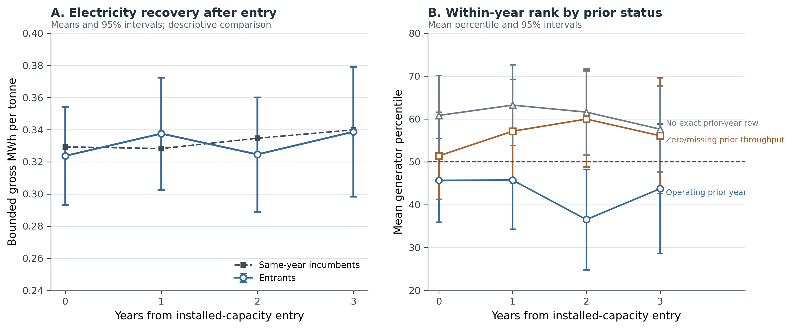

# Three Margins of Electricity Recovery: Coverage, Selective Entry, and Generator Sizing in Japan's Municipal Incinerator Fleet, FY2005-FY2024

## Abstract

Facility counts can misdiagnose electricity recovery when activity, transition,
and engineering margins are collapsed. We link 23,593 Japanese municipal-
incinerator records for fiscal year (FY) 2005-FY2024 into 1,690 audited stable
administrative lineages and 1,767 reported asset episodes. In FY2024, 41.1% of
records reported installed capacity, while positive-output facilities handled
80.1% of throughput and installed-capacity facilities held 70.5% of processing
design capacity. First reported installed-capacity entry was sparse: 35 events
entered the broad exact-year model and 33 remained after requiring positive
prior-year operation. A frozen five-parameter Firth model gave a conditional
300-versus-100 t/day odds ratio of 6.72 (1,999-lineage-bootstrap 95% confidence
interval: 4.31-12.46); the corresponding odds ratios were 7.09 after prior
operation, 7.15 within the same reported asset episode, and 6.76 after uncertain
lineages were excluded. Reclassifying each event or deleting its entire lineage
left the scale contrast between 6.12 and 7.30. Among 6,511 engineering-valid
generator-years across 493 lineages, adjusted installed capacity was 79.1%,
58.6%, and 23.5% lower in pre-1990, 1990s, and 2000s cohorts than in 2010-or-later
cohorts. Their electrical capacity factors were 35.3%, 22.0%, and 1.5%
higher, respectively, with the 2000s interval spanning zero. Thus the apparent
cohort hierarchy lies primarily in installed generator design, not uniformly
better annual use. The contribution is a three-margin national diagnosis that
separates coverage, selective entry, and installed design from operation; it
does not identify physical projects, recoverable potential, or causal effects.

**Keywords:** municipal solid waste; incineration; waste-to-energy; Japan;
generator sizing; capacity factor; administrative record linkage

## 1. Introduction

Japan's municipal waste system relies extensively on incineration for volume
reduction and hygienic treatment. Electricity recovery can use part of the heat
released during combustion, but it does not by itself make incineration
preferable to prevention, reuse, or recycling. Its value depends on plant
design, waste properties, energy use, and the wider waste and electricity
systems (Astrup et al., 2009, 2015; Brunner & Rechberger, 2015; European
Commission, 2017). Japan-specific work likewise extends beyond a binary label
of whether a plant generates electricity (Uno, 2015; Tabata & Tsai, 2016;
Yamada et al., 2023).

The Ministry's FY2024 national summary reports 415 electricity-generating
facilities among 991 incineration facilities, or 41.9% (Ministry of the
Environment Japan, 2026). That published context is distinct from this thesis's
analytical measure: 417 of 1,014 retained FY2024 facility records report
positive installed electrical capacity, or 41.1%. The numerator definition and
record denominator differ, so the official ratio is not substituted into the
analytical calculations.

The most visible national statistic is often a facility count. Yet a small
intermittent facility and a large continuous facility each contribute one unit,
despite handling different waste volumes. A count describes how widely
equipment appears across records, not how much waste passes through generating
facilities or where processing capacity is located. Those are distinct coverage
questions.

A second problem arises in facility histories. First reporting of installed
capacity is uncommon and can occur within an administratively continuous
facility, with a reported asset reset, or in a forward-dated record. These cases
do not have one verified physical meaning. The workbooks also lack a reliable
identifier over the full period: codes are absent in FY2010-FY2012 and fully
change between FY2019 and FY2020. Treating them as persistent keys would break
histories and create false events.

A third problem concerns gross electricity divided by throughput. This MWh/t
ratio combines generator size relative to processing capacity, annual use of
installed electrical capacity, and waste loading. Treating it as an independent
operating measure can make a design-cohort difference look operational.

This thesis addresses the three problems in one national facility-level study.
It reconstructs stable administrative lineages before creating lags, separates
facility participation from waste-volume and design-capacity coverage, uses a
bias-reduced event-history model for sparse first-entry events, and decomposes
gross generation intensity into observable engineering components. The aim is
descriptive and diagnostic. The study does not estimate the effect of a
specific equipment project, infer a physical closure from administrative
absence, or calculate net electricity export, useful heat, lifecycle emissions,
or recoverable technical potential. Its primary contribution is a three-margin
diagnosis: coverage separates equipment counts from covered activity,
transition estimates first reported entry among observed non-generators, and
components separate installed generator design from annual use.

### 1.1 Research questions

The three research questions (RQs) are:

> **RQ1: Count versus waste-volume coverage.** How did the share of facility
> records reporting installed electrical-generation capacity evolve from
> FY2005 to FY2024, and how does that count-based measure compare with the share
> of recorded waste throughput handled by positive-output facilities and the
> share of waste-processing design capacity located at installed-capacity
> facilities?

> **RQ2: First reported installed-capacity entry.** Among stable administrative
> lineages first observed without installed electrical-generation capacity,
> which prior-year age and waste-processing-scale profiles are associated with
> first reporting positive capacity, and does the evidence change after the
> risk set is restricted to lineages with positive prior-year waste throughput?

> **RQ3: Installed design, annual use, and exploratory pathways.** Among
> operating generators, how do raw installed electrical capacity and annual
> electrical capacity factor differ across reported start-year cohorts after
> observed controls; how do these components combine with waste loading to
> produce gross MWh/t; and how do first-complete-year component ranks differ
> descriptively between continuity-lineage and rebuild/replacement-like entries?

The sequence matters. RQ1 establishes the denominator problem at fleet level.
RQ2 then asks which observed non-generating lineages enter the installed-capacity
state. RQ3 begins only after positive throughput and gross output are observed,
and asks what produces differences within the generating segment. Figure 1
shows the annual count, throughput, and design-capacity coverage measures that
anchor this sequence.

### 1.2 Thesis objectives and significance

The thesis has four linked objectives. First, it establishes a reproducible
longitudinal facility record before calculating transitions. This is necessary
because the official identifiers do not provide an uninterrupted key over the
study period. Second, it compares three fleet-coverage denominators rather than
allowing the facility count to stand for the whole system. Third, it estimates
first reported installed-capacity entry only within an explicit population at
risk and uses a sparse-event estimator suited to the small number of observed
entries. Fourth, it decomposes gross generation per tonne into generator design
intensity, electrical capacity factor, and waste-processing utilization. The
objectives therefore progress from data identity, to fleet description, to
transition, and finally to conditional engineering structure.

The academic significance lies primarily in this integrated measurement
architecture. Existing studies offer important analyses of system outcomes,
facility performance, and Japanese waste-to-energy policy, but those questions
do not share one denominator or one comparison population. Treating them as if
they did can turn a descriptive fleet share into a performance statement, or a
conditional generator comparison into an explanation of adoption. This thesis
shows how the three questions can be studied together without collapsing their
estimands. It also demonstrates why identity reconstruction is part of the
research design rather than a preliminary clerical step: transition estimates
depend on which annual records are considered continuous.

The practical significance is diagnostic rather than prescriptive. National
and municipal decision-makers need to know whether low participation by count
also means low coverage of waste activity, whether observed entry is broadly
distributed or concentrated among particular facility profiles, and whether a
gross-output difference reflects generator size or annual use. The results can
identify where additional engineering, financial, or project-history evidence
is most valuable. They cannot by themselves select a retrofit, replacement, or
closure project.

The social significance follows from keeping electricity recovery within the
waste hierarchy. Recovering electricity can reduce wasted combustion heat, but
it does not make waste prevention, reuse, and recycling unnecessary. Clear
measurement helps prevent a high throughput-coverage statistic from being
presented as proof of environmental optimality. It also avoids treating every
non-generating facility as an equally feasible opportunity when local waste
supply, costs, grid access, heat demand, and alternative treatment arrangements
remain unobserved.

## 2. Analytical Foundation and Comparator Adaptation

### 2.1 From one fleet average to three margins

System studies consider material flows, lifecycle effects, energy substitution,
and waste hierarchy (Astrup et al., 2009, 2015; Brunner & Rechberger, 2015;
Münster & Meibom, 2010). Facility studies benchmark operating plants (Chen et
al., 2012; Yeh, 2020), while Japan studies examine policy, power systems, heat
use, and technology (Sasao, 2018; Shino, 2019; Tabata & Tsai, 2016; Uno, 2015).
These perspectives do not share one denominator or estimand.

The present design separates three margins and their estimands. Fleet coverage is an annual ratio
whose denominator is either facilities, tonnes, or waste-processing design
capacity. Entry is a discrete-time conditional probability among lineages
observed at risk. Generator components are conditional associations among
positive-throughput, positive-output generator-years that pass stated
engineering checks. A coefficient from the generator frame cannot explain why
a non-generator enters, and a facility participation rate cannot describe the
share of waste processed with electricity output.

This separation permits a low count share and high throughput share to be true
simultaneously. It also permits newer cohorts to report higher gross MWh/t
because of larger generators even when older generators do not have lower
annual capacity factors. Section 3 states that identity explicitly.

### 2.2 What is adapted from high-profile and close comparators

High-profile studies supply research logic, not a ready-made model. Cui et al.
(2026) foreground facility hierarchy, Liu et al. (2025) emphasize effectiveness
over expansion, and Han et al. (2025) place recovery beside other sustainability
dimensions. This thesis asks where hierarchy appears in Japan without estimating
an optimization frontier, city energy-carbon system, or pollutant outcomes.

Sasao (2018) supports repeated Japanese facility observations and explicit
output questions. Shino (2019) makes generation relative to waste input an
important observable. This thesis retains that observable but treats it as an
accounting intensity requiring decomposition.

Chen et al. (2012) and Yeh (2020) motivate separating activities within
operating plants. This study adds an entry risk set and uses component
regressions because the available fields do not support a comparable network or
revenue frontier across all years.

**Table 1. Transparent adaptation of comparator research logic**

| Comparator | Research logic used here | Adaptation in this thesis | Outside this thesis's estimand |
|:--|:--|:--|:--|
| Cui et al. (2026) | Examine hierarchy rather than only a fleet mean | Separate generator design intensity from annual capacity factor and waste loading | Plant optimization or a transferable frontier |
| Liu et al. (2025) | Distinguish effective system coverage from equipment expansion | Compare facility participation with throughput and design-capacity coverage | Urban energy-carbon effectiveness or welfare effects |
| Han et al. (2025) | Keep resource recovery distinct from other sustainability outcomes | State gross electricity boundaries and avoid a total-sustainability score | Pollutant-control, health, or lifecycle assessment |
| Sasao (2018) | Use repeated Japanese facility data for policy-relevant output questions | Construct a first-entry event history and explicit risk sets | Replication of the original policy specification |
| Shino (2019) | Treat electricity per waste input as an informative observable | Decompose gross MWh/t into sizing, capacity factor, and waste loading | Treating the ratio as an independent engineering score |
| Chen et al. (2012); Yeh (2020) | Recognize multiple plant activities and persistent heterogeneity | Model observable components and within-year ranks | Data-envelopment or revenue-frontier estimation |

The adaptation changes the unit and estimands to fit Japanese administrative
data. Its distinctive elements are audited lineages, count-volume coverage,
sparse first entry, and an exact engineering identity; its conclusions are
narrower than studies with process, cost, emissions, or city-system data.

## 3. Data and Methods

### 3.1 Source workbooks and recoverable provenance

The source is the Ministry of the Environment Japan General Waste Treatment
Survey facility workbook series, also distributed through the Japanese official
statistics system (e-Stat, n.d.; Ministry of the Environment Japan, 2026). The
study covers 20 fiscal years, FY2005-FY2024. For each year, the checked-in parser
reads the first workbook sheet and searches the first six spreadsheet rows for
recognized Japanese header terms. The resulting standardized fields include
facility and municipality information, reported start year, waste-processing
design capacity, annual throughput, furnace and facility attributes, installed
electrical capacity, and gross electricity generated.

The provenance audit records all 20 workbooks, their filenames, byte sizes,
256-bit Secure Hash Algorithm (SHA-256) hashes, parsed sheet names, detected
header rows, and final field
mappings. The files total 15,158,836 bytes and have 20 distinct hashes. Seventeen
standardized fields are detected in the older workbooks; 19 are detected from
FY2018 onward. Sold-electricity and sales-revenue fields are not detected for
FY2005-FY2017, which is one reason the outcome is gross generation rather than
net export or revenue. The original download timestamp was not recorded.
Volatile checkout modification times are deliberately not persisted; the
manifest instead records each workbook's last Git commit timestamp as repository
history, not retrieval time. Configured source URLs were not revalidated during
the provenance build. The
hashes establish which local files produced the results, not the publisher's
revision history or a complete acquisition chain.

Parsing yields 23,599 raw rows. Six rows are exact duplicates of another source
record and are collapsed before identity resolution, leaving 23,593 unique
facility-year records. Derived age is fiscal year minus reported start year.
Thirty-six source ages are missing and 355 are negative. Negative values are
converted to missing for age-dependent analysis rather than set to zero.
Waste-processing utilization is annual throughput divided by 365 times design
capacity. Installed generation is indicated by reported electrical capacity
greater than zero.

### 3.2 Stable administrative lineages and asset episodes

Official facility codes cannot support the longitudinal design by themselves.
All 3,716 rows in FY2010-FY2012 lack a code. Between FY2019 and FY2020, both
years contain codes, yet the sets have zero overlap. The latter break is a
complete recode, not evidence that the entire fleet was replaced. Across that
transition, the identity resolver restores 1,064 adjacent-year lineage links,
equivalent to 97.3% of FY2019 records. Across the longer FY2009-FY2013 bridge,
882 official codes overlap while 1,135 stable lineages are linked.

The resolver therefore constructs a *stable administrative lineage*: a sequence
of records judged to describe the same continuing administrative facility or
site history. It is not a claim that ownership, buildings, furnaces, or other
physical assets remain unchanged. The algorithm is deterministic and proceeds
as follows.

1. Text and identifiers are normalized conservatively, including Unicode form,
   spacing, punctuation, and numeric-code formatting. A complete standardized
   row fingerprint identifies exact duplicate records, which are collapsed
   before matching.
2. Records are compared only within prefecture. Candidate evidence combines
   normalized facility name, municipality, reported start year,
   waste-processing capacity, furnace count, facility type, and the annual
   official code. Code agreement is supporting evidence, but contradictory name
   and configuration evidence can veto a code match.
3. Adjacent fiscal years are resolved before gaps, preventing an older history
   from winning a tie over an otherwise equivalent immediately prior record.
   Short gaps of up to four years are considered afterward. Within each
   prefecture-year problem, one-to-one global assignment prevents one prior
   record from being assigned to multiple current records.
4. Unmatched records seed new deterministic lineage IDs from canonical record
   fingerprints rather than row order. Within a lineage, a new asset episode is
   created when reported start year changes materially in either direction, a
   mature record resets to a near-zero age, or a major name and configuration
   discontinuity appears.

The result contains 1,690 stable administrative lineages and 1,767 asset
episodes, with no duplicate lineage-year and no history longer than the 20-year
study window. The match audit classifies 15,324 records as code plus exact-name
links, 274 as code with other supporting evidence, 6,204 as exact-name links
without code support, 101 as fuzzy-name links without code support, and 1,690 as
new lineage seeds.

Candidate links below the minimum score are excluded before assignment, as are
ambiguous links lacking an exact-name or official-code signal. This removes
3,092 sub-threshold and 15,308 weak ambiguous candidate edges. Sixteen accepted
links, spanning 14 lineages, still have a low current-record or prior-record
margin but retain strong evidence; every one is exposed in the identity audit.
The entry and component analyses therefore include whole-lineage
identity-certain sensitivities that exclude all 14 affected lineages rather
than selectively removing individual years.

Known difficult cases are embedded as executable checks. Three pairs that must
link and three pairs that must remain separate are tested directly, including
examples from the FY2019-FY2020 recode and earlier code reuse. The resolver is
also rerun after random row permutation and after insertion of an unrelated
synthetic record in six difficult or duplicate-bearing prefectures. The
lineage/episode mapping must remain unchanged. These golden-link, separation,
permutation, and insertion tests reduce identifiable implementation risks; they
do not make probabilistic record linkage certain. Any result depending on a
small number of lineages remains vulnerable to unresolved name or configuration
ambiguity. The uncertainty flag makes that vulnerability testable rather than
implicit.

A blinded clerical-review packet provides a further validation gate consistent
with guidance for linked administrative cohorts (Harron et al., 2020). It
contains all 35 modeled event links, all 16 accepted uncertain links, all 31
gap links, 50 deterministic FY2019-FY2020 bridge links, and a stratified sample
of other accepted pairs. Match scores, algorithmic decisions, and final lineage
IDs are withheld from the reviewer-facing packet. A second reviewer records
same history, different history, indeterminate, or probable reset before the
answer key is opened and disagreements are adjudicated. The packet is generated
and archived; until independent review is completed, it is a protocol and
sensitivity resource rather than evidence of independent validation.

### 3.3 Analytical frames and estimands

The three RQs use related but non-identical samples. Table 2 prevents their
denominators from being blended.

**Table 2. Analytical frames after identity and data-quality checks**

| Frame | Facility-year rows | Stable lineages | Events | Estimand |
|:--|--:|--:|--:|:--|
| Full administrative panel | 23,593 | 1,690 | Not applicable | Annual facility, throughput, and design-capacity coverage |
| Descriptive non-generator risk set | 16,519 | 1,223 | 55 | Observed first installed-capacity entries during follow-up |
| Broad exact-year complete-covariate entry model | 15,154 | 1,137 | 35 | Conditional annual administrative-lineage entry odds using prior-year covariates |
| Exact-year model after prior operation | 13,072 | 1,019 | 33 | Nested sensitivity requiring positive prior-year throughput |
| Same-asset-episode continuity sensitivity | 15,095 | 1,135 | 24 | Entry odds after excluding transitions that cross an inferred asset-episode boundary |
| Identity-certain-lineage sensitivity | 15,107 | 1,130 | 35 | Broad model after excluding every lineage containing an accepted uncertain identity link |
| Positive-throughput, positive-output generators | 6,660 | 504 | Not applicable | Descriptive operating-generator frame |
| Engineering-valid component model | 6,511 | 493 | Not applicable | Conditional generator-component associations |

The entry sample excludes 467 lineages already reporting positive installed
capacity in their first observed year because their entry time is left-censored.
A remaining lineage contributes annual risk rows until its first positive
capacity observation or its last observed non-generating year. The first
observed risk row is dropped from modeling because a lagged predictor is not
available. The complete-covariate frame further drops 120 rows with missing
lagged age or processing capacity, and 22 non-adjacent rows are excluded from
the exact-year model; none of those 22 rows contains an event.

The 55 descriptive events, the 35 complete-covariate events, and the pathway
categories answer different bookkeeping questions. Coincidentally, the pathway
audit also identifies 35 continuity-lineage events. That count should not be
conflated with the 35 events in the exact-year regression sample. The former is
a pathway classification among observed entries; the latter is a covariate
completeness restriction.

### 3.4 RQ1: coverage definitions and fleet identity

For fiscal year $t$, let $N_t$ be all retained facility records,
$I_{it}^{K}$ indicate positive installed electrical capacity, $I_{it}^{G}$
indicate positive gross generation with positive throughput, $W_{it}$ be
annual throughput, and $C_{it}$ be waste-processing design capacity. The three
headline coverage measures are

\[
P_t^{facility}=\frac{\sum_i I_{it}^{K}}{N_t},
\]

\[
P_t^{throughput}=\frac{\sum_i W_{it}I_{it}^{G}}
{\sum_i W_{it}},
\]

and

\[
P_t^{design}=\frac{\sum_i C_{it}I_{it}^{K}}
{\sum_i C_{it}}.
\]

The first uses facility records, the second tonnes, and the third tonnes per day
of design capacity. Positive output is used in the throughput numerator because
installed capacity does not guarantee positive annual generation. For the
engineering-valid subset, fleet gross intensity has the exact decomposition

\[
\frac{\sum_i G_{it}^{valid}}{\sum_i W_{it}}
=
\left(\frac{\sum_i W_{it}^{valid}}{\sum_i W_{it}}\right)
\left(\frac{\sum_i G_{it}^{valid}}{\sum_i W_{it}^{valid}}\right).
\]

The first term is valid generator-throughput coverage and the second is
throughput-weighted conditional gross intensity. This identity distinguishes
how much waste is covered from how much gross electricity is reported per tonne
within the covered segment.

### 3.5 RQ2: sparse first-entry model

The event is the first observed year with positive installed electrical capacity
after a lineage has been observed without it. It is an administrative state
transition. It does not uniquely identify first physical operation, equipment
installation, or a particular construction history.

Discrete-time event-history analysis represents each at-risk lineage-year as a
binary outcome (Allison, 1982; Beck et al., 1998). For lineage $i$ in year
$t$, the frozen primary model is

\[
\begin{aligned}
\operatorname{logit}\{\Pr(Y_{it}=1\mid Y_{i,t-1}=0)\}
&=\alpha + \beta_A\frac{A_{i,t-1}}{10}
+\beta_C\log\left(1+\frac{C_{i,t-1}}{100}\right) \\
&\quad+\beta_T\frac{t-2014.5}{5}
+\beta_R\log(1+R_{it}),
\end{aligned}
\]

where $A$ is prior-year reported facility age, $C$ is prior-year processing
design capacity in t/day, and $R$ is elapsed observed time at risk. Age is
scaled per ten years and calendar time per five years. Including the intercept,
the specification has five parameters for 35 broad-frame events. It was written
and frozen before the revised fit. The earlier 11-parameter model with age,
calendar-era, and duration bands is retained as a sensitivity, not used as the
primary model. Technology and geography are not added because they would spend
sparse-event information without creating causal control.

Ordinary maximum-likelihood logit is vulnerable to small-sample bias and
separation in a sparse event design. The primary estimator therefore uses
Firth's bias reduction (Firth, 1993) and its finite-estimate solution to
separation (Heinze & Schemper, 2002), maximizing the penalized log-likelihood

\[
\ell_F(\boldsymbol{\theta})=
\ell(\boldsymbol{\theta})+
\frac{1}{2}\log\left|\mathcal{I}(\boldsymbol{\theta})\right|,
\]

where $\ell$ is the binomial log-likelihood and $\mathcal{I}$ is the expected
information matrix. The Jeffreys-prior penalty reduces first-order bias and
keeps finite estimates under separation. The coefficient table labels the
fitted-model standard errors, confidence intervals, and term-level *p*-values as
model-based. To represent repeated observations from the same lineage, the
primary uncertainty calculation uses 1,999 deterministic cluster-bootstrap
replications that resample complete lineages with replacement. Percentile
intervals use the resulting coefficient distributions. Every requested
replication must converge and return all focal coefficients; otherwise the
analysis fails rather than silently dropping a bootstrap draw. The continuous
age coefficient is reported with both model-based and lineage-bootstrap
uncertainty.

Four frames are fitted. The broad exact-year frame includes every complete
at-risk row whose lag belongs to the same stable administrative lineage; it can
cross an inferred asset-episode boundary because its estimand is first
administrative-lineage entry. The prior-operation frame is a nested sensitivity
that additionally requires positive prior-year throughput. It is not an
independent comparison group, so differences between it and the broad frame are
not treated as an equality or equivalence test. A same-asset-episode continuity
sensitivity excludes the 59 exact-year rows that cross an inferred episode
boundary, including 11 events. An identity-certain sensitivity excludes every
lineage containing any of the 16 accepted uncertain links. These two additional
frames show whether inference depends on the continuity and linkage rules.

For an intuitive scale contrast, the odds ratio comparing 300 with 100 t/day is

\[
OR_{300:100}=\exp\left[\beta_C
\left\{\log(1+300/100)-\log(1+100/100)\right\}\right]
=\exp(\beta_C\log 2).
\]

The four reduced-degree-of-freedom frames are primary. The earlier
11-parameter Firth model and conventional logit and complementary-log-log fits
are retained as specification and link-function sensitivities.

### 3.6 RQ3: engineering decomposition and component models

Let $G_{it}$ be annual gross generation in MWh, $W_{it}$ annual throughput
in tonnes, $K_{it}$ installed electrical capacity in kW, and $C_{it}$
waste-processing design capacity in t/day. Define

\[
Y_{it}=\frac{G_{it}}{W_{it}}
\quad\text{(gross generation intensity, MWh/t)},
\]

\[
D_{it}=\frac{K_{it}}{C_{it}}
\quad\text{(generator design intensity, kW per t/day)},
\]

\[
F_{it}=\frac{G_{it}}{8.76K_{it}}
\quad\text{(annual electrical capacity factor)},
\]

and

\[
U_{it}=\frac{W_{it}}{365C_{it}}
\quad\text{(waste-processing utilization)}.
\]

The factor 8.76 converts one kW operating for 8,760 hours into annual MWh. These
definitions imply the exact facility-year identity

\[
Y_{it}=\frac{8.76}{365}\frac{D_{it}F_{it}}{U_{it}}
=0.024\frac{D_{it}F_{it}}{U_{it}}.
\]

Gross MWh/t is thus a ratio produced jointly by installed sizing, annual use of
that electrical capacity, and annual waste loading. The identity does not say
that any one component is exogenous. For example, throughput, capacity factor,
maintenance, and waste composition may be jointly determined during a year.

The primary sample requires positive installed capacity, throughput, and gross
output. Values are excluded rather than clipped if gross intensity falls
outside 0.01-0.80 MWh/t, electrical capacity factor outside 0.02-1.20,
waste-processing utilization outside 0.02-1.20, or generator design intensity
outside 0.1-100 kW per t/day. A non-missing non-negative reported age and all
model fields are also required. Of 6,660 positive-throughput, positive-output
rows, 149 fail at least one check, leaving 6,511 rows across 493 lineages.
Heating value between 3 and 25 megajoules per kilogram (MJ/kg) is audited as a
plausibility field but is not an inclusion condition for the primary component
models; 102 otherwise valid rows lack it.

Two pooled component models are estimated by ordinary least squares with
standard errors clustered by stable lineage (Wooldridge, 2010). To avoid making
a ratio the primary design outcome, installed electrical capacity is modeled in
its raw reported unit:

\[
\log K_{it}=\alpha_K+\mathbf{V}_{it}\boldsymbol{\beta}_K
+\beta_{KC}\log C_{it}+\mathbf{T}_{it}\boldsymbol{\eta}_K
+\lambda_t+\varepsilon_{Kit},
\]

\[
\log F_{it}=\alpha_F+\mathbf{V}_{it}\boldsymbol{\beta}_F
+\beta_{FC}\log C_{it}+\beta_U U_{it}
+\mathbf{T}_{it}\boldsymbol{\eta}_F+\lambda_t+\varepsilon_{Fit}.
\]

$\mathbf{V}_{it}$ contains reported start-year cohorts before 1990, 1990-1999,
and 2000-2009 relative to 2010 or later. Reported start year is an
administrative design-vintage marker, not a verified boiler or generator
installation date. $\mathbf{T}$ includes furnace count and coarse furnace and
facility-type groups; $\lambda_t$ are fiscal-year indicators. Because
$\log D=\log K-\log C$, the corresponding design-intensity scale elasticity is
$\beta_{KC}-1$ under identical controls; this is an algebraic translation, not
an independent corroborating model. A direct gross-output model replaces
$\log C$ with $\log W$ and $\log K$, retaining cohort, technology,
furnace-count, and year terms.

A specification diagnostic compares a legacy-style regression of $\log Y$ on
reported age, processing scale, waste utilization, heating value, technology,
and year with the same model after adding $\log D$. Both specifications use the
5,806 engineering-valid rows with reported heating value in the 3-25 MJ/kg
plausibility range. This is not a causal mediation design. It asks whether
coefficients previously attributed to age, scale, or utilization are stable
after the omitted installed-sizing component is represented.

Robustness checks split the period into FY2005-FY2014 and FY2015-FY2024, give
each lineage equal total weight, and apply conservative and broad predefined
engineering bounds. Asset-episode fixed effects and exact-adjacent first
differences are used only for operating components that vary meaningfully
within an episode. Design intensity is predominantly a between-asset attribute,
so within-episode change is not presented as its primary estimand.

Finally, event pathways are classified from observed administrative continuity.
A continuity-lineage entry remains in the same lineage and asset episode across
adjacent years without a reported reset. A rebuild/replacement-like entry has an
asset-episode, reported-start-year, or mature-to-new age reset. A
forward-dated/placeholder entry has a future start year or new-build placeholder
name. These labels are descriptive evidence rules. They do not verify the
physical project mechanism. First-complete-year outcomes are compared as
within-fiscal-year percentile ranks among engineering-valid generators, which
reduces confounding by fleet-wide time trends but does not remove selection into
each pathway.

## 4. Results

### 4.1 RQ1: facility counts understate waste-volume coverage

The official 415/991 ratio (41.9%) describes the Ministry's published count of
electricity-generating facilities. The results below use the separate analytical
definition of positive installed capacity among retained facility records.

Installed-capacity participation rises steadily from 21.6% of facility records
in FY2005 to 41.1% in FY2024. Positive-output facilities already handle a much
larger share of waste: throughput coverage rises from 60.5% to 80.1% over the
same period. The design-capacity share at installed-capacity facilities moves
from 56.0% to 70.5%. Figure 1 therefore shows long-run increases with
year-to-year variation under all three denominators, alongside a persistent
count-volume gap.

The FY2024 cross-section makes the distinction concrete. The administrative
panel contains 1,014 facility records, of which 417 report positive installed
electrical capacity, giving the 41.1% participation rate. There are 410
positive-throughput, positive-output facilities. They process 24.70 million of
the 30.84 million recorded tonnes, or 80.1%. In contrast, 469 operating
non-generators process 6.14 million tonnes, or 19.9%. Another 126 records report
neither positive throughput nor generation, and nine installed-capacity records
report no positive output. Because output and installed-capacity flags are not
identical, these segment counts should not be forced into a single binary
partition.

After the predefined output and capacity-factor checks, valid generator rows
cover 79.7% of FY2024 throughput. Their throughput-weighted conditional gross
intensity is 0.425 MWh/t. Multiplying 0.797 by 0.425 gives 0.338 MWh per total
fleet tonne, exactly matching valid gross generation divided by all recorded
throughput. This arithmetic is more informative than the facility count alone:
most recorded waste is already processed at facilities reporting positive
generation, even though installed equipment appears in fewer than half of
facility records.

The result does not imply that the remaining 19.9% of operating throughput can
or should all be redirected or equipped. It also does not measure electricity
used internally, net export, heat recovery, marginal emissions, or project
cost. Its contribution is denominator discipline: 41.1%, 80.1%, and 70.5%
answer different questions, and no one of them is a sufficient measure of the
remaining opportunity.

### 4.2 RQ2: entry is rare and strongly associated with processing scale

The descriptive risk set contains 55 first reported installed-capacity entries.
The pathway audit classifies 35 as continuity-lineage entries, 11 as
rebuild/replacement-like, and nine as forward-dated or placeholder entries. The
35 exact-year modeled events have a different composition: 24 are
continuity-lineage entries and 11 are rebuild/replacement-like; none is
forward-dated. The four calendar eras contain 7, 4, 14, and 10 events,
respectively. In the bridge to reported output, 47 of the 55 descriptive events
show positive gross generation in the event year and 51 do so by the following
observed fiscal year. Installed capacity and positive annual output are closely
related but not identical states.

Only 35 events remain after requiring an exact one-year lag and complete prior
age and capacity; 33 remain after requiring positive prior-year throughput.
This sparse count is central to interpretation. The Firth model addresses
finite-estimate and first-order bias problems, but it cannot create information
that the panel does not contain.

Observed rates already show strong scale ordering. Entry occurs in 1 of 3,854
risk rows in the smallest processing-capacity quartile (0.026%), 2 of 4,175 in
the second quartile (0.048%), 9 of 3,702 in the third (0.243%), and 23 of 3,423
in the largest (0.672%). Because risk duration, calendar period, and age differ
across these groups, the adjusted model is needed before interpreting the
gradient.

In the frozen five-parameter broad Firth model, the coefficient on
$\log(1+C/100)$ is 2.749. The implied 300-versus-100 t/day odds ratio is 6.72,
with a 1,999-lineage-bootstrap 95% confidence interval (CI) of 4.31 to 12.46.
The prior-operation, same-episode, and identity-certain odds ratios are 7.09
(CI 4.08-13.76), 7.15 (CI 4.44-14.05), and 6.76 (CI 4.23-12.30), respectively.
Because these frames are nested, their coefficients are parallel sensitivity
estimates rather than between-group contrasts.

The broad continuous-age coefficient is -0.327 per ten years (bootstrap CI
-0.774 to 0.070); the prior-operation and identity-certain intervals also span
zero. The same-episode estimate is more negative (-0.751; CI -1.364 to -0.206)
but relies on only 24 events. This contrast makes age a continuity-sensitive
association, not a general equipment-age response. The earlier 11-parameter
model reaches the same caution: its broad, prior-operation, and
identity-certain joint age tests are not significant, while the same-episode
result changes with covariance choice.

Event influence is small relative to the estimated scale gradient. Reclassifying
each event as a non-event one at a time leaves 300-versus-100 t/day odds ratios
from 6.12 to 7.30. Deleting the event's entire administrative lineage leaves a
range of 6.13 to 7.30. Thus no one modeled event or event lineage creates the
scale result. These perturbations diagnose influence; they do not make events
independent or validate their physical mechanism.

The supported RQ2 conclusion is narrow but robust. First reported capacity entry
is rare and selectively concentrated among larger waste-processing facilities.
This concerns witnessed transitions among prior non-generators and survives all
continuity frames and event-level attacks. It remains observational: scale can
proxy for contracts, finances, catchments, technology, or municipal capacity.

### 4.3 RQ3: the gross-intensity hierarchy is principally a sizing hierarchy

The engineering-valid generator frame has 6,511 observations from 493 stable
lineages. Median gross intensity is 0.327 MWh/t, median generator design
intensity is 14.0 kW per t/day, median electrical capacity factor is 0.607, and
median waste-processing utilization is 0.609. These summaries describe
generator-years that pass stated bounds, not the full fleet.

Reported start-year cohorts differ much more in installed generator size than
in annual capacity factor. Median design intensity rises from 5.33 kW per t/day
before 1990 to 10.83 in the 1990s, 15.83 in the 2000s, and 20.59 in 2010 or
later. Median gross intensity rises in parallel from 0.145 to 0.283, 0.348, and
0.475 MWh/t. Median electrical capacity factors are 0.619, 0.625, 0.561, and
0.664; they do not show a comparable monotonic gradient.

The raw installed-kW model sharpens this pattern. Relative to the 2010-or-later
cohort and conditional on processing design capacity, technology, furnace count,
and fiscal year, adjusted installed electrical capacity is 79.1% lower before
1990 (95% CI 75.3%-82.3% lower), 58.6% lower for 1990-1999 (53.2%-63.5%), and
23.5% lower for 2000-2009 (16.7%-29.6%). The elasticity of installed kW with
respect to processing t/day is 1.532 (95% CI 1.447-1.617), and model $R^2$ is
0.786. Subtracting one from this elasticity gives the 0.532 design-intensity
elasticity under identical controls; that equality is a change of outcome
scale, not independent replication.

The electrical-capacity-factor model tells a different story. Conditional on
processing scale, waste utilization, technology, furnace count, and fiscal
year, pre-1990 and 1990s capacity factors are 35.3% (95% CI 24.6%-46.8%) and
22.0% (14.4%-30.0%) higher than in the 2010-or-later cohort. The 2000s estimate
is 1.5% higher, with a CI from 4.1% lower to 7.4% higher. Waste
utilization is positively associated with log electrical capacity factor
(coefficient 1.695, 95% CI 1.448 to 1.942), while processing scale is negatively
associated (-0.116, 95% CI -0.162 to -0.070). This model explains 33.9% of log
capacity-factor variation. These coefficients describe annual use of installed
kW. They do not show that utilization has an independent positive association
with gross MWh/t after generator sizing is represented.

The direct gross-output model is consistent with the component structure. The
elasticity of annual gross MWh with respect to throughput is 0.638 (95% CI 0.536
to 0.740), and the elasticity with respect to installed electrical capacity is
0.576 (95% CI 0.502 to 0.650), conditional on cohort, observed technology,
furnace count, and year. The model $R^2$ is 0.914. It confirms that both waste
loading and installed kW are central to annual output, but it is not a production
function with exogenous inputs.

The most important diagnostic compares gross-intensity specifications on the
5,806-row plausible-heating-value subset. In the
legacy-style model without generator design intensity, the reported-age
coefficient is -0.0349, the processing-capacity coefficient is 0.1001, and the
waste-utilization coefficient is 0.6699; all have *p*<0.001. After adding log
generator design intensity, the corresponding coefficients become -0.0020
(*p*=0.2977), -0.0092 (*p*=0.1991), and -0.0995 (*p*=0.2038). The sizing coefficient
is 0.7532 (*p*<0.001), and model $R^2$ rises from 0.4737 to 0.8131. This is not a
causal decomposition. It shows that the former age, scale, and utilization
interpretation is sensitive to whether installed generator sizing is
represented.

Adjacent-year rank persistence is highest for generator design intensity:
0.995 across 5,963 pairs from 470 lineages. Gross-intensity rank persistence is
0.961 and capacity-factor persistence is 0.873. The corresponding within-to-total
variance ratios are 0.016 for log design intensity, 0.089 for log gross
intensity, and 0.426 for log capacity factor. Sizing is therefore mostly a
between-asset design attribute, while annual capacity factor contains much more
within-asset movement.

The principal component conclusions remain stable across the two ten-year
windows, lineage-equal weighting, and conservative or broad engineering bounds.
For example, the processing-scale coefficient in the design-intensity model is
0.474 in FY2005-FY2014 and 0.577 in FY2015-FY2024; it is 0.520 under conservative
bounds and 0.536 under broad bounds. Excluding every identity-uncertain lineage
leaves 6,450 rows across 487 lineages and gives a nearly unchanged coefficient
of 0.533. Within-asset-episode models also retain a
positive association between utilization and electrical capacity factor. Those
checks strengthen the component description but do not resolve simultaneous
changes in throughput, maintenance, installed capacity, and output.

### 4.4 Exploratory pathway comparison

The first-complete-year comparison asks where entrants sit in the same-year
generator distribution, not what entry causes. Across all exact-year entrants
with available engineering-valid outcomes at event time plus one, 44 lineages
have mean gross-intensity rank 51.6%, generator-design rank 48.1%, and
capacity-factor rank 56.3%. The pooled average is therefore near the middle of
the contemporaneous generator distribution.

Pathways are heterogeneous. At event time plus one, 27 continuity-lineage
entrants average 0.260 MWh/t and rank at 40.2% for gross intensity, 36.8% for
generator design intensity, and 53.8% for electrical capacity factor. Eleven
rebuild/replacement-like entrants average 0.442 MWh/t and rank at 72.5%, 66.1%,
and 65.5%, respectively. Figure 4 displays these component ranks. Six
forward-dated/placeholder observations are omitted from the plotted contrast
because that category is too sparse and its administrative timing is difficult
to interpret.

The larger pathway difference aligns more closely with generator sizing than
with capacity factor.
That pattern is consistent with the broader component results, but it is not an
estimated effect of pathway. Pathway assignment is based on reported resets,
follow-up is selective, and there is no counterfactual match between otherwise
equivalent projects.

## 5. Discussion

### 5.1 What the thesis changes in the fleet narrative

The 41.1% analytical participation rate describes equipment distribution, not
waste coverage. Positive-output facilities handle 80.1% of throughput, and the
installed segment holds 70.5% of processing design capacity. Japan therefore
combines incomplete diffusion across records with substantial volume coverage;
non-generating records are not equal-sized unused opportunities.

Entry is strongly associated with processing scale in all four reduced models,
and the result survives every event reclassification and whole-event-lineage
deletion. The model still does not show that enlarging a facility would produce
entry. Scale can proxy for unobserved municipal, technical, and financial
conditions. Age is weaker evidence: broad, prior-operation, and
identity-certain bootstrap intervals span zero, while the same-episode result
uses only 24 events. This sensitivity is evidence against a simple age-only
narrative, not evidence for one preferred continuity definition.

Gross MWh/t also changes meaning after decomposition. Its observed cohort
hierarchy aligns primarily with installed generator capacity: older cohorts
have substantially smaller adjusted kW but not lower annual capacity factors.
Once sizing is included, the other legacy coefficients no longer carry a
distinct gross-intensity interpretation. The empirical contribution is not
“newer plants work better”; it is that reported design and annual use point in
different cohort directions.

### 5.2 Direct answers to the research questions

**RQ1 is answered by a denominator contrast, not by one preferred percentage.**
In FY2024, installed-capacity participation covers 41.1% of retained facility
records, positive-output facilities handle 80.1% of recorded throughput, and
installed-capacity facilities hold 70.5% of recorded processing design
capacity. The difference means that generation is concentrated in larger or
more heavily used parts of the observed fleet. It does not mean that 80.1% of
waste becomes electricity, that the remaining throughput is recoverable, or
that the covered facilities are environmentally optimal. RQ1 therefore changes
the fleet narrative from "how many facilities generate?" to "which share of
facilities, activity, and processing capacity is covered?"

**RQ2 is answered by a robust scale association and a continuity-sensitive age
association.** The broad five-parameter Firth model gives a 300-versus-100
t/day odds ratio of 6.72, and the corresponding contrast remains close to seven
under the prior-operation, same-episode, identity-certain, reclassification, and
lineage-deletion checks. The evidence consequently supports processing scale as
a stable profile of first reported entry in this administrative panel. Age is
less stable across continuity definitions and should not support an age-only
screening rule. Most importantly, the outcome is first reported positive
installed capacity within an administrative lineage. It is not a verified
retrofit, construction start, or causal response to changing capacity.

**RQ3 is answered by separating installed design from annual use.** The adjusted
cohort hierarchy is large for installed electrical capacity, whereas older
cohorts do not show uniformly lower electrical capacity factors. Gross MWh/t
therefore cannot be read as an independent operating-efficiency score. It is
produced jointly by generator sizing, annual utilization of electrical
capacity, and waste loading. The small pathway comparison suggests different
first-complete-year component ranks between continuity-lineage and
rebuild/replacement-like entries, but selection and uncertain physical meaning
keep that comparison exploratory.

Together, the answers provide one ordered diagnosis. RQ1 locates electricity
recovery within the fleet; RQ2 describes which observed non-generator lineages
first enter the installed-capacity state; and RQ3 explains the observable
structure inside the generating segment. No result is asked to answer a
question belonging to another frame. That separation is the central thesis
contribution and the main safeguard against an aggregate or conditional result
being interpreted causally.

### 5.3 Evidence-bound implications

Monitoring should report facility, throughput, and design-capacity coverage
together. Screening can treat processing scale as a marker for further
feasibility work, but not use an age-only rule. Existing generators should be
compared conditional on sizing and design vintage before gross MWh/t is
interpreted as an operating gap.

These are measurement and diagnostic implications, not a ranked list of
projects. The study does not determine whether a municipality should build,
replace, coordinate, maintain, or retire a facility. Such decisions require
capital costs, waste-supply agreements, grid and internal-use conditions,
maintenance history, emissions controls, heat demand, and alternatives higher
in the waste hierarchy. The thesis's role is to prevent an aggregate statistic
or misspecified ratio from deciding those questions implicitly.

### 5.4 Limitations and next evidence needed

The 20 workbooks are hash-identified and parser mappings are documented, but
their original retrieval timestamps and publisher-side revision history are
unavailable. Future acquisition should archive both.

Stable administrative lineages remain inferred. The resolver addresses exact
duplicates, code breaks, row-order dependence, and known difficult links, but no
physical-site registry confirms ownership, construction, or closure histories.
Administrative absence is therefore not modeled as a physical outcome.

Entry is rare and partially left-censored. Firth estimation and lineage
bootstrapping cannot overcome only 35 broad-frame, 33 prior-operation, and 24
same-episode events. Although all 1,999 requested bootstrap replications per
frame converge, resampling cannot create missing project information. The parsimonious models omit financing,
prices, contracts, catchments, maintenance, and detailed technology. Scale may
proxy for these, so odds ratios are associations rather than effects of changing
t/day.

Generator fields also have strict boundaries. Gross generation is not net
export; on-site use and useful heat are incomplete; reported capacity may differ
from availability; and MWh/t is not the European Union R1 energy-efficiency
indicator, a lifecycle measure, or an economic measure (Grosso et al., 2010).
Heating-value coverage is insufficient for a common thermal measure. Bounds
remove 149 rows but may exclude unusual valid cases or retain plausible-looking
errors.

Reported start year is not an equipment date and can bundle original design,
later equipment, reporting, waste, and municipality context. Annual throughput,
capacity factor, maintenance, and output are jointly determined. Controls,
fixed effects, and adjacent differences do not create exogenous variation; the
equations remain accounting identities and conditional descriptions.

The 2010-or-later cohort necessarily enters the panel only from FY2010 onward,
whereas older cohorts span more of the study window. Fiscal-year indicators
create within-year comparisons where cohorts overlap, but they do not remove
selective survival, unrecorded replacement, or cohort-specific reporting. The
adjusted contrasts are conditional administrative differences, not physical
depreciation or technology effects.

Finally, the pathway contrast is small and selected, and reported resets do not
verify physical replacement. Linking procurement, construction, generator,
net-export, heat-use, outage, and waste-composition records would enable the
project-specific questions this panel cannot answer.

## 6. Conclusion

Japan's municipal-incineration fleet looks different at three margins. In
FY2024, installed capacity appears in 41.1% of facility records, while
positive-output facilities handle 80.1% of throughput and installed-capacity
facilities represent 70.5% of processing design capacity. At the transition
margin, first reported entry is sparse but strongly scale-selective: the broad
300-versus-100 t/day odds ratio is 6.72 and remains near seven under every frame
and event-level attack. Age remains continuity-sensitive. At the component
margin, older cohorts have markedly smaller adjusted installed kW but do not
have lower annual capacity factors.
An exploratory comparison places continuity-lineage entrants below
rebuild/replacement-like entrants in first-complete-year component ranks, but
that small, selected contrast remains descriptive.

The thesis's contribution is therefore not a claim that every non-generator is
an equal opportunity or that newer facilities simply perform better. It is a
three-margin diagnostic: reconstruct lineages before transitions, separate
counts from covered activity, and separate installed design from annual use.
That architecture gives a professor or later reviewer a clear foundation for
deciding which next question requires engineering, capital-history, or causal
evidence.

## Acknowledgements

The author thanks Prof. Han Ji for supervision and critical feedback during the
development of this thesis.

## Funding

This research did not receive any specific grant from funding agencies in the
public, commercial, or not-for-profit sectors.

## Contributor Roles Taxonomy (CRediT) Authorship Contribution Statement

Pann Phetra: Conceptualization, Data curation, Formal analysis, Investigation,
Methodology, Visualization, Writing - original draft, Writing - review &
editing.

## Declaration of Competing Interest

The author declares no known competing financial interests or personal
relationships that could have appeared to influence the work reported in this
paper.

## Ethical Approval

This study uses publicly released administrative facility data and does not
involve human participants, animal subjects, or private personal data.

## Data Availability

The facility-level source data are derived from the Ministry of the Environment
Japan General Waste Treatment Survey, which is publicly released by the Ministry
and e-Stat. Analysis code, machine-readable result manifests, derived tables,
figure-generation scripts, and manuscript figures are available in the
versioned public repository at
https://github.com/Pann13223029/incineration-paper. The repository also preserves
the source workbooks used for this analysis, cites e-Stat as the source, and
labels harmonized data as researcher-edited content. e-Stat permits reuse,
copying, public transmission, and modification with source citation under terms
compatible with Creative Commons Attribution 4.0; users should consult the
current e-Stat terms for exceptions and updates.

## Declaration of Generative AI and AI-Assisted Technologies in the Thesis Preparation Process

During the preparation of this thesis, the author used OpenAI Codex and
Anthropic Claude for language revision, thesis organization, and assistance
with code development and review. The author executed the analyses, inspected
the source data and generated outputs, independently checked the reported
results, reviewed and edited all AI-assisted material, and takes full
responsibility for the content. These tools were not used as authors and did not
replace author judgment or accountability.

## References

Allison, P. D. (1982). Discrete-time methods for the analysis of event histories.
*Sociological Methodology*, *13*, 61-98. https://doi.org/10.2307/270718

Astrup, T., Møller, J., & Fruergaard, T. (2009). Incineration and
co-combustion of waste: Accounting of greenhouse gases and global warming
contributions. *Waste Management & Research*, *27*(8), 789-799.
https://doi.org/10.1177/0734242X09343774

Astrup, T. F., Tonini, D., Turconi, R., & Boldrin, A. (2015). Life cycle
assessment of thermal waste-to-energy technologies: Review and recommendations.
*Waste Management*, *37*, 104-115.
https://doi.org/10.1016/j.wasman.2014.06.011

Beck, N., Katz, J. N., & Tucker, R. (1998). Taking time seriously:
Time-series-cross-section analysis with a binary dependent variable. *American
Journal of Political Science*, *42*(4), 1260-1288.
https://doi.org/10.2307/2991857

Brunner, P. H., & Rechberger, H. (2015). Waste to energy - key element for
sustainable waste management. *Waste Management*, *37*, 3-12.
https://doi.org/10.1016/j.wasman.2014.02.003

Chen, P.-C., Chang, C.-C., Yu, M.-M., & Hsu, S.-H. (2012). Performance
measurement for incineration plants using multi-activity network data
envelopment analysis: The case of Taiwan. *Journal of Environmental
Management*, *93*(1), 95-103. https://doi.org/10.1016/j.jenvman.2011.08.011

Cui, J., Cui, Y., Li, J., Gao, X., Wei, W., Chen, Y., Ma, W., Zhu, N., Geng,
Y., Zhao, Y., & Lou, Z. (2026). Efficiency hierarchy and optimization of waste
incineration in China to balance disposal and energy supply. *Nature
Communications*, *17*(1), Article 3069.
https://doi.org/10.1038/s41467-026-69897-w

e-Stat. (n.d.). *Nation Survey on the State of Discharge and Treatment of
Municipal Solid Waste* (Statistics code 00650101). Portal Site of Official
Statistics of Japan. https://www.e-stat.go.jp/en/statistics/00650101 (accessed
10 July 2026).

European Commission. (2017). *The role of waste-to-energy in the circular
economy* (COM(2017) 34 final). European Commission.
https://eur-lex.europa.eu/legal-content/EN/TXT/?uri=CELEX:52017DC0034

Firth, D. (1993). Bias reduction of maximum likelihood estimates. *Biometrika*,
*80*(1), 27-38. https://doi.org/10.1093/biomet/80.1.27

Grosso, M., Motta, A., & Rigamonti, L. (2010). Efficiency of energy recovery
from waste incineration, in the light of the new Waste Framework Directive.
*Waste Management*, *30*(7), 1238-1243.
https://doi.org/10.1016/j.wasman.2010.02.036

Han, Q.-l., Liu, H.-q., Gong, Y.-y., Tao, J.-y., Sun, Y.-n., Wei, G.-x., Zhu,
Y.-w., & Chen, G.-y. (2025). Strengthening pollutant control and resource
recovery can enhance sustainable waste incineration in China. *Communications
Earth & Environment*, *6*, Article 863.
https://doi.org/10.1038/s43247-025-02859-0

Harron, K., Doidge, J. C., & Goldstein, H. (2020). Assessing data linkage
quality in cohort studies. *Annals of Human Biology*, *47*(2), 218-226.
https://doi.org/10.1080/03014460.2020.1742379

Heinze, G., & Schemper, M. (2002). A solution to the problem of separation in
logistic regression. *Statistics in Medicine*, *21*(16), 2409-2419.
https://doi.org/10.1002/sim.1047

Liu, B., Wang, P., Zhou, J., Guo, Y., Ma, S., Chen, W.-Q., Li, J., & Chang,
V. W.-C. (2025). Refocusing on effectiveness over expansion in urban
waste-energy-carbon development in China. *Nature Energy*, *10*, 215-225.
https://doi.org/10.1038/s41560-024-01683-8

Ministry of the Environment Japan. (2026). *General Waste Treatment Survey
results: FY2024 municipal solid waste treatment survey*. Environmental
Management Bureau, Ministry of the Environment Japan.
https://www.env.go.jp/recycle/waste_tech/ippan/ (accessed 10 July 2026).

Münster, M., & Meibom, P. (2010). Long-term affected energy production of waste
to energy technologies identified by use of energy system analysis.
*Waste Management*, *30*(12), 2510-2519.
https://doi.org/10.1016/j.wasman.2010.04.015

Sasao, T. (2018). How does municipal solid waste policy affect heat and
electricity produced by incinerators? *Detritus*, *2*, 133-141.
https://doi.org/10.31025/2611-4135/2018.13650

Shino, Y. (2019). System analysis of MSW incinerator power generation
performance. *Journal of the Japan Society of Material Cycles and Waste
Management*, *30*, 113-121. https://doi.org/10.3985/jjsmcwm.30.113

Tabata, T., & Tsai, P. (2016). Heat supply from municipal solid waste
incineration plants in Japan: Current situation and future challenges. *Waste
Management & Research*, *34*(2), 148-155.
https://doi.org/10.1177/0734242X15617009

Uno, S. (2015). Trends in Waste-to-Energy Technologies for High Efficiency
Power Generation. *Material Cycles and Waste Management Research*, *26*(2),
114-119. https://doi.org/10.3985/mcwmr.26.114

Wooldridge, J. M. (2010). *Econometric analysis of cross section and panel
data* (2nd ed.). MIT Press.

Yamada, K., Ii, R., Yamamoto, M., Ueda, H., & Sakai, S. (2023). Japan's
greenhouse gas reduction scenarios toward net zero by 2050 in the material
cycles and waste management sector. *Journal of Material Cycles and Waste
Management*, *25*(4), 1807-1823.
https://doi.org/10.1007/s10163-023-01650-7

Yeh, L.-T. (2020). Analysis of the dynamic electricity revenue inefficiencies
of Taiwan's municipal solid waste incineration plants using data envelopment
analysis. *Waste Management*, *107*, 28-35.
https://doi.org/10.1016/j.wasman.2020.03.040
