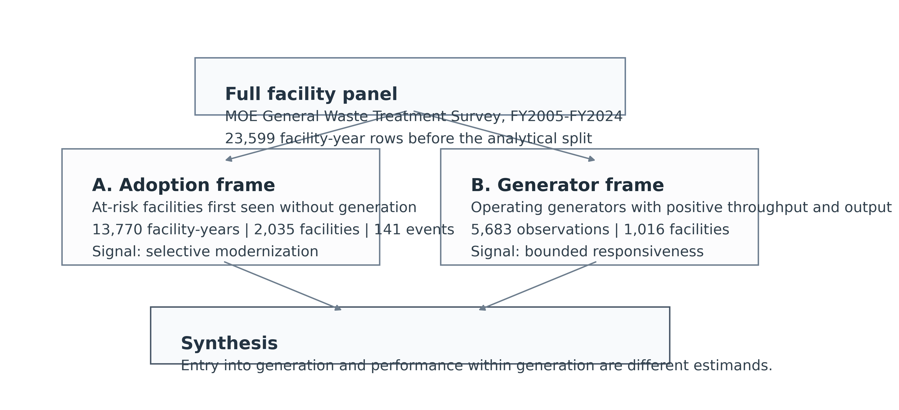

<!-- _class: hero -->

# Explaining the Paper Clearly

## Selective modernization and bounded responsiveness in Japan's waste-incineration fleet

  10-15 minute Zoom briefing
  Paper only
  Full script available

  Pann Phetra 
  Paper briefing deck generated from the reproducible paper workspace

<!--
Script cue: Start by saying this is not a general lecture on waste incineration. It is a focused explanation of one paper: what problem it studies, how the evidence is organized, what it finds, and what claim boundary makes it defensible.
-->

---

# The 30-Second Version

  

    
Problem

    
Japan burns waste widely, but electricity recovery is uneven.

    
By FY2024, only 41.1% of facilities in the panel are flagged as power-generating.

  

  

    
Design

    
The paper separates two questions that averages mix together.

    
First, which non-generators enter power generation? Second, how well do generators perform once they exist?

  

  

    
Finding

    
Entry is selective; generator performance remains structured.

    
Younger and larger facilities are more likely to enter; older, smaller, less utilized generators recover less electricity per tonne.

  

  
<strong>One-line takeaway:</strong> Japan's incineration transition should not be summarized as one average fleet problem.

<!--
Script cue: Give the listener the destination first. The paper is about a diagnostic split: entry into generation versus performance after entry.
-->

---

# Why This Issue Matters

  

    

      

        
1

        
Waste is burned

        
Incineration reduces waste volume and supports hygienic municipal disposal.

      

      
→

      

        
2

        
Heat is produced

        
The plant already creates heat; the question is whether useful energy is recovered.

      

      
→

      

        
3

        
Electricity may be generated

        
Only some facilities convert waste heat into reported electricity generation.

      

    

  

  

    
Plain-language context

    
The policy issue is not simply whether Japan uses incineration. Japan already relies heavily on incineration. The sharper issue is whether facilities recover useful energy from that system, and whether old or small facilities can realistically catch up.

  

  
This makes the paper a fleet-diagnosis study, not a broad argument that incineration itself is always good or bad.

<!--
Script cue: Use this slide to orient non-specialists. Explain the physical intuition before describing the econometrics.
-->

---

# The Main Trap: One Average Fleet

  

    
What an average hides

    
A single fleet average mixes two different bottlenecks.

    <ul>
      <li>Some facilities do not generate electricity at all.</li>
      <li>Some facilities generate, but recover electricity less efficiently.</li>
      <li>Averages blur the difference between entering generation and performing well after entry.</li>
    </ul>
  

  

    

      

        
Non-generators

        
Entry problem

        
Do they ever report power generation?

      

      

        
Generators

        
Performance problem

        
How much electricity per tonne do they recover?

      

      

        
Weak shortcut

        
One average

        
Looks simple, but loses the bottleneck location.

      

      

        
Paper design

        
Two linked margins

        
Separate the gate into generation from performance within generation.

      

    

  

<!--
Script cue: This is the conceptual heart of the presentation. Do not rush it.
-->

---

# Research Questions

  

    
RQ1: Adoption

    
Who enters electricity generation?

    
Among facilities first observed without generation, which ones later first report power generation?

  

  

    
RQ2: Efficiency

    
Who performs better after entry?

    
Among identifiable operating generators, how much electricity is recovered per tonne processed?

  

  

    
RQ3: Synthesis

    
Do both margins tell one story?

    
Or does the fleet contain different modernization problems at different points?

  

  
<strong>Translation:</strong> First ask who gets through the door. Then ask how well they do once they are inside.

<!--
Script cue: Make clear that the paper is organized around questions, not around methods for their own sake.
-->

---

# Data and Sample Architecture

  

    
Administrative source

    
FY2005-FY2024

    
Ministry of the Environment General Waste Treatment Survey

    
A national facility-level panel covering Japanese municipal waste incineration facilities.

  

  

    
Full source panel

    
23,599

    
facility-year observations

    
2,948 identifiable facilities across 47 prefectures.

  

  

    
Adoption frame

    
13,770

    
at-risk facility-years

    
2,035 facilities first observed without generation, with 141 observed first-adoption events.

  

  

    
Generator frame

    
5,683

    
canonical generator rows

    
1,016 identifiable operating generators used for conditional-efficiency models.

  

<!--
Script cue: Do not list every cleaning rule orally. Emphasize why two samples are necessary.
-->

---

# Design Logic in One Diagram

  

    
  

  

    

      
Extensive margin

      
Transition into generation

      
Estimated with a lagged discrete-time hazard among facilities still at risk of first reported generation.

    

    

      
Intensive margin

      
Efficiency among generators

      
Estimated with descriptive panel models for electricity generated per tonne processed.

    

  

  
The samples are linked but not identical because they answer different questions.

<!--
Script cue: This is where you justify the architecture. A single sample would be cleaner-looking but wrong for the research question.
-->

---

# Result 1: Adoption Is Selective

  

    
  

  

    

      
By age

      
Events collapse after age 10.

      
Facilities aged 0-10 account for 102 of 141 first-adoption events.

    

    

      
By capacity

      
Events concentrate in large plants.

      
The largest capacity quartile accounts for 99 first-adoption events; the smallest quartile records only 1.

    

  

<!--
Script cue: The figure should carry the visual result. Your spoken explanation should translate the pattern: adoption is not spreading evenly across the fleet.
-->

---

# Result 1 in Plain English

  

    
Hazard model summary

    
Older at-risk facilities are less likely to first report generation.

    <ul>
      <li>Age 10-20: about <strong>-1.76 percentage points</strong>.</li>
      <li>Age 20-30: about <strong>-1.72 percentage points</strong>.</li>
      <li>Age 30+: about <strong>-1.13 percentage points</strong>.</li>
      <li>Capacity: each extra 100 t/day adds about <strong>+0.50 percentage points</strong>.</li>
    </ul>
  

  

    
Pathway audit

    
The observed event mix looks capital-intensive, but not one single mechanism.

    <ul>
      <li>82 reset/rebuild-like transitions.</li>
      <li>38 continuity or in-place upgrade-like transitions.</li>
      <li>20 forward-dated or placeholder entries.</li>
    </ul>
  

  
<strong>Defensible wording:</strong> selective modernization, not proof that replacement is the only pathway.

<!--
Script cue: Explain percentage points carefully. These are changes in annual probability of first reporting generation, not changes in engineering efficiency.
-->

---

# Result 2: Generator Performance Is Structured

  

    
  

  

    

      
Performance gradient

      
Older generators recover less electricity per tonne.

      
The pattern is descriptive, but stable across main model variants.

    

    

      
Variance structure

      
Most differences are between facilities.

      
The within-to-total variance ratio is 0.1499, and only 0.0956 after 2011.

    

  

<!--
Script cue: Do not overclaim irreversibility. Say performance is bounded and structured, not impossible to improve.
-->

---

# Result 2 in Plain English

  

    
Age

    
Older plants tend to perform worse.

    
This likely reflects durable design, inherited equipment, and institutional constraints, not age alone as a magic cause.

  

  

    
Scale

    
Larger plants tend to perform better.

    
Scale can support better energy recovery and steadier operation, although the paper does not prove a single mechanism.

  

  

    
Utilization

    
Better-loaded plants perform better.

    
Operations still matter, but they do not erase the larger cross-facility hierarchy.

  

  
The generator result is not "nothing can be improved." It is "improvement happens within a performance envelope shaped by facility characteristics."

<!--
Script cue: This slide protects the paper from sounding fatalistic.
-->

---

# The Combined Story

  

    

      
A

      
Non-generating segment

      
The first problem is whether facilities enter electricity recovery at all.

    

    
→

    

      
B

      
Generating segment

      
The second problem is how much electricity generators recover per tonne.

    

    
→

    

      
C

      
Planning implication

      
Fleet triage and generator optimization should be treated as separate tasks.

    

  

  

    
If a plant does not generate

    
Ask renewal, consolidation, or entry questions.

  

  

    
If a plant already generates

    
Ask utilization, routing, and upgrade questions.

  

<!--
Script cue: This is the policy bridge. Keep it practical and avoid prescribing one universal solution.
-->

---

# What Makes the Paper Original

  

    
Originality 1

    
Same national panel, two linked margins.

    
The paper studies both observed entry into generation and conditional performance after entry.

  

  

    
Originality 2

    
It exposes what aggregate fleet views hide.

    
The evidence distinguishes selective entry from persistent generator hierarchy.

  

  

    
Originality 3

    
It is careful about claim boundaries.

    
The paper does not pretend to identify one causal modernization mechanism.

  

  
The publication pitch is not "Japan is understudied." It is "entry and conditional performance should be separated before the fleet is interpreted."

<!--
Script cue: This answers the question: why does this deserve to be a paper rather than just a thesis chapter?
-->

---

# What the Paper Does Not Claim

  

    
Boundaries

    <ul>
      <li>It does not estimate a strict causal effect of age, scale, or policy.</li>
      <li>It does not prove replacement is the only modernization pathway.</li>
      <li>It does not calculate complete lifecycle climate benefits.</li>
      <li>It does not treat the generator frame as a full census of all generation activity.</li>
    </ul>
  

  

    
Defended claim

    
The paper is a diagnostic fleet decomposition.

    
Its strength is showing where the bottleneck appears in the data: selective entry into generation and bounded performance among operating generators.

  

<!--
Script cue: Use this slide to sound rigorous, not defensive. Good papers are clear about what they do not identify.
-->

---

# Likely Zoom Questions

  

    
<strong>Q: Is this causal?</strong> No. It is a structured diagnostic analysis with explicit sample limits and robustness checks.

  

  

    
<strong>Q: Why not one model for the whole fleet?</strong> Because non-generators and generators answer different questions; one model would mix entry with performance.

  

  

    
<strong>Q: Does this mean old plants cannot improve?</strong> No. It means broad late-life catch-up is not what dominates the observed data.

  

  

    
<strong>Q: What should municipalities do?</strong> First separate asset-renewal screening for non-generators from optimization of existing generators.

  

<!--
Script cue: Keep answers short. Invite detailed methods questions only if the audience wants them.
-->

---

<!-- _class: close -->

# Closing Takeaway

The paper argues that Japan's incineration fleet should be read as a two-part modernization problem, not as one average transition curve.

  
First ask which facilities enter energy recovery. Then ask how well generators perform after entry. The policy diagnosis changes when those margins are separated.

<!--
Script cue: End with the one sentence you want remembered. Then stop and invite questions.
-->

---

<!-- _class: appendix dense -->

# Appendix A: Model Details

  

    
Adoption model

    
Lagged discrete-time logit hazard among facilities still at risk of first observed generation.

    <ul>
      <li>Outcome: first report of power generation in the next observed year.</li>
      <li>Predictors: prior-year age band and design capacity.</li>
      <li>Controls: fiscal-year fixed effects and prefecture fixed effects.</li>
      <li>Uncertainty: facility-clustered standard errors.</li>
    </ul>
  

  

    
Efficiency model

    
Descriptive panel models among identifiable operating generators.

    <ul>
      <li>Outcome: winsorized log electricity generated per tonne processed.</li>
      <li>Predictors: age, capacity, utilization, heating value, grid-emission control.</li>
      <li>Models: pooled OLS, year fixed effects, random effects, year fixed effects plus random effects.</li>
      <li>Uncertainty: facility-clustered standard errors.</li>
    </ul>
  

---

<!-- _class: appendix dense -->

# Appendix B: Key Numbers to Remember

| Evidence item | Number | Interpretation |
|:--|--:|:--|
| FY2024 facilities flagged as power-generating | 41.1% | Most facilities remain outside electricity generation in the panel. |
| Adoption risk-set size | 13,770 | Facility-years first observed without generation. |
| Observed first-adoption events | 141 | Events used to describe entry into generation. |
| Events from age 0-10 facilities | 102 | Adoption is concentrated among young facilities. |
| Events in largest capacity quartile | 99 | Adoption is concentrated among large facilities. |
| Generator regression frame | 5,683 | Identifiable operating-generator observations. |
| Within-to-total variance ratio | 0.1499 | Most generator-efficiency variation is between facilities. |

---

<!-- _class: appendix dense -->

# Appendix C: File Map

  

    
Slides

    
paper/slides/paper-zoom-briefing.md

    
Editable source deck.

  

  

    
Script

    
paper/slides/paper-zoom-script.md

    
Full speaking script and timing guide.

  

  

    
PDF

    
paper/share/paper-zoom-briefing.pdf

    
Shareable screen-sharing file after export.

  

  

    
Build command

    
npm run slides:paper:pdf

    
Regenerates the PDF from the Markdown source.

  

