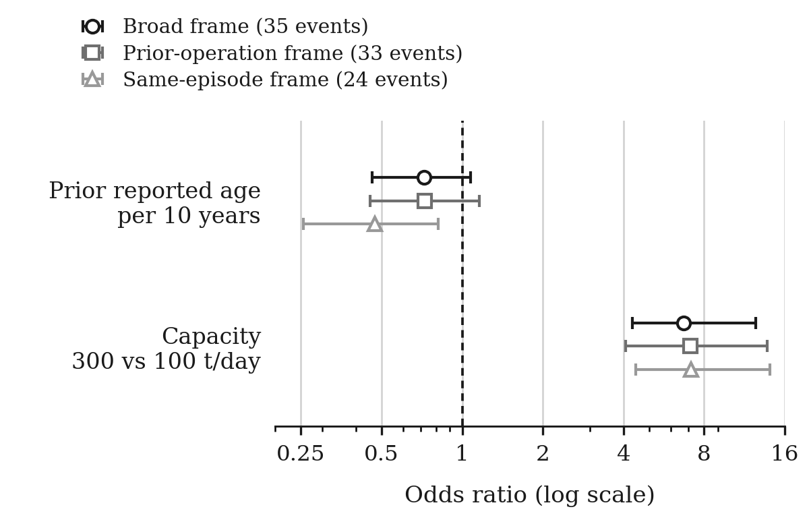
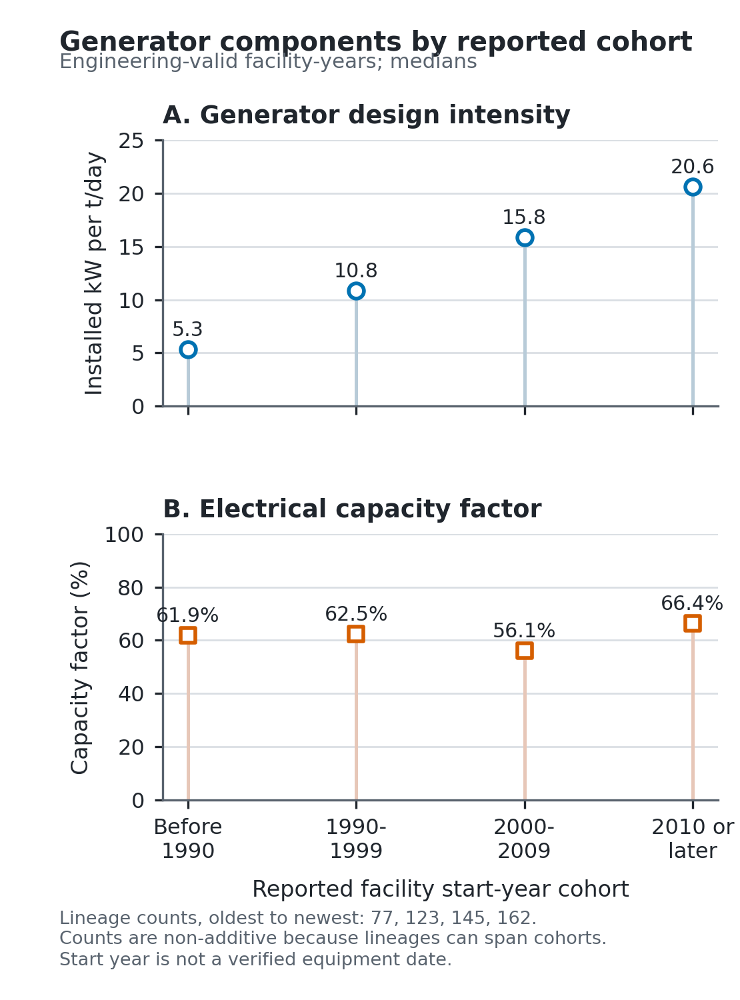

<!-- _class: hero -->

# Explaining the Paper Simply

## Why Japan's incineration energy-recovery pattern matters

  8-10 minute live route
  Paper only
  Appendix only if asked

  Pann Phetra 
  Paper briefing for discussion and feedback

<!--
Script cue: Set expectation. This is a simple route through why the paper matters, what it finds, and what feedback is needed.
-->

---

# Why This Matters

  

    

      
1

      
Waste is burned

      
Japan relies heavily on municipal waste incineration.

    

    
&rarr;

    

      
2

      
Heat already exists

      
Incineration creates heat whether or not electricity is recovered.

    

    
&rarr;

    

      
3

      
Not all heat becomes electricity

      
In FY2024, only 41.1% of panel facilities are flagged as power-generating.

    

  

  
This matters because the same waste-treatment process can either recover useful power or miss that energy-recovery opportunity.

<!--
Script cue: Start with practical stakes, not methods.
-->

---

# Main Idea in Plain Words

  
Plain claim

  
One fleet average hides two different questions.

  

    
Question 1

    
Which plants start generating electricity?

    
This is the "entry" question.

  

  

    
Question 2

    
Among generators, who produces more electricity per tonne?

    
This is the "performance" question.

  

<!--
Script cue: Define entry and performance before using those words.
-->

---

# Method in Plain Language

  

    

      
1

      
Build a facility panel

      
Follow municipal incineration facilities from FY2005-FY2024.

    

    
&rarr;

    

      
2

      
Split by generation status

      
Non-generators answer the start-generating question; generators answer the output question.

    

    
&rarr;

    

      
3

      
Read both patterns

      
The method shows where bottlenecks appear in the fleet.

    

  

  
This is diagnostic: it identifies patterns and bottlenecks, not strict cause-and-effect.

<!--
Script cue: Keep the method to three steps. Technical model details are appendix-only.
-->

---

# Result 1: Starting Generation Is Uneven

  

  
Facilities that first start generating electricity are mostly young and large: 102/141 events are from age 0-10 facilities, and 99/141 are in the largest capacity quartile.

<!--
Script cue: Say the two numbers slowly, then stop.
-->

---

# Result 2: Generator Output Is Uneven

  

  
Among plants that already generate, older facilities recover less electricity per tonne. Scale and utilization help, but they do not erase large facility-level differences.

<!--
Script cue: Avoid saying old plants cannot improve. Say the observed gaps are structured.
-->

---

# Why the Method Matters for Decisions

  

    

      
A

      
Non-generators

      
Can this plant start recovering electricity?

    

    
&rarr;

    

      
B

      
Generators

      
Can this plant recover more electricity from the same waste?

    

    
&rarr;

    

      
C

      
Planning

      
Use different decisions for different bottlenecks.

    

  

  
This matters because renewal, starting electricity generation, and generator optimization are not the same task.

<!--
Script cue: This is the practical payoff. Keep it grounded and non-prescriptive.
-->

---

# Why This Can Stand as a Paper

  

    
Clear question

    
It separates starting generation from generator output.

    
That avoids a confusing one-average story.

  

  

    
Useful evidence

    
It follows one national facility panel.

    
The same fleet is read through two linked questions.

  

  

    
Careful claim

    
It says what the evidence can and cannot prove.

    
That keeps the paper useful without overstating causality.

  

<!--
Script cue: This is the supervisor-facing contribution pitch.
-->

---

# What This Does and Does Not Prove

  

    
Boundaries

    <ul class="simple-list">
      <li>No strict causal policy-effect claim.</li>
      <li>No proof that replacement is the only pathway.</li>
      <li>No complete lifecycle climate accounting.</li>
      <li>No claim that the generator frame is a perfect census.</li>
    </ul>
  

  

    
Defended claim

    
It identifies where the bottlenecks appear.

    
Starting generation is unevenly spread, and generator output remains uneven after entry.

  

<!--
Script cue: Present limits as discipline, not weakness.
-->

---

<!-- _class: close -->

# Feedback Ask

The paper's message is: first ask who starts generating electricity, then ask who generates well after starting.

  
Useful feedback: is this two-part story clear, defensible, and worth using as the paper's main pitch?

<!--
Script cue: Stop here. Use appendices only if the listener asks.
-->

---

<!-- _class: appendix dense -->

# Appendix A: Method Details

  

    
Start-generating model

    
Among facilities not yet generating, estimate who first reports generation in the next observed year.

    <ul class="simple-list">
      <li>Outcome: first report of power generation in the next observed year.</li>
      <li>Predictors: prior-year age band and design capacity.</li>
      <li>Controls: fiscal-year fixed effects and prefecture fixed effects.</li>
      <li>Uncertainty: facility-clustered standard errors.</li>
    </ul>
  

  

    
Generator-output model

    
Among identifiable operating generators, compare electricity generated per tonne processed.

    <ul class="simple-list">
      <li>Outcome: winsorized log electricity generated per tonne processed.</li>
      <li>Predictors: age, capacity, utilization, heating value, grid-emission control.</li>
      <li>Models: pooled OLS, year FE, RE, and year FE plus RE.</li>
      <li>Uncertainty: facility-clustered standard errors.</li>
    </ul>
  

---

<!-- _class: appendix dense -->

# Appendix B: Key Numbers

| Evidence item | Number | Interpretation |
|:--|--:|:--|
| FY2024 facilities flagged as power-generating | 41.1% | Most facilities remain outside electricity generation in the panel. |
| Source panel | 23,599 | Facility-year observations across FY2005-FY2024. |
| Identifiable facilities | 2,948 | National facility-level evidence. |
| Adoption risk-set size | 13,770 | Facility-years first observed without generation. |
| Observed first-adoption events | 141 | Events used to describe entry into generation. |
| Events from age 0-10 facilities | 102 | Adoption is concentrated among young facilities. |
| Events in largest capacity quartile | 99 | Adoption is concentrated among large facilities. |
| Generator regression frame | 5,683 | Identifiable operating-generator observations. |
| Within-to-total variance ratio | 0.1499 | Most generator-efficiency variation is between facilities. |

---

<!-- _class: appendix dense -->

# Appendix C: Pathway Audit

  

    
Reset / rebuild-like

    
82

    
observed events

  

  

    
Continuity / upgrade-like

    
38

    
observed events

  

  

    
Placeholder / forward-dated

    
20

    
observed events

  

  
<strong>Safe wording:</strong> selective modernization with capital-intensive evidence, not proof that replacement is the only pathway.

---

<!-- _class: appendix dense -->

# Appendix D: File Map

  

    
Slides

    
paper/slides/paper-zoom-briefing.md

    
Editable source deck.

  

  

    
Script

    
paper/slides/paper-zoom-script.md

    
Separate live presentation script.

  

  

    
Checklist

    
paper/slides/paper-zoom-presentation-checklist.md

    
Run sheet for a simple, direct presentation.

  

  

    
Build command

    
npm run slides:paper:pdf

    
Regenerates the shareable PDF.

  

