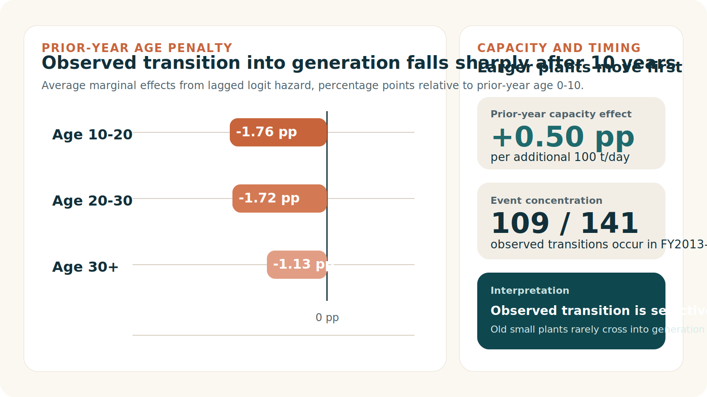
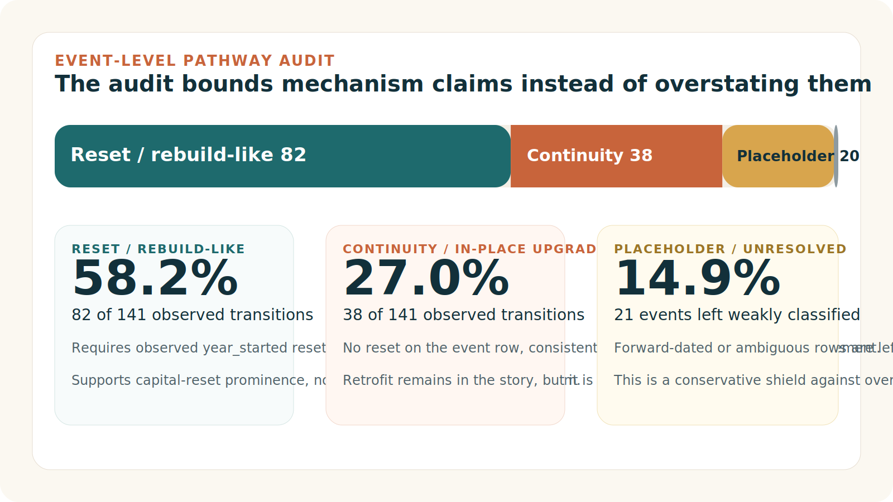
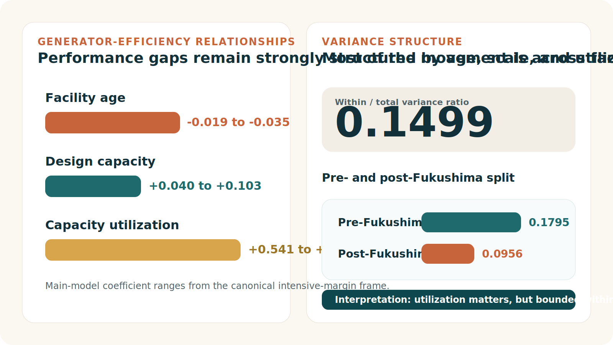

# Final Viva Cheat Sheet

One-file oral defense reference for the current thesis baseline.

Use this with:

- `research/notes/defense-rapid-answers.md`
- `research/notes/defense-q-and-a.md`
- `research/notes/examiner-risk-register.md`
- `research/slides/defense-deck.md`

This file is for fast rehearsal, not for introducing new claims. If you drift, return to the narrow defended claim.

---

## 1. Canonical Thesis Line

Japan's incineration transition is empirically two-part: observed entry into power generation is selective on the extensive margin, while conditional generator performance is shaped by age, scale, utilization, and bounded within-facility responsiveness on the intensive margin.

## 2. Why This Is One Thesis, Not Two

The two layers answer one transition question in sequence.

- The extensive margin asks where modernization enters the fleet at all.
- The intensive margin asks whether large gains remain once a facility is already inside the generating regime.

The integrated claim is therefore:

- transition into generation is selective
- conditional performance within generation is bounded

Without both layers, the thesis would either overgeneralize from generators to the whole fleet or stop at entry without showing what happens inside the generating segment.

Memory hook:

- `Two margins`
- `Three drivers`
- `One boundary`

Meaning:

- `Two margins`: adoption, then conditional performance
- `Three drivers`: age, scale, utilization
- `One boundary`: observational evidence, not one-mechanism causality

---

## 3. Five Dangerous Questions

### 1. Why not two-way fixed effects?

Best answer:

I do not use two-way fixed effects for the main claim because age moves mechanically with time and only 14.99% of the log-efficiency signal is within-facility in the canonical frame. Two-way FE would therefore lean on the smaller part of the signal while the thesis is trying to explain structured heterogeneity across facilities. I report the Hausman result transparently, but defend the main intensive-margin estimates as structured descriptive associations rather than clean structural parameters.

Short bridge:

- `The narrow defended claim is descriptive structure, not a causal FE estimate.`

### 2. Aren't your samples too selected?

Best answer:

Yes, and the thesis is explicit about that. The adoption result is about observed first transition within the coded, initially non-generating risk set, and the efficiency result is conditional on already generating facilities. Neither is a fleet-wide causal claim, which is why the thesis is designed as two linked frames rather than one overextended model.

Short bridge:

- `The redesign was built to stop sample overreach.`

### 3. Does the thesis prove replacement?

Best answer:

No. The pathway audit shows a mixed observed transition pattern with many reset- or rebuild-like entries, but it does not separate replacement, major refurbishment, and new build cleanly. I use it as pathway evidence, not mechanism identification.

Short bridge:

- `What the panel directly shows is pathway evidence, not one clean mechanism.`

### 4. Does the 0.1499 ratio prove lock-in?

Best answer:

No. By itself it is descriptive. The defended claim is that the low within-to-total ratio is consistent with most variation being between facilities rather than within the same facility over time. Together with the stable age, scale, and utilization relationships, that is strongly consistent with bounded responsiveness in the generator frame, but it is not proof of irreversibility.

Short bridge:

- `So the calibrated conclusion is bounded responsiveness, not lock-in proven.`

### 5. Aren't the policy recommendations stronger than the identification?

Best answer:

The policy section is an inferential implication, not a directly estimated ranking of interventions. The defended point is that the evidence is most consistent with capital-side modernization mattering most for the weakest segment, while routing, utilization, and selective major refurbishment remain secondary but real levers.

Short bridge:

- `The thesis gives an evidence-consistent ordering, not a demonstrated ranking.`

---

## 4. Core Numbers

### Must say

- `23,599` facility-year observations
- `2,948` facilities
- `141` observed first-adoption events
- `0.1499` within-to-total variance ratio
- `0.400` MWh/t mean efficiency at age 0-10
- `0.183` MWh/t mean efficiency at age 30+
- `59%` of active facilities still generate no electricity
- `4.6` million t-CO2 gross avoided emissions in FY2024

### Useful backup

- Adoption risk set: `13,770` facility-years, `2,035` facilities
- Lagged hazard frame: `11,717` facility-years, `1,915` facilities, `140` estimable events
- Pathway audit: `82` reset/rebuild-like, `38` continuity-type, `20` placeholder/forward-dated, `1` unresolved
- Canonical generator frame: `5,683` facility-years, `1,016` facilities
- Pre-Fukushima variance ratio: `0.1795`
- Post-Fukushima variance ratio: `0.0956`

---

## 5. Defended Claim / Out Of Scope

### Defended claim

- The thesis is a disciplined observational panel study.
- It separates observed adoption into generation from conditional efficiency among generators.
- It finds selective modernization on the extensive margin.
- It finds bounded responsiveness on the intensive margin.
- It shows that cross-facility heterogeneity dominates within-facility movement in the generator frame.
- It supports an evidence-consistent policy hierarchy in which capital-side modernization matters most for the weakest segment.

### Out of scope

- It does not prove a causal effect of age, capacity, or utilization.
- It does not prove replacement is the dominant mechanism.
- It does not reconstruct the full historical modernization path of the whole fleet.
- It does not show that operations do not matter.
- It does not provide a full life-cycle climate accounting.
- It does not show that Japan's result automatically generalizes everywhere.

---

## 6. Fast Oral Answers

### Default opener

This thesis asks two linked questions: which facilities record transition into power generation, and, conditional on generation, which facilities achieve higher energy recovery efficiency? Using a 20-year Ministry of the Environment panel, I show that observed transition into generation is selective among younger and larger facilities, while performance inside the generator sample is strongly shaped by age, scale, utilization, and limited within-facility movement over time.

### Longer rescue answer

The thesis uses one two-part empirical architecture because one generator-only frame cannot answer both margins of the transition question. The extensive-margin model studies observed first adoption into generation among coded facilities first seen without it. The intensive-margin model then studies efficiency only among facilities that already generate power. On the extensive margin, observed transition is concentrated among younger and larger facilities in the coded risk set, not diffuse late-life conversion among old small plants. On the intensive margin, efficiency is consistently lower at older facilities and higher at larger and more fully utilized ones, and the low within-to-total ratio is consistent with most efficiency variation lying between facilities rather than within the same facility over time. The defended conclusion is therefore calibrated: the evidence is most consistent with selective modernization on the way into generation and bounded responsiveness once facilities are already inside the generator segment.

---

## 7. Visual Memory Anchors

### Who enters?



What to say:

- The extensive-margin story is selective, not diffuse.
- Old small plants rarely record observed transition into generation.
- The design uses lagged predictors so the model reads as pre-transition structure, not same-year redesign.

### What pathways appear?



What to say:

- The audit prevents policy language from outrunning the data.
- Reset/rebuild-like events are the largest observed bucket.
- The thesis does not claim that replacement, new build, and major refurbishment are cleanly separated inside that bucket.

### What is bounded?



What to say:

- The key intensive-margin fact is the structure of variation, not one coefficient in isolation.
- Most log-efficiency variation is between facilities rather than within facilities over time.
- The right defended phrase is `bounded responsiveness`, not `irreversibility proven`.

---

## 8. Question-to-Response Map

### If the examiner says the thesis is not causal

Say:

That is correct. The thesis is a reproducible observational panel study. Its strength is disciplined scope, not a hidden causal design.

### If the examiner says the thesis is really two adjacent studies

Say:

They belong together because the first asks who enters the generating regime and the second asks whether large gains remain once facilities are already inside it. Without both layers, the transition story is incomplete.

### If the examiner says the originality is only moderate

Say:

The originality claim is thesis-level and design-level, not a claim to overturn the whole literature. The contribution is the two-part facility-level architecture on Japan's fleet, not the invention of age and scale as concepts.

### If the examiner says the policy section is too ambitious

Say:

The revised policy section is intentionally narrowed. It follows from the two-part evidence as implication, not as directly estimated governance ranking.

### If the examiner says heat recovery is missing

Say:

Yes. The thesis focuses on electricity because that is what the facility-level panel supports cleanly. Heat integration is a real future-work extension, not something the thesis pretends to estimate.

---

## 9. Best Oral Verbs

Use:

- `shows`
- `supports`
- `is consistent with`
- `suggests`
- `indicates`
- `within the coded observed-risk frame`
- `within the canonical generator frame`

Avoid:

- `proves`
- `demonstrates conclusively`
- `dominant mechanism`
- `causal effect`
- `the whole fleet history`
- `operations do not matter`

---

## 10. Opening And Closing Moves

### Opening moves

Use one of these when an answer starts getting messy:

- `The narrow defended claim is...`
- `What the panel directly shows is...`
- `What it does not show on its own is...`

### Clean closing lines

Contribution:

This thesis shows that Japan's incineration transition is not one uniform process: transition into generation is selective, and performance within generation is bounded by design-conditioned heterogeneity.

Limitation:

The thesis provides disciplined observational evidence, not a one-mechanism causal identification design.

Policy:

The evidence is most consistent with capital-side modernization mattering most for the weakest segment, while operating-side levers remain real but bounded.

---

## 11. Mini Diagram: How To Defend The Thesis

```text
One transition question
  -> Where does modernization enter the fleet?
  -> What happens once facilities are already inside generation?

Correct frame for each margin
  -> coded observed-risk frame
  -> canonical generator frame

Defended empirical result
  -> selective modernization
  -> bounded responsiveness

Calibrated interpretation
  -> capital-side modernization matters most for the weakest segment
  -> routing, utilization, and selective upgrading still matter, but less

Guardrail
  -> not causal
  -> not one uniquely identified mechanism
  -> not unrestricted full-fleet history
```

---

## 12. Final Pre-Viva Checklist

- Can you explain the thesis in one sentence without reading?
- Can you say why it is one integrated design rather than two adjacent studies?
- Can you explain the two sample frames without hesitation?
- Can you explain why FE is not the main estimator without sounding evasive?
- Can you state the pathway-audit limitation directly?
- Can you state the policy implication without using the word `prove`?
- Can you distinguish `bounded responsiveness` from `lock-in proven`?

If any answer still feels slow, practice that answer with:

- `research/notes/defense-rapid-answers.md`
- `research/notes/defense-q-and-a.md`
- `research/notes/defense-question-order.md`

---

## 13. Last Resort Safe Answer

If a question becomes messy, say:

The safest way to state it is this: the thesis is a two-part observational panel study. It shows selective modernization into generation in the coded observed-risk frame and bounded responsiveness within the canonical generator frame. It does not claim one uniquely identified mechanism or a clean causal ranking of policy tools.
